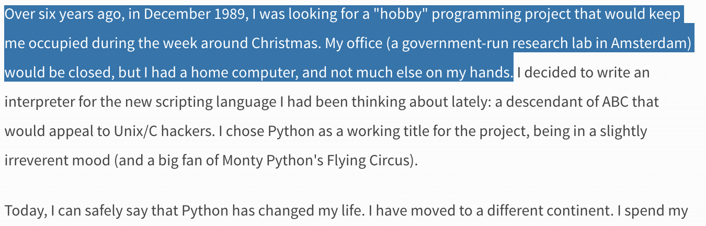
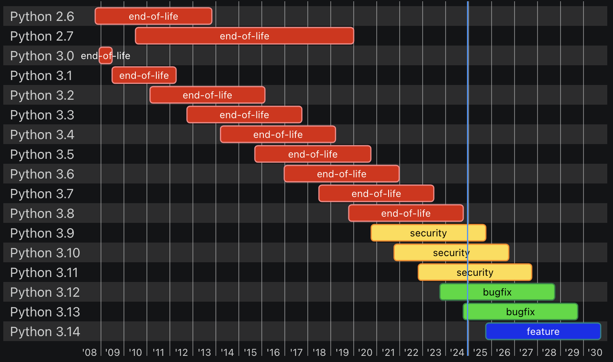
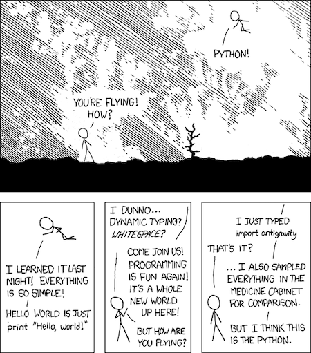
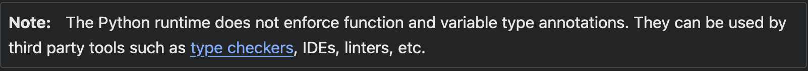
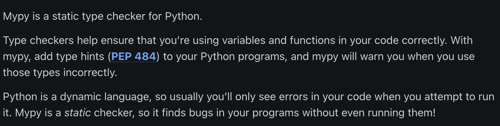
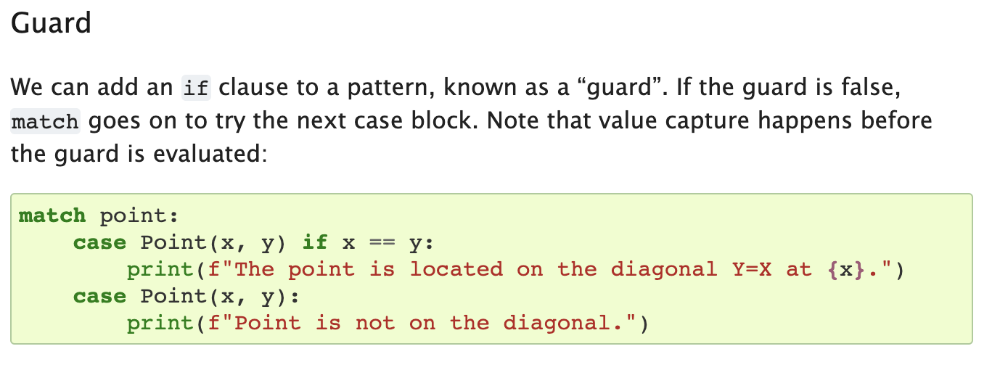

# Lecture 2: Python Crash Course
CSCI 4360/6360: Data Science II

News headline the literal first day of this class in Fall 2023


Read more: https://arstechnica.com/information-technology/2023/08/you-can-now-wield-python-analytics-inside-excel-but-microsoft-says-its-safe/

## Part 1: Python Background

Python as a language was implemented from the start by Guido van Rossum. What was originally something of a [snarkily-named hobby project to pass the holidays](https://www.python.org/doc/essays/foreword/) turned into a huge open source phenomenon used by millions.



### Python's history

The original project began in 1989.

 - Release of Python 2.0 in 2000

 - Release of Python 3.0 in 2008

 - Python 2.0 was EOL (end-of-life) in 2020, so you should be on Python 3 now. The latest version of Python is 3.13 (though it's still a bit bleeding-edge).



You're welcome to use whatever version you want, just be aware: the AutoLab autograders will be using **3.10 - 3.11** (in general, anything **3.10** and above should be fine, though absolutely no lower than 3.9).

https://devguide.python.org/versions/

### Python, the Language

Python is an **intepreted** language.

 - Contrast with **compiled** languages
 - Performance, ease-of-use
 - Modern intertwining and blurring of compiled vs interpreted languages

Python is a very **general** language.

 - Not designed as a specialized language for performing a specific task. Instead, it relies on third-party developers to provide these extras.



Instead, as [Jake VanderPlas](http://jakevdp.github.io/) put it:

> "Python syntax is the glue that holds your data science code together. As many scientists and statisticians have found, Python excels in that role because it is powerful, intuitive, quick to write, fun to use, and above all extremely useful in day-to-day data science tasks."

## Part 2: Language Basics

The most basic thing possible: Hello, World!


```python
print("Hello, world!")
```

    Hello, world!


Yep, that's all that's needed!

(Take note: the biggest different between Python 2 and 3 is the `print` function: it technically wasn't a function in Python 2 so much as a *language construct*, and so you didn't need parentheses around the string you wanted printed; in Python 3, it's a full-fledged *function*, and therefore requires parentheses)

### Variables and Types

Python is dynamically-typed, meaning you don't have to declare types when you assign variables. Python is also *duck-typed*, a colloquialism that means it *infers* the best-suited variable type at runtime ("if it walks like a duck and quacks like a duck...")


```python
x = 5
type(x)
```


    int


```python
y = 5.5
type(y)
```


    float


It's important to note: even though you don't have to specify a type, Python still assigns a type to variables. It would behoove you to know the types so you don't run into tricky type-related bugs!


```python
x = 5 * 5
```

What's the type for `x`?


```python
type(x)
```


    int


```python
y = 5 / 5
```

What's the type for `y`?


```python
type(y)
```


    float


There are functions you can use to explicitly *cast* a variable from one type to another:


```python
x = 5 / 5
type(x)
```


    float


```python
y = int(x)
type(y)
```


    int


```python
z = str(y)
type(z)
```


    str


### Type Hinting

As of version 3.5, Python supports *type hinting*. The documentation makes this distinction clear:



Think of type hinting in Python as non-comment documentation.

An example directly from the `typing` docs:


```python
def surface_area_of_cube(edge_length: float) -> str:
    return f"The surface area of the cube is {6 * edge_length ** 2}."
```

The function `surface_area_of_cube` takes a single argument `edge_length` which is expected to be of type `float`. The function then returns a value of type `str`.

You can use type hinting to do type *aliasing* for convenience:


```python
Vector = list[float]
# "Vector" types are now equivalent to "list[float]" types
# in the eyes of any static checkers you use

def scale(scalar: float, vector: Vector) -> Vector:
    return [scalar * num for num in vector]

# passes type checking; a list of floats qualifies as a Vector.
new_vector = scale(2.0, [1.0, -4.2, 5.4])
print(new_vector)
```

    [2.0, -8.4, 10.8]


**IMPORTANT**: Type hinting is a bleeding-edge feature in Python that is still undergoing a lot of changes. I struggled with this example for a good 15 minutes before realizing I was reading type hinting documentation for Python 3.13, which differs slightly from type hinting in 3.10.

Type hinting is really cool, but keep in mind: **Python's runtime IGNORES type hints.** They are not enforced in any way by Python; they are purely for convenience, hence why I call them "non-comment documentation."

If you want to actually _enforce_ type hints, you need a static type checker like [mypy](https://mypy.readthedocs.io/)



### Walrus Operator

Introduced in Python 3.8 (still relatively recent!), the walrus operator, or "Assignment Expression", is a way of assigning a value to a variable in mid-expression.

Other languages have had this ability for awhile, but there was heated debate about how best to implement this in Python.

Normally, you'd first assign a value to a variable, and then perform a check.


```python
v = 10
if (v > 5):
    print("We've reached this location")
```

    We've reached this location


Alternatively, you can perform the assignment right in the middle of the expression.


```python
if ((v := 10) > 5):
    print("We've now reached this location")
```

    We've now reached this location


Note two important changes.

 1. The operator itself: it's a colon ":" and an assignment "=" smashed together. They look like the [walrus](https://en.wikipedia.org/wiki/Walrus), hence the name.
 2. The assignment expression has been wrapped in an additional set of parentheses.

Just as important to note: anywhere that you could use the walrus operator, you can also break it apart into two separate expressions! This is purely for brevity, but never sacrifice clarity for it.

### Data Structures

There are four main types of built-in Python data structures, each similar but ever-so-slightly different:

 1. Lists (the Python workhorse)
 2. Tuples
 3. Sets
 4. Dictionaries

(Note: generators and comprehensions are worthy of mention; definitely look into these as well)

Lists are basically your catch-all multi-element data structure; they can hold anything.


```python
some_list = [1, 2, 'something', 6.2, ["another", "list!"], 7371]
print(some_list[3])
type(some_list)
```

    6.2


    list


Tuples are like lists, except they're *immutable* once you've built them (and denoted by parentheses, instead of brackets).


```python
some_tuple = (1, 2, 'something', 6.2, ["another", "list!"], 7371)
print(some_tuple[5])
type(some_tuple)
```

    7371


    tuple


Sets are probably the most different: they are mutable (can be changed), but are *unordered* and *can only contain unique items* (they automatically drop duplicates you try to add). They are denoted by braces.


```python
some_set = {1, 1, 1, 1, 1, 86, "something", 73}
some_set.add(1)
print(some_set)
type(some_set)
```

    {73, 'something', 1, 86}


    set


Finally, dictionaries. Other terms that may be more familiar include: maps, hashmaps, or associative arrays. They're a combination of sets (for their *key* mechanism) and lists (for their *value* mechanism).


```python
some_dict = {"key": "value", "another_key": [1, 3, 4], 3: ["this", "value"]}
print(some_dict["another_key"])
type(some_dict)
```

    [1, 3, 4]


    dict


Dictionaries explicitly set up a mapping between a *key*--keys are unique and unordered, exactly like sets--to *values*, which are an arbitrary list of items. These are very powerful structures for data science-y applications.

### Slicing and Indexing

Ordered data structures in Python are 0-indexed (like C, C++, and Java). This means the first elements are at index 0:


```python
print(some_list)
```

    [1, 2, 'something', 6.2, ['another', 'list!'], 7371]


```python
index = 0
print(some_list[index])
```

    1


However, using colon notation, you can "slice out" entire sections of ordered structures.


```python
start = 0
end = 3
print(some_list[start : end])
```

    [1, 2, 'something']


Note that the starting index is *inclusive*, but the ending index is *exclusive*. Also, if you omit the starting index, Python assumes you mean 0 (start at the beginning); likewise, if you omit the ending index, Python assumes you mean "go to the very end".


```python
print(some_list[:end])
```

    [1, 2, 'something']


```python
start = 1
print(some_list[start:])
```

    [2, 'something', 6.2, ['another', 'list!'], 7371]


### Loops

Python supports two kinds of loops: `for` and `while`

`for` loops in Python are, in practice, closer to *for each* loops in other languages: they iterate through collections of items, rather than incrementing indices.


```python
for item in some_list:
    print(item)
```

    1
    2
    something
    6.2
    ['another', 'list!']
    7371


 - the collection to be iterated through is at the end (`some_list`)
 - the current item being iterated over is given a variable after the `for` statement (`item`)
 - the loop body says what to do in an iteration (`print(item)`)

But if you need to iterate by index, check out the `enumerate` function:


```python
for index, item in enumerate(some_list):
    print("{}: {}".format(index, item))
```

    0: 1
    1: 2
    2: something
    3: 6.2
    4: ['another', 'list!']
    5: 7371


`while` loops operate as you've probably come to expect: there is some associated boolean condition, and as long as that condition remains `True`, the loop will keep happening.


```python
i = 0
while i < 10:
    print(i)
    i += 2
```

    0
    2
    4
    6
    8


**IMPORTANT**: Do not forget to perform the *update* step in the body of the `while` loop! After using `for` loops, it's easy to become complacent and think that Python will update things automatically for you. If you forget that critical `i += 2` line in the loop body, this loop will go on forever...

Another cool looping utility when you have multiple collections of identical length you want to loop through simultaneously: the `zip()` function


```python
list1 = [1, 2, 3]
list2 = [4, 5, 6]
list3 = [7, 8, 9]

for x, y, z in zip(list1, list2, list3):
    print("{} {} {}".format(x, y, z))
```

    1 4 7
    2 5 8
    3 6 9


This "zips" together the lists and picks corresponding elements from each for every loop iteration. Way easier than trying to set up a numerical index to loop through all three simultaneously, but you can even combine this with `enumerate` to do exactly that:


```python
for index, (x, y, z) in enumerate(zip(list1, list2, list3)):
    print("{}: ({}, {}, {})".format(index, x, y, z))
```

    0: (1, 4, 7)
    1: (2, 5, 8)
    2: (3, 6, 9)


### Conditionals

Conditionals, or `if` statements, allow you to branch the execution of your code depending on certain circumstances.

In Python, this entails three keywords: `if`, `elif`, and `else`.


```python
grade = 82
if grade > 90:
    print("A")
elif grade > 80:
    print("B")
else:
    print("Something else")
```

    B


A couple important differences from C/C++/Java parlance:
 - **NO** parentheses around the boolean condition!
 - It's not "`else if`" or "`elseif`", just "`elif`". It's admittedly weird, but it's Python

Conditionals, when used with loops, offer a powerful way of slightly tweaking loop behavior with two keywords: `continue` and `break`.

The former is used when you want to skip an iteration of the loop, but nonetheless keep going on to the *next* iteration.


```python
list_of_data = [4.4, 1.2, 6898.32, "bad data!", 5289.24, 25.1, "other bad data!", 52.4]

for x in list_of_data:
    if type(x) == str:
        continue
    
    # This stuff gets skipped anytime the "continue" is run
    print(x)
```

    4.4
    1.2
    6898.32
    5289.24
    25.1
    52.4


`break`, on the other hand, literally slams the brakes on a loop, pulling you out one level of indentation immediately.


```python
import random

i = 0
iters = 0
while True:
    iters += 1
    i += random.randint(0, 10)
    if i > 1000:
        break

print(iters)
```

    200


### Structural Pattern Matching

This is a fancy way of describing what is essentially a _switch statement_ from C/C++/Java.

Introduced in Python 3.10 (so, [very new!](https://docs.python.org/3.10/whatsnew/3.10.html#pep-634-structural-pattern-matching)), you can now match patterns as a way of introducing conditions.


```python
def http_error(status):
    match status:
        case 400:
            return "Bad request"
        case 404:
            return "Not found"
        case 418:
            return "I'm a teapot"

        # If an exact match is not confirmed, this last case will be used if provided
        case _:
            return "Something's wrong with the internet"
```


```python
http_error(404)
```


    'Not found'


```python
http_error(502)
```


    "Something's wrong with the internet"


These can get _really complex_, so I'd recommend checking out the PEP documentation.



### File I/O

Python has a great file I/O library. There are usually third-party libraries that expedite reading certain often-used formats (JSON, XML, binary formats, etc), but you should still be familiar with input/output handles and how they work:


```python
text_to_write = "I want to save this to a file."
f = open("some_file.txt", "w")
f.write(text_to_write)
f.close()
```

This code writes the string on the first line to a file named `some_file.txt`. We can read it back:


```python
f = open("some_file.txt", "r")
from_file = f.read()
f.close()
print(from_file)
```

    I want to save this to a file.


Take note what changed: when writing, we used a `"w"` character in the `open` argument, but when reading we used `"r"`. Hopefully this is easy to remember.

Also, when reading/writing *binary* files, you have to include a "b": `"rb"` or `"wb"`.

### Functions

A core tenet in writing functions is that **functions should do one thing, and do it well**.

Writing good functions makes code *much* easier to troubleshoot and debug, as the code is already logically separated into components that perform very specific tasks. Thus, if your application is breaking, you usually have a good idea where to start looking.

**WARNING**: It's very easy to get caught up writing "god functions": one or two massive functions that essentially do everything you need your program to do. But if something breaks, this design is very difficult to debug.

Homework assignments will often require you to break your code into functions so different portions can be autograded.

Functions have a header definition and a body:


```python
def some_function():  # This line is the header
    pass              # Everything after (that's indented) is the body
```

This function doesn't do anything, but it's perfectly valid. We can call it:


```python
some_function()
```

Not terribly interesting, but a good outline. To make it interesting, we should add input arguments and return values:


```python
def vector_magnitude(vector):
    d = 0.0
    for x in vector:
        d += x ** 2
    return d ** 0.5
```


```python
v1 = [1, 1]
d1 = vector_magnitude(v1)
print(d1)
```

    1.4142135623730951


```python
v2 = [53.3, 13.4]
d2 = vector_magnitude(v2)
print(d2)
```

    54.95862079783298


### NumPy Arrays

If you looked at our previous `vector_magnitude` function and thought "there must be an easier way to do this", then you were correct: that easier way is NumPy arrays.

NumPy arrays are the result of taking Python lists and adding a ton of back-end C++ code to make them *really* efficient.

Two areas where they excel: *vectorized programming* and *fancy indexing*.

Vectorized programming is perfectly demonstrated with our previous `vector_magnitude` function: since we're performing the same operation on every element of the vector, NumPy allows us to build code that implicitly handles the loop


```python
import numpy as np

def vectorized_magnitude(vector):
    return (vector ** 2).sum() ** 0.5
```


```python
v1 = np.array([1, 1])
d1 = vectorized_magnitude(v1)
print(d1)
```

    1.4142135623730951


```python
v2 = np.array([53.3, 13.4])
d2 = vectorized_magnitude(v2)
print(d2)
```

    54.95862079783298


We've also seen indexing and slicing before; here, however, NumPy really shines.

Let's say we have some super high-dimensional data:


```python
X = np.random.random((500, 600, 250))
```

We can take statistics of any dimension or slice we want:


```python
X[:400, 100:200, 0].mean()
```


    0.49956684956905956


```python
X[X < 0.01].std()
```


    0.0028872417363789192


```python
X[:400, 100:200, 0].mean(axis = 1)
```


    array([0.49944172, 0.47224418, 0.517016  , 0.50349409, 0.46108838,
           0.48671116, 0.44074704, 0.57138506, 0.46698106, 0.47233007,
           0.50659231, 0.52285567, 0.48836735, 0.5033266 , 0.51291024,
           0.49224532, 0.50181827, 0.51582447, 0.5169269 , 0.45603042,
           0.49091331, 0.48080555, 0.45988305, 0.47888684, 0.47576944,
           0.49183819, 0.49314842, 0.49403733, 0.46064221, 0.4553653 ,
           0.47834965, 0.49981028, 0.50150973, 0.49048384, 0.43660323,
           0.5182332 , 0.5299335 , 0.53405866, 0.50739176, 0.47930836,
           0.51570378, 0.46031199, 0.47148859, 0.51785771, 0.50412137,
           0.42598752, 0.47060743, 0.51522468, 0.49033351, 0.52644648,
           0.51289712, 0.49268783, 0.47309393, 0.50397807, 0.50025523,
           0.5109229 , 0.49934955, 0.49763461, 0.49749783, 0.52540606,
           0.51153779, 0.5483544 , 0.47759441, 0.51782639, 0.53851302,
           0.50614338, 0.44742773, 0.50187189, 0.52683583, 0.53371706,
           0.49960892, 0.52164817, 0.5004231 , 0.51978887, 0.55740953,
           0.47009899, 0.5374541 , 0.55775634, 0.49384248, 0.46166015,
           0.45705687, 0.50032478, 0.48580515, 0.52434765, 0.46575697,
           0.5048663 , 0.50845653, 0.48783786, 0.45561966, 0.50996148,
           0.44267819, 0.46429146, 0.49080507, 0.56099999, 0.51118655,
           0.51626106, 0.46647207, 0.5022075 , 0.53726753, 0.5273155 ,
           0.48250798, 0.44602433, 0.54594293, 0.44886197, 0.52085765,
           0.5172152 , 0.510806  , 0.53143531, 0.49686568, 0.54907925,
           0.47103954, 0.4569552 , 0.50612796, 0.47359769, 0.46726589,
           0.49092668, 0.52160274, 0.49445655, 0.47481545, 0.51986045,
           0.4645771 , 0.50504025, 0.48598514, 0.54349689, 0.52886988,
           0.48951703, 0.49874588, 0.51261301, 0.51174858, 0.44672477,
           0.50939732, 0.49926906, 0.52995372, 0.49915156, 0.48606955,
           0.45879912, 0.4993576 , 0.47732875, 0.51422616, 0.50842305,
           0.52606065, 0.51056631, 0.52692134, 0.51360492, 0.43115107,
           0.50508275, 0.51537996, 0.51384165, 0.49523427, 0.51522605,
           0.52643971, 0.54313007, 0.50402494, 0.54279303, 0.53794727,
           0.47662113, 0.55428043, 0.50103287, 0.45111527, 0.51048139,
           0.50092177, 0.47751149, 0.49007899, 0.46597269, 0.49654727,
           0.60071381, 0.47776453, 0.51690874, 0.51121973, 0.50009558,
           0.49712861, 0.49690188, 0.5171476 , 0.53716952, 0.46234302,
           0.45343986, 0.55212739, 0.49821131, 0.47929445, 0.49196264,
           0.48724377, 0.5151308 , 0.51013592, 0.55465297, 0.51634832,
           0.47694583, 0.47757639, 0.50539882, 0.50556321, 0.56490288,
           0.47782577, 0.46904687, 0.5017327 , 0.49909327, 0.48725312,
           0.48349753, 0.47363641, 0.55014743, 0.47928807, 0.45933692,
           0.4917468 , 0.51841705, 0.50122563, 0.49939172, 0.53694635,
           0.5066837 , 0.46457108, 0.49269088, 0.44310722, 0.48491748,
           0.50766502, 0.48549954, 0.53271156, 0.46237328, 0.53034208,
           0.49791838, 0.53811023, 0.54690621, 0.49264095, 0.44635657,
           0.50149166, 0.51886277, 0.50646291, 0.54953599, 0.49604619,
           0.49063266, 0.48878558, 0.47588801, 0.50168612, 0.47615474,
           0.52167071, 0.45285666, 0.49851434, 0.4457162 , 0.48632062,
           0.46622351, 0.51003479, 0.51390749, 0.50246842, 0.48775464,
           0.48737728, 0.47531672, 0.47118079, 0.54723681, 0.51643477,
           0.4850125 , 0.5449987 , 0.47502235, 0.47689017, 0.5564529 ,
           0.53008977, 0.56001498, 0.49498323, 0.51349286, 0.50050063,
           0.5168905 , 0.51821422, 0.46100034, 0.48183402, 0.49043079,
           0.50220385, 0.50896885, 0.49612849, 0.4972982 , 0.48411812,
           0.47877529, 0.52273271, 0.50690892, 0.49702295, 0.51170299,
           0.48419898, 0.55120715, 0.48788084, 0.49368935, 0.47958947,
           0.51375701, 0.55321104, 0.48817874, 0.5601759 , 0.50582612,
           0.46503825, 0.4935711 , 0.51537612, 0.47421267, 0.46078434,
           0.54146113, 0.48016893, 0.57660981, 0.45924089, 0.52338895,
           0.54414314, 0.4924024 , 0.49816681, 0.50176946, 0.49535534,
           0.51569646, 0.49201297, 0.47665844, 0.55592794, 0.51593156,
           0.46550959, 0.4901271 , 0.46782311, 0.53322462, 0.51293972,
           0.50623515, 0.50206964, 0.51018483, 0.47214767, 0.4875291 ,
           0.52322358, 0.50890249, 0.49742876, 0.48866275, 0.49913119,
           0.50038124, 0.50405758, 0.50284793, 0.53134594, 0.49120772,
           0.47119844, 0.47984838, 0.46896369, 0.5162869 , 0.51060861,
           0.46716994, 0.46138321, 0.51831758, 0.45034293, 0.50727217,
           0.48425117, 0.49901586, 0.5117877 , 0.44626091, 0.49366251,
           0.52250622, 0.47137421, 0.48823022, 0.46355799, 0.48297531,
           0.45849614, 0.49826603, 0.5018006 , 0.53027553, 0.49104429,
           0.53475808, 0.53419603, 0.51336594, 0.49737664, 0.44425113,
           0.43717835, 0.48035877, 0.52054145, 0.48625197, 0.50322102,
           0.5371977 , 0.49029784, 0.53773795, 0.49560237, 0.532912  ,
           0.52124736, 0.48952215, 0.47378606, 0.52146146, 0.50099963,
           0.54012174, 0.52125253, 0.48572131, 0.4737778 , 0.47305307,
           0.45826967, 0.49166773, 0.50355952, 0.46341002, 0.51864045,
           0.5396732 , 0.50692607, 0.48555718, 0.54058632, 0.52850325,
           0.49126665, 0.53142638, 0.52608114, 0.51330806, 0.46695512,
           0.43617527, 0.53669919, 0.4857681 , 0.49537785, 0.52160501,
           0.50152158, 0.45031192, 0.5106592 , 0.52725318, 0.52884444,
           0.55194157, 0.44346731, 0.50068734, 0.52517367, 0.49241824])


## Parting Thoughts

 - Python is a dynamically typed language with loads of built-in constructs

 - Get used to types, functions, collections, loops, conditionals, and NumPy arrays

 - Documentation is your friend, both as a consumer (Python docs, package readthedocs) and a creator (comments, type hints, good variable and function naming conventions)

 - NumPy arrays in particular will be important going forward into machine learning

## Questions?

## References

 - Python documentation https://docs.python.org/3/ (make sure you select the right Python version from the drop-down menu)
 - Mypy static type checker cheat sheet https://mypy.readthedocs.io/en/stable/cheat_sheet_py3.html
