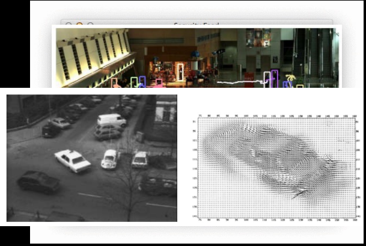
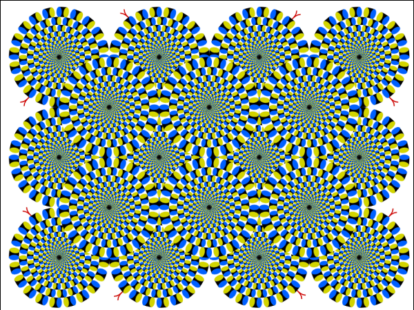
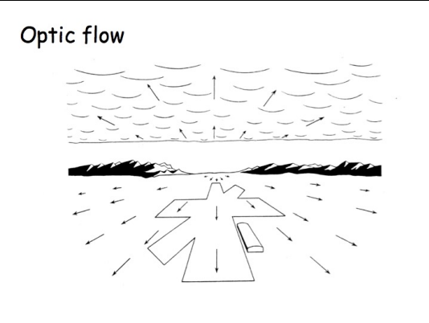
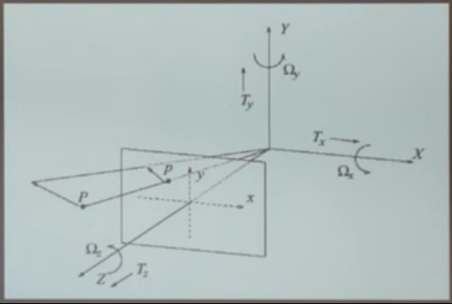
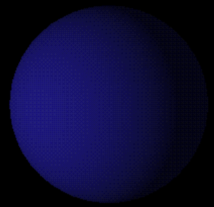
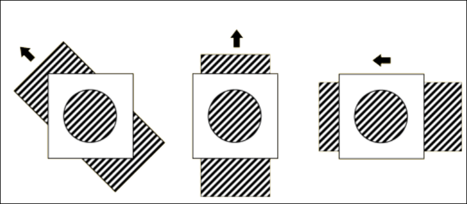
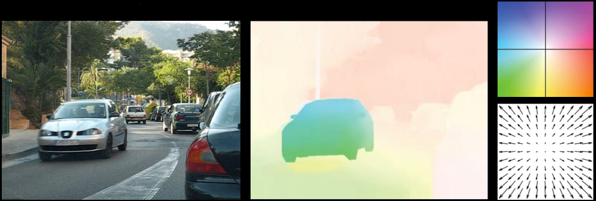
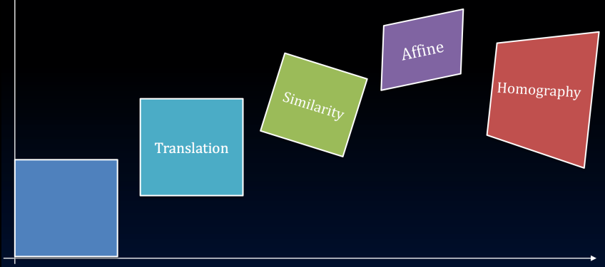

# Dense Motion Analysis

## Motion analysis
- Our world is in motion

- Core problem in computer vision
- Examples:
  - Object tracking
  - Trajectory analysis
  - Object finding
  - Video enhancement, stabilization, 3D reconstruction, object recognition

 
 ## Perception vs Representation
 - We can *perceive* motion where none exists, or not perceive motion where motion exists

 - Shapeless or transparent objects, or limited sight, are problematic
 - Computer would not see motion in the previous images (which is good)
 - … computer doesn’t “see” in the human sense
 - Point being: **computers only analyze motion of opaque, solid objects**
 - Key: **motion representation**

## Representing Motion
- We perceive optic flow
- Pattern of flow (vectors)
- Ecological optics – J.J. Gibson 

- Deviations
  - 3D motion of object is represented as 2D projection—losing 1 dimension of information
  - Optical flow = 2D velocity describing *apparent* motion
 

## Thought Experiments

### Thought Experiment 1
- We have a matte ball, rotating
- **What does the 2D motion field look like?**
- **What does the 2D optical flow field look like?**

### Thought Experiment 2
- We have a matte ball, *stationary*
- **What does the 2D motion field look like?**
- **What does the 2D optical flow field look like?**

## Just to throw a wrench in things…
- The **Aperture Problem**: lighting is not the only source of error

## Aside
- With all these limitations and pitfalls, it’s important to keep the following items in mind (with thanks to Dr. Michael Black):
  - We are, more or less, intentionally forgetting any physics we might know
  - We are dealing with **images**
  - We’re hoping the 2D flow is *related* to the structure of the world and can be a viable proxy for the motion field
  - Fixing the above is important—**you could work on it!**

## Optical Flow
- Motion, or *displacement*, at all pixels
  - Magnitude: saturation
  - Orientation: hue

## Optical Flow Goals
- Find a mapping for each pixel (x1, y1) -> (x2, y2)
  - Seems simple enough…?
- Motion types
  - Translation
$$
\begin{bmatrix}
x_2 \\[6pt]
y_2
\end{bmatrix}
=
\begin{bmatrix}
x_1 + a \\[6pt]
y_1 + b
\end{bmatrix}
$$
  - Similarity

  - Affine

  - Homography

