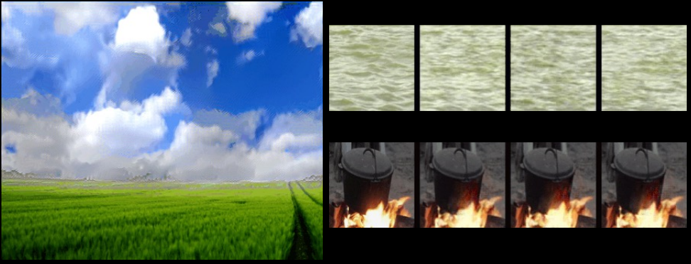
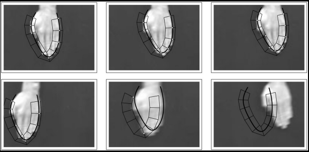
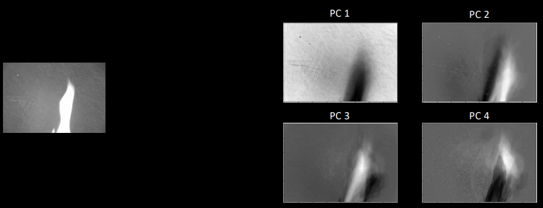
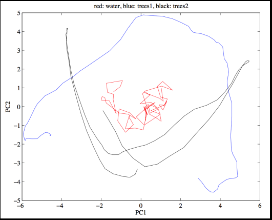
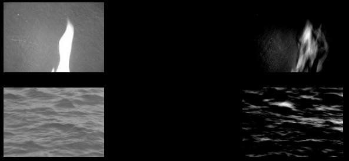
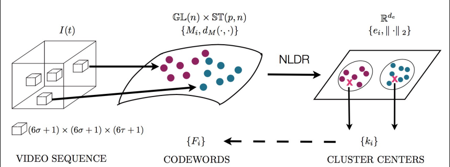
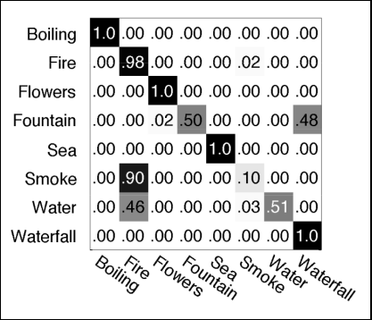
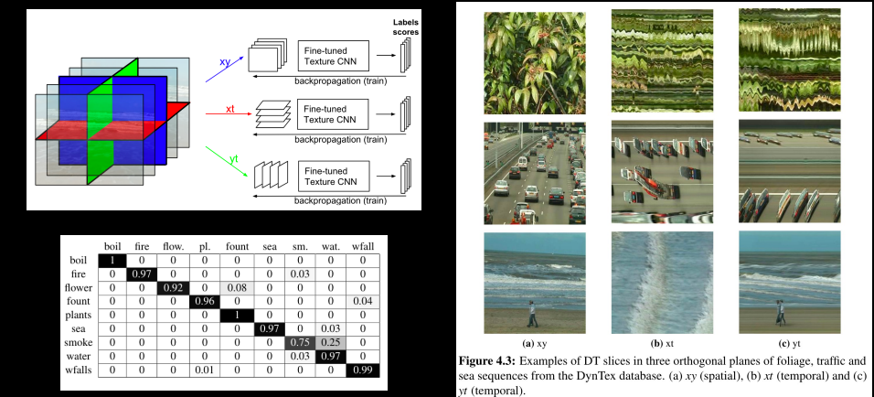
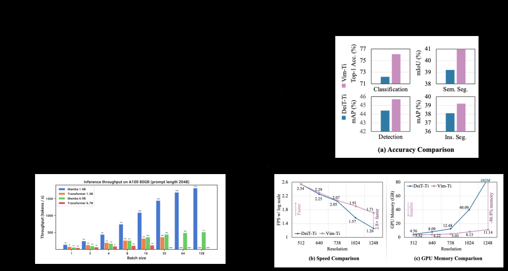

# Linear Dynamical Systems

## Last time...
- Motion analysis via optical flow
- Parametric vs energy-based formulations
- Importance of assumptions
- Modern formulations
    - Robustness to outliers (large optical flow)
    - Relatedness to markov random fields
    - Coarse-to-fine image pyramids

## This lecture
- A specific type of motion: **dynamic textures**



## Dynamic Textures
- *“Dynamic textured sequences are scenes with complex motion patterns due to interactions between multiple moving components.”*
- Examples
    - Blowing leaves
    - Flickering flames
    - Water rippling
- **Multiple moving components: problematic for optical flow**
- How to analyze dynamic textures?

## Dynamical Models
- Goal: an effective procedure for tracking changes over sequences of images, while maintaining a certain coherence of motions
- Hand tracking<br>

- Top row: slow movements
- Bottom Row: fast movements
- Fixed curves or priors cannot exploit coherence of motion

## Linear Dynamical Models
- Two main components (using notation from Hyndman 2006):
- Apperance Model:
$$
\begin{aligned}
y_t &= C\,x_t + u_t
\end{aligned}
$$

- State Model:
$$
\begin{aligned}
x_t &= A\,x_{t-1} + W\,v_t
\end{aligned}
$$

## Autoregressive Models
- This is the definition of a 1st-order autoregressive (AR) process!
$$
\begin{aligned}
x_t &= A\,x_{t-1} + W\,v_t
\end{aligned}
$$
- Each observation ($x_t$) is a function of previous observations, plus some noise
- **Markov model!**
- AR models can have higher orders than 1
- Each observation is dependent on the previous d observations
$$ x_t \;=\; A_1\,x_{t-1} \;+\; A_2\,x_{t-2} \;+\;\dots\;+\;A_d\,x_{t-d} \;+\; W\,v_t $$

## Appearance Model
- $y_t$: image of height $h$ and width $w$ at time $t$, usually flattened into $1 \times hw$ vector (Image in a sequence)
- $x_t$: state space vector at time $t$, $1 \times q$ (where $q <<< hw$) (Low-dimensional "state") 
- $u_t$: white Gaussian noise (Noise inherent to the system)
- $C$: output matrix, maps between spaces, $hw \times q$
$$ y_t = C_\,x_t + u_t $$
- Each of these is 1 column of $C$
- There are $q$ of them (first 4 shown here).


- shows how the appearance of the dynamic texture is factored into a small set of basis images (the columns of $C$), with their weights evolving over time according to the dynamical model.
- How do we learn the appearance model?
- Choose state-space dimension size $q$
- Noise term is i.i.d Gaussian
$$ Y = \bigl[\bar y_{1},\;\bar y_{2},\;\dots,\;\bar y_{f}\bigr]^{T} $$
$$ Y = U\,\Sigma\,V^{T} $$
$$ C = \hat{U} $$
- $\hat{U}$ is a matrix of the first $q$ columns of $U$
$$ X \;=\; \hat{\Sigma}\,\hat{V}^{T} $$
- $\hat{V}$ is a matrix of the first $q$ columns of $V$, and $\hat{\Sigma}$ is a diagonal matrix of the first $q$ singular values

## State Model
- $x_t$ and $x_{t-1}$: Low dimensional state space vectors at times $t$ and $t – 1$, each $1 \times q$ vector
- $A$: State transition matrix, $q \times q$ matrix
- $W$: driving noise, $q \times q$ matrix
- $v_t$: white Gaussian noise
$$ x_t = A_\,x_{t-1} + W_\,v_t $$
- Three textures
- q = 2



## LDS as Generative Models
- Once we’ve learned the parameters, we can *generate new instances*<br>

- Major strength of LDS!

## Problem with LDS
- PCA = Linear + Gaussian
- What if the *state space* isn’t linear, or data aren’t Gaussian?
- Nonlinear appearance models
    - Wavelets
    - IsoMap
    - LLE
    - Kernel PCA
    - Laplacian Eigenmaps
- These introduce their own problems!
- Comparing LDS models
- Given a sequence $Y$: $ \theta = (C, A, Q) $
- New sequence $Y'$: $ \theta' = (C', A', Q') $
- How do we compare these systems?
```
if C1 == C2 \
   and A1 == A2 \
   and Q1 == Q2:
    ...
// WRONG!
```
- Despite linear formulation, $\theta$ are NOT Euclidian
- Valid distance metrics include spectral methods and distribution comparators

## Comparing LDS
- Select multiple, non-overlapping patches from each video
- Build LDS for each patch


- Embed the LDS in low-dimensional space
- Compute cluster centroids in embedding space
    - These centroids become *codewords*
- Represent videos as a *document of codewords*
$$p = \arg\min_{j} \|\,e_{j} - k_{i}\|^{2}$$
    - Compute TF-IDF
$$ w_{ik} \;=\; \frac{N_{ki}}{N_{i}}\;\ln\!\Bigl(\frac{V}{V_{i}}\Bigr) $$
- Perform classification on document weight vectors


- Rows correspond to the true class of each test video patch,
- Columns to the predicted class,
- Cell values are the fraction (or percentage) of patches of the true class (row) that were assigned to each predicted class (column).
- The dark diagonal entries (all 1.0 or near it) show high correct‐classification rates for most textures, while the off‐diagonals (shaded gray) reveal the main confusions—for example, Fountain is misclassified as Waterfall about 48% of the time, and Water is sometimes confused with Boiling (~46%).

## Deep learning + dynamic textures


- Model Architecture
    - take each video and slice it along three orthogonal planes: $xy$ (purely spatial), $xt$ (horiztonal time), $yt$ (vertical time)
    - You feed each slice‐stack into its own copy of a pre‐trained “Texture CNN,” fine‐tuning each stream separately via backpropagation
    - Each stream produces per‐class scores, which you can fuse or vote on at test time
- Classification Results
    -  A confusion matrix over eight dynamic‐texture classes (“boil,” “fire,” “flower,” “fountain,” “sea,” “smoke,” “water,” “waterfall”)
    -  Entries on the diagonal (in black) are high (near 1.0), showing strong per‐class accuracy; off‐diagonal gray cells show the few remaining confusions.
- Example Slices
    - Three example sequences (foliage, traffic, sea) from the DynTex database.
    - For each, you see the $xy$ slice (spatial appearance), the $xt$ slice (horizontal motion over time), and the $yt$ slice (vertical motion over time).
    - These illustrate why you need both spatial and temporal cues to recognize each dynamic texture.
- combining three fine‐tuned CNN streams—each looking at a different spatiotemporal view—yields high accuracy on dynamic‐texture classification.

## Mamba state space models
- Motivated by performance and space considerations of Transformer architectures in large language models
- (Conceptual) combination of RNN + CNN + AR models
- Innovations
    - Input selection mechanism
    - Hardware-aware algorithm
    - Architecture
- Vision Mamba (ViM) for image processing
- Upshot: beat Transformer models of same parameter size, equivalent performance to Transformer models of 2x parameter size
- Much faster inference across the board (ie, generation) and with fewer resources

## Conclusion
- Dynamic textures are motion with statistical regularity
- Regularity can be exploited through parametric representation
- Linear dynamical systems (LDS)
    - Autoregressive models (AR)
    - Markov assumption
    - Representation model + State model
    - Generative Models
- Deep networks can learn the same feature set and in some cases exceed the performance of LDS (though are harder to train)
- Mamba state space models make LDS-like architectures cool again
