# Graphs

## Why graphs?
- Lots of data is graphs
    - Facebook, Twitter, citation data, and other social networks
    - The web, the blogosphere, the semantic web, Freebase, Wikipedia, Twitter, and other *information* networks
    - Text corpora (like RCV1), large datasets with discrete feature values, and other *bipartite* networks
        - nodes = documents or words
        - links connect document $\rightarrow$ word or word $\rightarrow$ document
    - Computer networks, biological networks (proteins, ecosystems, brains, ...), ...
    - Heterogeneous networks with multiple types of nodes
        - people, groups, documents

## Properties of Graphs
- Nodes and Edges
- Set $V$ of vertices/nodes $v_1, \ldots$
- Set $E$ of edges $(u,v), \ldots$
    - Can be weighted/directed/labeled
- *Degree of* $v$ is # of edges on v
    - *Indegree* and *outdegree* for weighted graphs
- *Path* is a sequence of edges $(u1,v1),(u2,v2), \ldots$
- *Geodesic path between* $u$ *and* $v$ is shortest path connecting them
    - Diameter is $\max_{u,v \in V}$ {length of geodesic between $u, v$}
    - Effective diameter is 90th percentile
    - Mean diameter is over connected pairs
- *(Connected) component* is subset of nodes that are all pairwise connected via paths
- *Clique* is subset of nodes that are all pairwise connected via *edges*
- *Triangle* is a clique of size three

- Descriptive statistics
    - Number of connected components
    - Diameter
    - Degree distribution
    - Centrality
    - ...
- Models of formation and growth
    - Erdos-Rayni
    - Watts-Strogatz
    - Preferential attachment
    - Stochastic block models
    - ...

## Biology
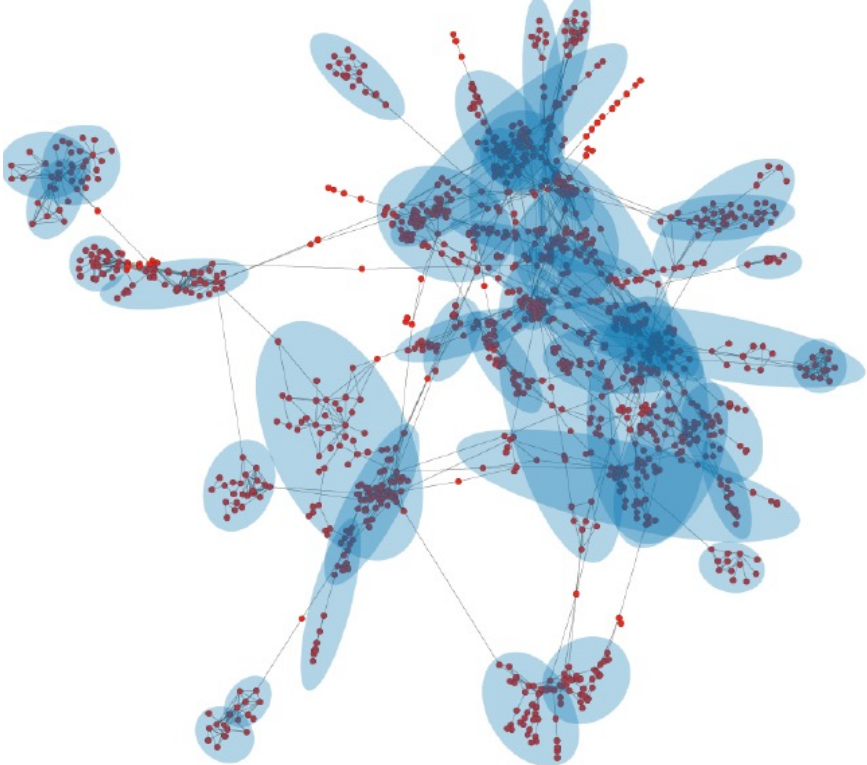
- Protein-protein interaction networks
    - Nodes: proteins
    - Edges: interactions
- Functional modules
- Cell phenotype hierarchies

## Facebook
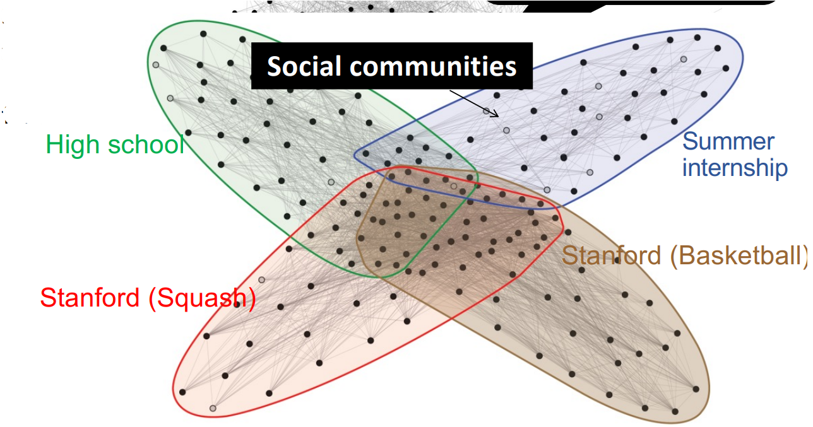
- Social communities
    - Nodes: Facebook users
    - Edges: Friendships

## Blogs
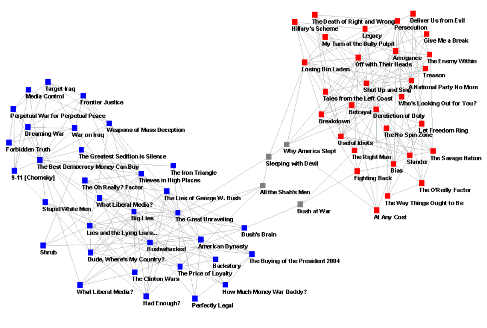
- Nodes are individual blogs about U.S. politics
- Edges are hyperlink references (one blog linking to another).
- Colors/positions reveal two tightly-linked communities—on the left you have predominantly liberal blogs (blue), on the right the conservative blogs (red), and a handful of neutral or cross-cutting sites (gray) sitting in between.
- In short, it shows how political blogs naturally segregate into two echo chambers, with dense intra-community linking and relatively few cross-links.

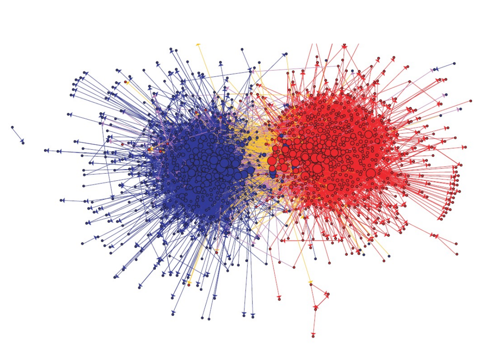
- Arrows show the direction of hyperlinks: who is linking to whom.
- Node size reflects each blog’s total linking activity (in-plus-out degree), so the big circles are the most heavily linked blogs.
- You can clearly see the two dense, self-referential clusters with many internal links and very few arrows crossing the ideological divide—illustrating the echo-chamber structure of the blogosphere at that time

## Erdos-Renyi graphs
- Take $n$ nodes, and connect each pair with probability $p$
    - Mean degree is $z=p(n-1)$
    - Mean number of neighbors distance $d$ from $v$ is $z^d$
- How large does $d$ need to be so that $z^d \ge n $?
    - If $z > 1$, $d = \log(n)/\log(z)$
    - If $z < 1$, you can’t do it
- So: *There tend to be either many small components ($z<1$) or one large one ($z>1$) giant connected component)*
- Another intuition: If there are a two large connected components, then with high probability a few random edges will link them up
- So: *If $z>1$, diameters tend to be small (relative to $n$)*
- A good model of degree distribution in ”natural” networks?

- Exact degree‐distribution in an Erdos-Renyi graph: $$ \Pr\bigl[\deg(v)=k\bigr]\;=\;p_k\;=\;\binom{n}{k}\,p^{k}\,(1-p)^{\,n-k} $$
- For a fixed size $z$ and a large $n$, $$ \Pr[\deg(v) = k] \;\approx\; \frac{z^{k}\,e^{-z}}{k!} $$
- where $$ \binom{n}{k} p^{k}\;\approx\;\frac{n^{k}}{k!}\,p^{k}\;=\;\frac{(n p)^{k}}{k!}\;\approx\;\frac{z^{k}}{k!} $$
- and where $$ (1-p)^{n-k} \approx e^{-z} $$

## Small world experiment
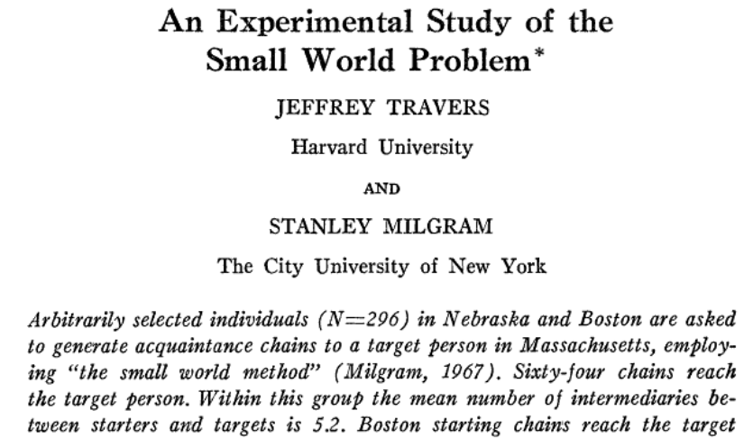
- They started 296 “acquaintance chains” in Nebraska and Boston, trying to forward a letter to a target in Massachusetts by only passing it to someone you personally know.
- Of those 296 chains, 64 actually reached the target, with an average successful chain length of about 6.2 intermediaries.
-  Milgram’s “six degrees of separation” is exactly what you’d expect if the social network were a sufficiently dense random graph: after only $\sim\log(n)$ friend-of-friend hops, you’ve spanned the globe. It demonstrates that real social networks—even though they’re not perfectly random—nevertheless exhibit that same “small-diameter” phenomenon ER theory predicts for $z>1$.

- Illustrations of the Small World
    - Milgram’s experiment
    - [Erdős numbers](http://www.ams.org/mathscinet/searchauthors.html)
    - [Bacon numbers](http://oracleofbacon.org/)
    - [LinkedIn](http://www.linkedin.com/)
    - Privacy issues: the whole network is not visible to all

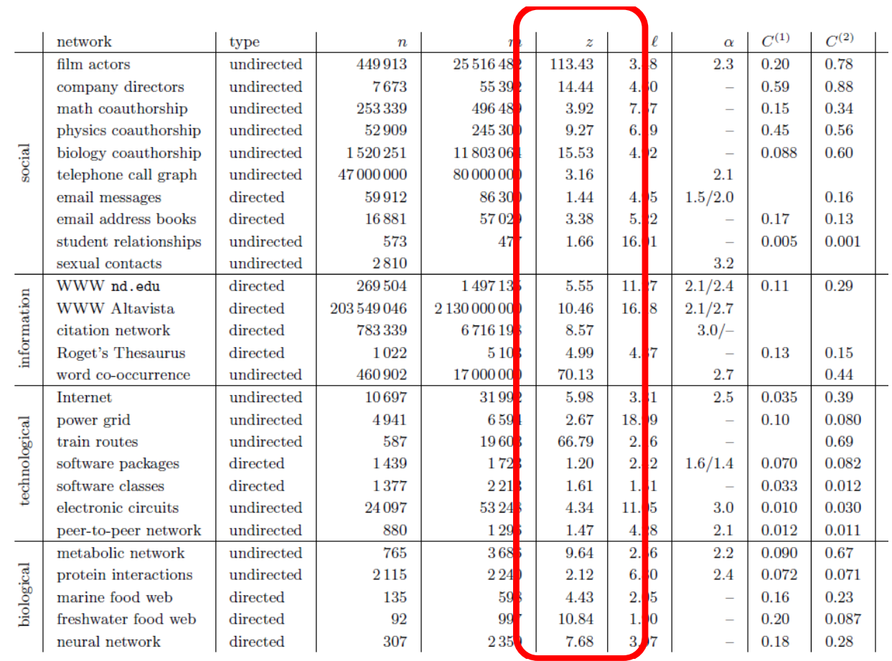

## Degree Distribution
- Plot cumulative degree
    - X axis is degree
    - Y axis is number of nodes whose degree is $\ge k$
- Typically use a log-log scale
    - Straight lines are a power law; normal curve dives to zero at some point
        - **This defines a “scale” for the network**

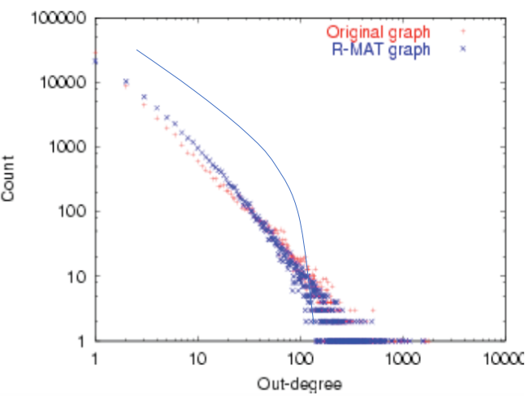
- You can see both graphs roughly lie on a straight line in the midrange—showing the R-MAT model produces a similar heavy‐tailed degree distribution to the original network. this is how you check (and compare) whether your data—or your generator—really follows a power‐law degree distribution, by looking for that straight line on a log–log cumulative‐count plot.

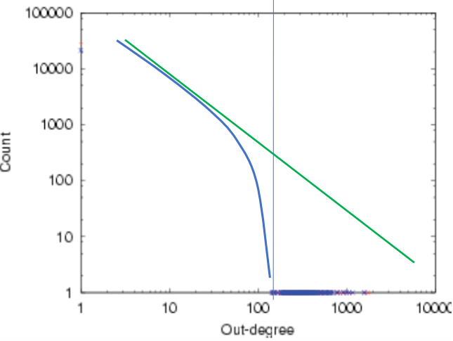
- The green straight line is the best fit over the mid-range degrees, showing the network is roughly scale-free there
- The blue empirical curve (the actual data) bends sharply downward around some $k \approx 100$
- That bending point is where the power law breaks—no nodes exist above that degree—so it defines the maximum scale (finite-size cutoff) of the network
$$ p_{k} \propto k^{-\alpha} $$

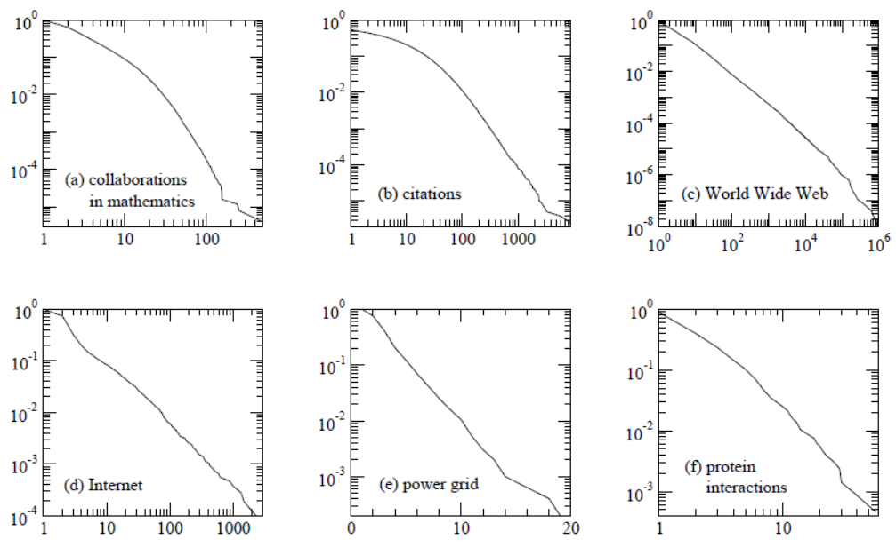
- Cumulative degree distributions for six different networks. The horizontal axis for each panel is vertex degree $k$ (or indegree for the citation and Web networks, which are directed) and the vertical axis is the cumulative probability distribution of degrees, i.e., the fraction of vertices that have degree greater than or equal to $k$. The networks shown are: (a) the collaboration network of mathematicians [182]; (b) citations between 1981 and 1997 to all papers cataloged by the Institute for Scientific Information [351]; (c) a 300 million vertex subset of the World Wide Web, circa 1999 [74]; (d) the Internet at the level of autonomous systems, April 1999 [86]; (e) the power grid of the western United States [416]; (f) the interaction network of proteins in the metabolism of the yeast S. Cerevisiae [212]. Of these networks, three of them, (c), (d) and (f), appear to have power-law degree distributions, as indicated by their approximately straight-line forms on the doubly logarithmic scales, and one (b) has a power-law tail but deviates markedly from power-law behavior for small degree. Network (e) has an exponential degree distribution (note the log-linear scales used in this panel) and network (a) appears to have a truncated power-law degree distribution of some type, or possibly two separate power-law regimes with different exponents.

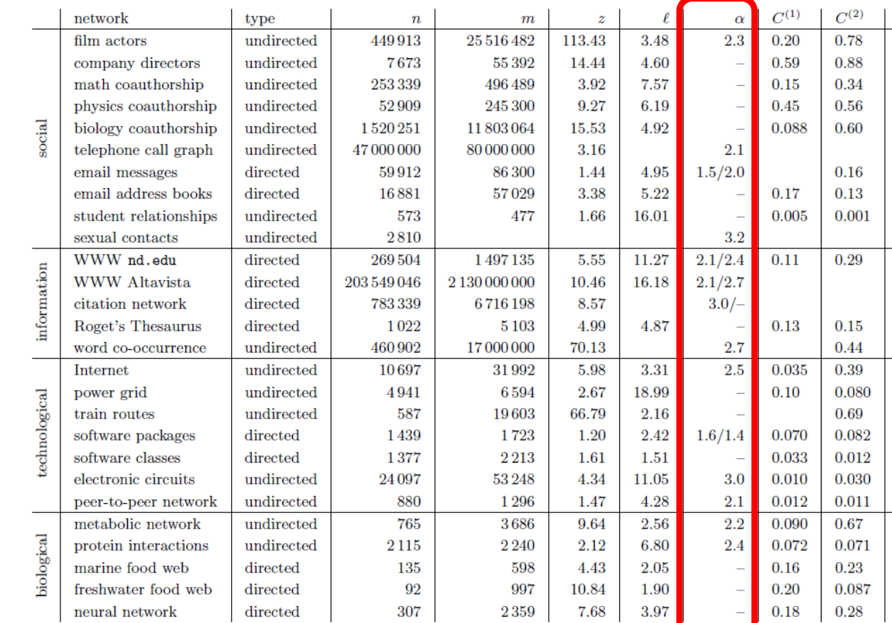
- Whenever a network’s tail really did look like a power law, $ p_{k} \propto k^{-\alpha} $ was estimated and $\alpha$ was recorded. If no clean power‐law regime was found, $\alpha$ was left blank
- can now directly compare, for dozens of very different real graphs (social, information, technological, biological), how “heavy” their tails are

## Graphs
- Some common properties of graphs:
    - **Distribution of node degrees**: **often scale-free**
    - Distribution of cliques (e.g.,triangles)
    - Distribution of paths
        - **Diameter** (max shortest-path)
        - Effective **diameter** (90th percentile) - **often small**
        - Connected components - **usually one giant CC**
    - ...
- Some types of graphs to consider:
    - Real graphs (social & otherwise)
    -  Generated graphs:
        - Erdos-Renyi “Bernoulli” or “Poisson”
        - Watts-Strogatz “small world” graphs
        - Barbosi-Albert “preferential attachment” **generates scale-free graphs**
        - ...

## Barabasi-Albert Networks
- Science 286 (1999)
- Start from a small number of node, add a new node with $m$ links
- Preferential Attachment
    - Probability of these links to connect to existing nodes is proportional to the node’s degree: $$ \Pi(k_i) \;=\; \frac{k_i}{\sum_j k_j} $$
    - ‘Rich gets richer’
- This creates ‘hubs’: few nodes with very large degrees

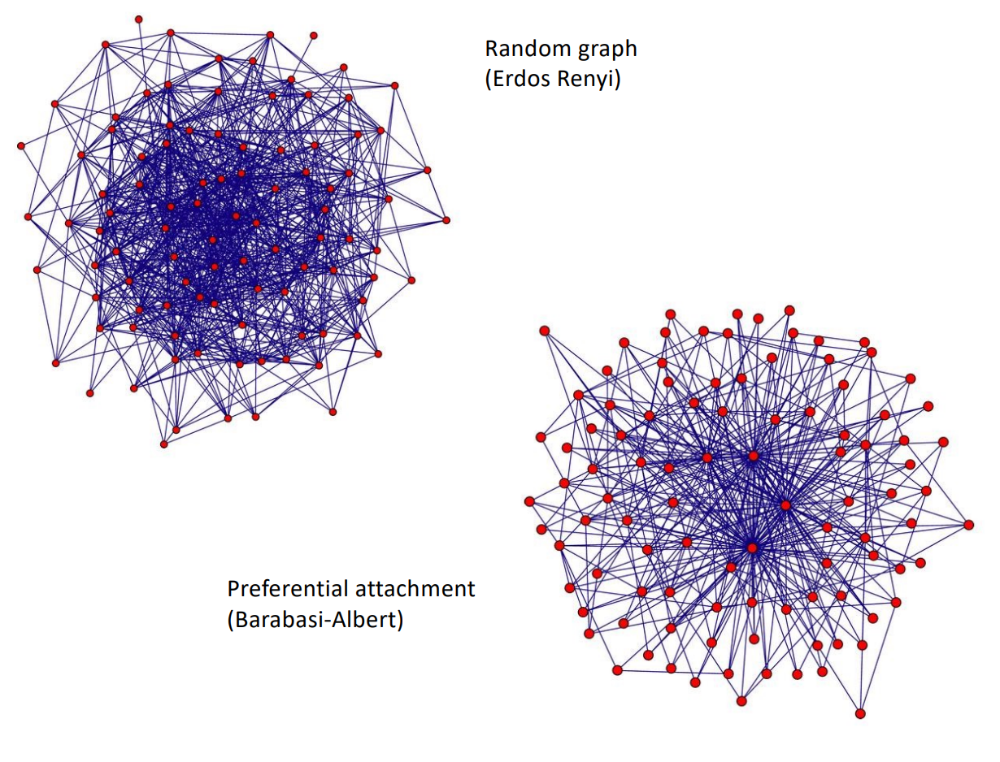
- Erdős–Rényi: every pair of nodes was linked with a fixed probability $p$. The result is a very homogeneous mesh—most nodes have about the same degree, and there are no obvious “important” vertices.
- Barabási–Albert: nodes were added one by one, each leeching $m$ edges onto existing nodes with probability proportional to their current degree (“rich get richer”). You can instantly see the hubs—a handful of high-degree nodes with the bulk of the edges radiating out, and many low-degree nodes hanging on the outskirts
- preferential attachment produces the fat-tailed, hub-dominated structure that random graphs do not

## Homophily
- One definition: excess edges between similar nodes
- Another definition: excess edges between common neighbors of $v$
$$\mathrm{CC}(v) \;=\; \frac{\#\text{ triangles connected to }v}{\#\text{ pairs connected to }v}$$
$$\mathrm{CC}(V, E)=\frac{1}{\lvert V\rvert}\sum_{v}\mathrm{CC}(v)$$
$$CC'(V, E)=\frac{\#\text{triangles in graph}}{\#\text{length-3 paths in graph}}$$
- All three measure the same phenomenon—“if A and B and C are each connected to B, how often is there that extra A–C link?”—but:
    - $ \mathrm{CC}(v) $ is a local, per-vertex score.
    - $ \mathrm{CC}(V, E) $ is the average of those local scores.
    - $ CC'(V, E) $ is the single global ratio of total triangles to total open triples.

- In a random Erdos-Renyi graph: $$ CC'(V, E)=\frac{\#\text{triangles in graph}}{\#\text{length-3 paths in graph}}\;\approx\;\frac{1}{n}\quad\text{for large }n $$
- Probably not realistic!
- In a natural graph, two of your mutual friends might also be friends
    - Both in the same class or organization
    - You introduced them
    - They introduced you

## Watts-Strogatz model
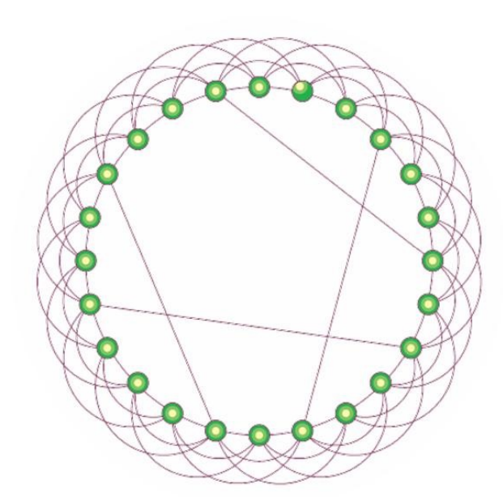
- Start with a ring
- Connect each node to $k$ nearest neighbors
    - $\rightarrow$ homophily
- Add some random shortcuts from one point to another
    - $\rightarrow$ small diameter
- Degree distribution *not* scale free
- Generalizes to $d$ dimensions

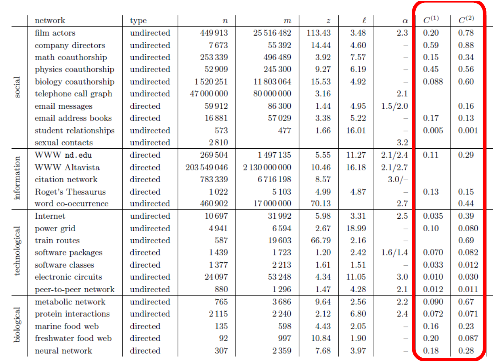
- $C^{(1)}$ is the average local clustering
- $C^{(2)}$ is the global transitivity
- compared to a pure Erdős–Rényi random graph with the same $n$ and mean degree $z$, which would have $C \approx z/n $ i.e. almost zero, you see that real networks are orders of magnitude more “clumpy”, as in they are small worlds

## Google's PageRank
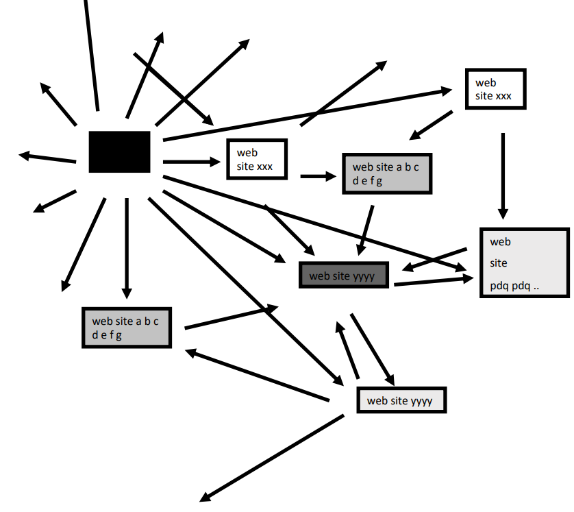
- Inlinks are “good” (recommendations)
- Inlinks from a “good” site are better than inlinks from a “bad” site
- but inlinks from sites with many outlinks are not as “good”...
- “Good” and “bad” are relative.

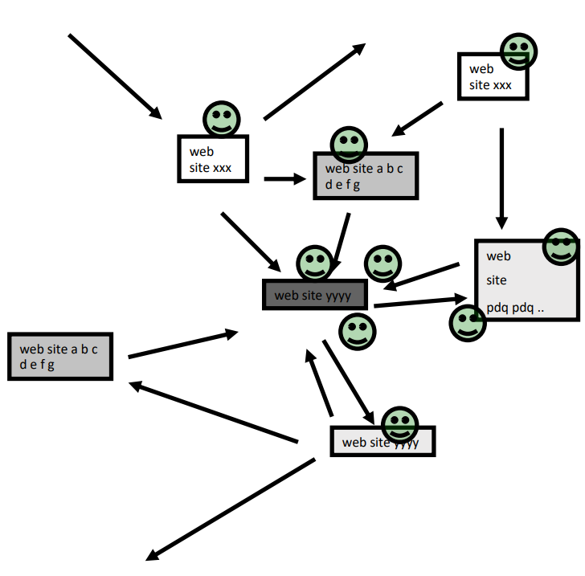
- Imagine a “pagehopper” that always either
    - follows a random link, or
    - jumps to random page
- PageRank ranks pages by the amount of time the pagehopper spends on a page:
    - or, if there were many pagehoppers, PageRank is the expected “crowd size”

## Random Walks
- $G$: a graph
- $P$: transition probability matrix
$$ P(u,v)=\begin{cases}\dfrac{1}{d_u} & \text{if } u : v\\[6pt]0, & \text{otherwise}\end{cases} \text{ where } d_u \coloneqq \text{the degree of }u
$$
- A lazy walk: $$ W = \frac{I + P}{2} $$

## Random Walks: PageRank
- A (bored) surfer
- either surf a random webpage wit probability $\alpha$
- or surf a linked webpage with probability $1 - \alpha$
- $\alpha$: the jumping constant
$$ p \;=\; \alpha \Bigl(\tfrac{1}{n},\,\tfrac{1}{n},\,\dots,\,\tfrac{1}{n}\Bigr)\;+\;(1 - \alpha)\,pW $$
- Two equivalent ways to define PageRank $ p=pr(\alpha , s) $
- (1) $$ p \;=\; \alpha\,s \;+\;(1 - \alpha)\,pW $$
- (2) $$ p \;=\; \alpha \sum_{t=0}^{\infty} (1 - \alpha)^{t}\,\bigl(sW^{t}\bigr) $$
$$ s = (\frac{1}{n}, \frac{1}{n}, \ldots, \frac{1}{n}) \rightarrow \text{ the (original) PageRank } $$
$$ s = \text{ some "seed", e.g., } (1, 0, \ldots, 0) \rightarrow \text{ personalized PageRank } $$

## Graph = Matrix
- Vector = Node $\rightarrow$ Weight

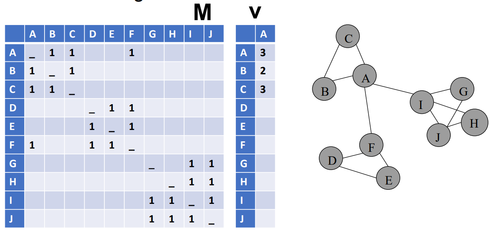

## PageRank
- Let $u = (\frac{1}{N}, \ldots, \frac{1}{N})$
    - dimension = #nodes N
- Let $A$ = adjacency matrix: $[a_{ij}=1 \iff i \text{ links to } j]$
- Let $W = [w_{ij} = \frac{a{ij}}{\mathrm{outdeg}(i)}]$
    - $w_ij$ is probability of jump from $i$ to $j$
- Let $v^0 = (1,1,\ldots,1)$
    - or anything else you want
- Repeat until converged:
    - Let $v^{t+1} = cu + (1-c)Wv^{t}$
        - $c$ is probability of jumping “anywhere randomly”
