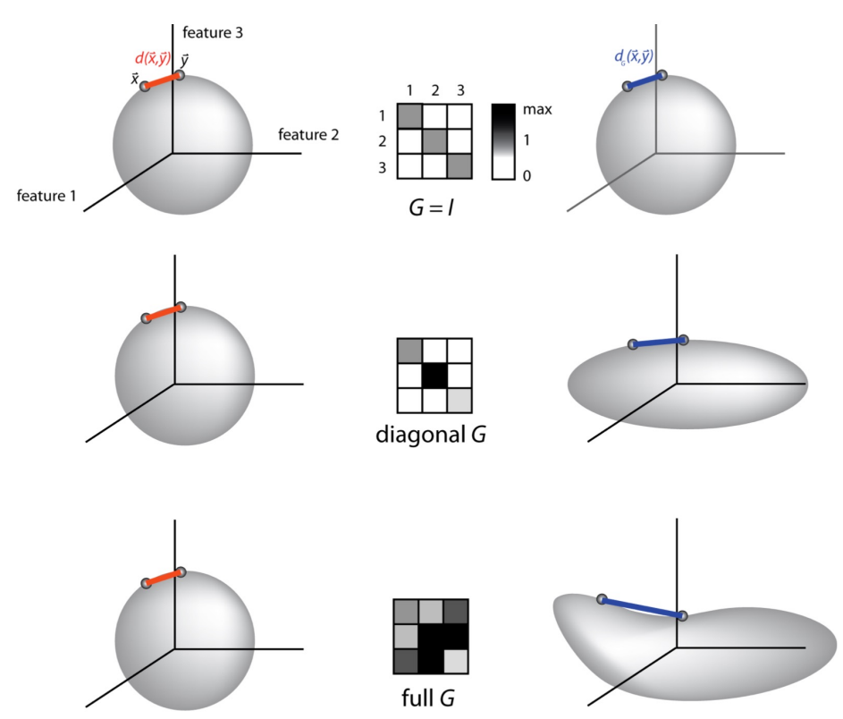
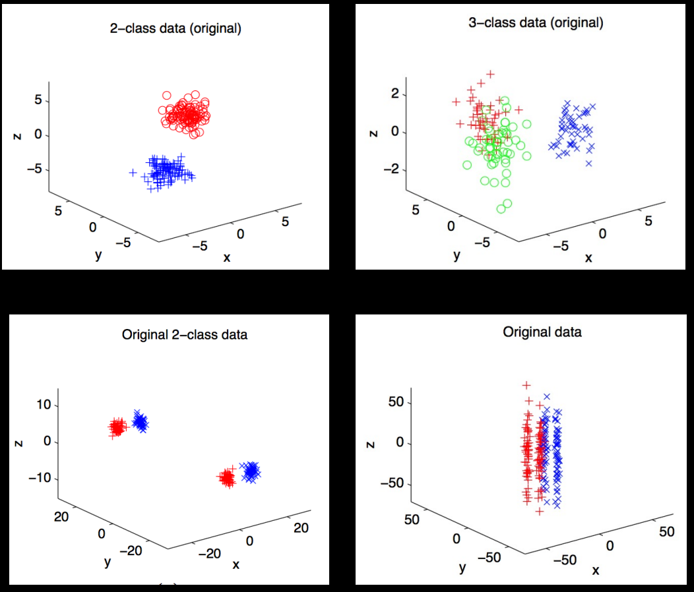
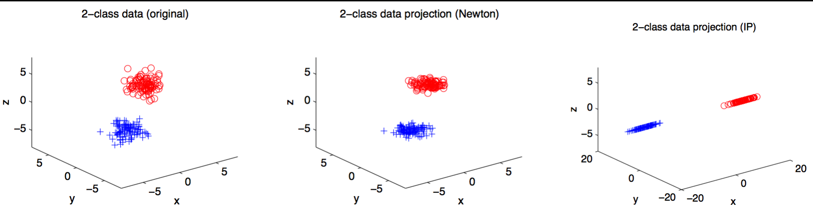
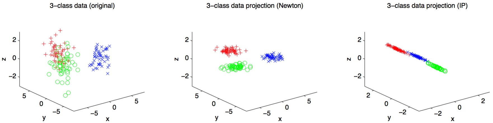
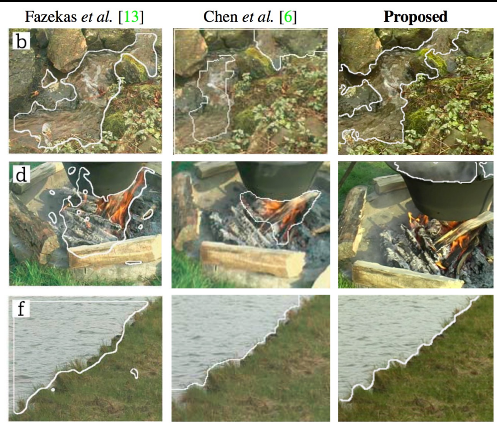
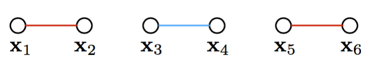
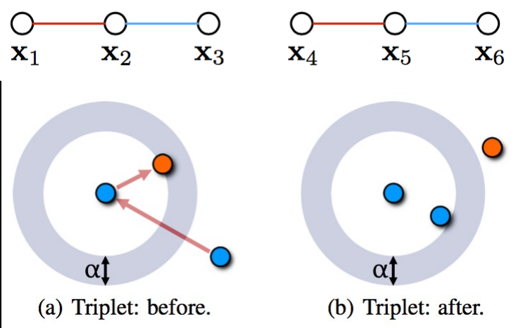
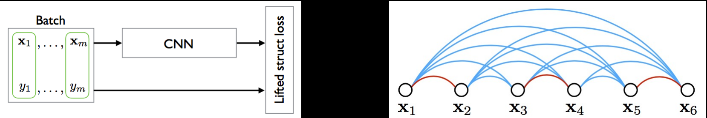
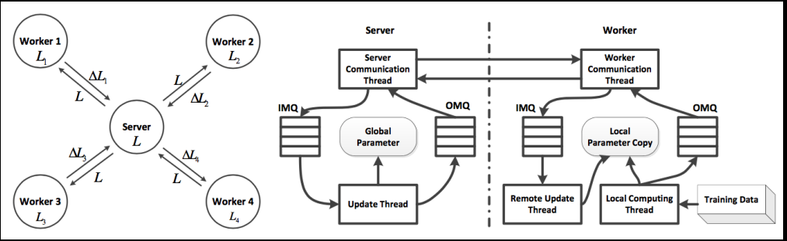

# Embeddings 1: Metric Learning

## Previously...
- Spectral Clustering
1. Define graph (affinities $\rightarrow$ Laplacian)
2. Compute eigenvectors (*embedding*)
3. Cluster embeddings trivially ($k$-means)

## Embeddings
- What is an *embedding*?
$$ f : X \to Y $$
    - Mapping
    - Transformation
    - Reveals/preserves "structure"


- From Vicki Boykis’ “What Are Embeddings” (2023)
    - ***Transforms*** multimodal input into representations that are easier to perform intensive computation on, in the form of **vectors**, tensors, or graphs. For the purpose of machine learning, we can think of vectors as a list (or array) of numbers.
    - ***Compresses*** input information for use in a machine learning **task** - the type of methods available to us in machine learning to solve specific problems - such as summarizing a document or identifying tags or labels for social media posts or performing **semantic search** on a large text corpus. The process of compression changes variable feature dimensions into fixed inputs, allowing them to be passed efficiently into downstream components of machine learning systems.
    - ***Creates (represents) an embedding space*** that is specific to the data the embeddings were trained on but that, in the case of deep learning representations, can also generalize to other tasks and domains through **transfer learning** - the ability to switch contexts - which is one of the reasons embeddings have exploded in popularity across machine learning applications.

## Embedding Strategies (non-DL)
- Principal Components Analysis (PCA) : Linear
    - Sparse & Kernel PCA : Sparse & Nonlinear
- Independent Components Analysis (ICA) : Non-Gaussian
- Non-negative Matrix Factorization (NMF) : Non-negative
- Locally-linear Embeddings (LLE) : Nonlinear
- Dictionary Learning : Sparse & Nonlinear

## Million dollar question: How to know the embedding is right?
- If you’re performing **classification**, it’s pretty easy to know if your embedding is “right”
    - Error decreases? $\rightarrow$ right!
    - Error increases? $\rightarrow$ wrong!
- what about for **unsupervised learning**?

## Assumptions
- Choice of embedding $\rightarrow$ assumptions about the data
- **What if we knew something about the data?**
- **"Side information"**: we  don’t know what classes/clusters the data belong to, but we do have some notion of similarity

## Side information
- Define a set $S$
    - for every pair $x_i$ and $x_j$ that are similar, we put this pair in $S$
- "Similar" is user-defined; can mean anything
- Likewise have a set $D$
    - for every pair $x_i$ and $x_j$ that are dissimilar, we put this pair in $D$
    - can consist of every pair not in $S$, or specific pairs if information is available
- We have this similarity information; what can we do with it?

## Distance metrics
- Goal: use side-information to **learn a new distance metric**
- Encode our side-information in a “metric” $A$
- Generalization of Euclidean distance
    - Note when $A = I$, this is regular Euclidean distance
    - When $A$ is diagonal, this is a “weighted” Euclidean distance
    - When data are put through nonlinear basis functions $\phi$, nonlinear metrics can be learned
$$ 
d(\vec{x}, \vec{y}) = d_{A}(\vec{x}, \vec{y}) 
= \| \vec{x} - \vec{y} \|_{A} 
= \sqrt{(\vec{x} - \vec{y})^{T}A(\vec{x} - \vec{y})} 
= \sqrt{(\phi(\vec{x}) - \phi(\vec{y}))^{T}A(\phi(\vec{x}) - \phi(\vec{y}))} 
$$

- Quick review: **What constitutes a *valid distance* metric?**
    1. Non negativity $$ d(\vec{x}, \vec{y}) \ge 0 $$
    2. Symmetry $$ d(\vec{x}, \vec{y}) = d(\vec{y}, \vec{x}) $$
    3. Triangle Inequality $$ d(\vec{x}, \vec{x}) \le d(\vec{x}, \vec{y}) + d(\vec{y}, \vec{z}) $$
    4. (**Not valid, "Pseudometric"**) Identity of indiscernibles $$ d(\vec{x}, \vec{y}) = 0 \iff x = y $$

## Form of a metric
- Learning metric $A$ ($G$ in figure) also equivalent to replacing each point $x$ with $A^{\frac{1}{2}}x$ and using standard Euclidean distance
- **It’s an embedding!**
- Learning a **space** inhabited by your data
    - Bonus: easy to incorporate new data! (unlike LLE or others)



## Learning a metric (1)
- Goal: Define a metric A that respects constraint sets $S$ and $D$
- Simple enough: constrain all pairs in $S$ to have small distances
$$ \min_{A}\sum_{\vec{x},\,\vec{y}\in S}\bigl\lVert \vec{x} - \vec{y} \bigr\rVert_{A}^{2} $$
- Is that all?
    - **Nope – trivially solved with $A = 0$**

## Learning a metric (2)
- Additional constraint: use pairs in $D$ to guarantee non-zero distances
$$ \sum_{\vec{x},\,\vec{y}\in D}\bigl\lVert \vec{x} - \vec{y} \bigr\rVert_{A} \ge 1 $$
- (choice of 1 is arbitrary; any other constant $c$ would have the effect of replacing $A$ with $c^{2}A$)
- Is that all?
    - **Nope – need to ensure $A$ is positive semi-definite (why?)**

```
Why is it important for metric matrices to be positive semi-definite?
    a. The matrix can be inverted (raised to -1 power)
    b. The matrix is mostly happy
    c. The matrix forms a convex basis
    d. The eigenvalues of the matrix are real // correct
```

## Aside!
- We used squared Euclidean distance in the first constraint $$ \min_{A}\sum_{\vec{x},\,\vec{y}\in S}\bigl\lVert \vec{x} - \vec{y} \bigr\rVert_{A}^{2} $$
- But not in the second! why? $$ \sum_{\vec{x},\,\vec{y}\in D}\bigl\lVert \vec{x} - \vec{y} \bigr\rVert_{A} \ge 1 $$
- Squared distance in 2nd constraint would always result in **rank-1 $A$**, i.e. the data would always be projected on a line

## Learning a metric (3)
- A third constraint: keep $A$ positive semi-definite $$ A \succeq 0 $$
    - (this means the diagonal is always $\ge 0$)
- If $A$ is PSD, its eigenvectors and eigenvalues exist and are real: $$ A = X \Lambda X^{T} $$
- Set any negative eigenvalues to 0: $$ \Lambda' \;=\;\mathrm{diag}\bigl(\max\{0,\lambda_{1}\},\;\dots,\;\{0,\lambda_{n}\}\bigr) $$
- Compute $A’$: $$ A' = X \Lambda' X^{T} $$

## Learning a Metric
- We have our constraints!
$$ \min_{A}\sum_{\vec{x},\,\vec{y}\in S}\bigl\lVert \vec{x} - \vec{y} \bigr\rVert_{A}^{2} $$
$$ \sum_{\vec{x},\,\vec{y}\in D}\bigl\lVert \vec{x} - \vec{y} \bigr\rVert_{A} \ge 1 $$
$$ A \succeq 0 $$
- How do we learn $A$?
    - *(Hint)* Linear in parameters of $A$
    - *(HINT)* First two constraints are verifiably convex

## Convex optimization
- For diagonal A, this is easy: $$ g(A) \;=\; g(A_{11},\dots,A_{nn})\;=\;\sum_{(x_i,x_j)\in S}\|x_i - x_j\|_{A}^{2}\;-\;\log\!\Bigl(\sum_{(x_i,x_j)\in \mathcal{D}}\|x_i - x_j\|_{A}\Bigr) $$
- (just a fancy reformulation of the original constraints)
- Minimizing $g$ is equivalent to solving original problem, up to multiplication of $A$ by a positive constant
- **Gradient descent!** (step-size intrinsically enforces PSD of $A$)

- Trickier for full $A$
- Gradient ascent + iterative projections
- For this to work, constraints needed to be reversed

- **Iterate**
    - **Iterate**
        - $ A \;\coloneqq\; \arg\min_{A'}\;\{\,\|A' - A\|_{F}\;:\;A' \in C_{1}\} $
        - $ A \;\coloneqq\; \arg\min_{A'}\;\{\,\|A' - A\|_{F}\;:\;A' \in C_{2}\} $
    - **until** $A$ converges
    - $ A \;\coloneqq\; A \;+\;\alpha\;\bigl(\nabla_{A}g(A)\bigr)_{\perp \nabla_{A}f} $
- **until** convergence

## Constraint reforumulation
| Previous                                                                                     | Current                                                                                     | Symbolically |
|----------------------------------------------------------------------------------------------|---------------------------------------------------------------------------------------------|--------------|
| $$ \min_{A}\sum_{\vec{x},\,\vec{y}\in S}\bigl\lVert \vec{x} - \vec{y} \bigr\rVert_{A}^{2} $$ | $$ \sum_{\vec{x},\,\vec{y}\in S}\bigl\lVert \vec{x} - \vec{y} \bigr\rVert_{A}^{2}  \le 1 $$ | $$ C_1 $$    |
| $$ \sum_{\vec{x},\,\vec{y}\in D}\bigl\lVert \vec{x} - \vec{y} \bigr\rVert_{A} \ge 1 $$       | $$ \max_{A}\sum_{\vec{x},\,\vec{y}\in D}\bigl\lVert \vec{x} - \vec{y} \bigr\rVert_{A} $$    | $$ g(A) $$   |
| $$ A \succeq 0 $$                                                                            | $$ A \succeq 0 $$                                                                           | $$ C_2 $$    |

## GA + IP
- Previous algorithm:
    - **Iterate**
        - **Iterate**
            - $ A \;\coloneqq\; \arg\min_{A'}\;\{\,\|A' - A\|_{F}\;:\;A' \in C_{1}\} $
            - $ A \;\coloneqq\; \arg\min_{A'}\;\{\,\|A' - A\|_{F}\;:\;A' \in C_{2}\} $
        - **until** $A$ converges
        - $ A \;\coloneqq\; A \;+\;\alpha\;\bigl(\nabla_{A}g(A)\bigr)_{\perp \nabla_{A}f} $
    - **until** convergence
- Reformulated algorithm:
    - **Iterate**
        - **Iterate**
            - $ \sum_{\vec{x},\,\vec{y}\in S}\bigl\lVert \vec{x} - \vec{y} \bigr\rVert_{A}^{2}  \le 1 $
            - $ A \succeq 0 $
        - **until** $A$ converges
        - $ A \coloneqq A + \alpha\nabla\max_{A}\sum_{\vec{x},\,\vec{y}\in D}\bigl\lVert \vec{x} - \vec{y} \bigr\rVert_{A} $
    - **until convergence**


- the heatmap of the metric after the 1st-6th outer iterations (inner projections have already converged at each step) are shown, together with the distribution of distances those metrics induce
- You can see the matrix slowly morph from its initialization toward a final PSD shape that spreads dissimilar feature-pairs apart (brighter off-diagonals in the heatmap) while the histogram of learned distances shifts and sharpens

## Experiments
- Generated artificial 3D data<br>

    - 2 class
    - 3 class
    - separated by y-axis
    - separated by z-axis





## Other Applications
- Video scene segmentation
- Identifying dynamic textures in videos



## Other formulations
- **Deep metric learning**
    - Differentiates different metric constraints
        - Contrastive <br> 
            - Pick pairs labeled "same" or "different"; Penalize large distances for “same” pairs and small distances for “different” pairs
        - Triplet <br> 
            - Form triplets **(anchor,positive,negative)** (the ring diagram: anchor in the center, positive inside the margin and negative outside); Enforce $d(\text{anchor, positive}) + \alpha < d(\text{anchor, negative})$ so positives move closer and negatives further away
        - Lifted structure <br>
            - Within each mini-batch of labeled examples, consider all positive and negative pairs at once; Feed the batch through a CNN to get embeddings, then apply a single “lifted” loss that simultaneously pulls together every positive pair and pushes apart every negative pair
- **Adaptive densities** <br> ![visual 1: many overlapping class-conditional “balls” of points in an embedding space; after magnet‐loss training, each class’s cluster has been pulled tightly together and pushed far from its neighbors. visual 2: Triplet loss embeddings, magnet loss embeddings, and softmax embeddings are compared for  two example object categories. visual 3: Plots training error versus number of iterations on four benchmarks (Pets, Flowers, Dogs, ImageNet Attributes); In every case the blue magnet‐loss curve converges faster and to a lower error than the orange triplet‐loss curve](./pics/magnetLoss_visual.png)
    - Introduces “magnet loss” *(how does it work?)*
        - Optimizes over entire neighborhoods simultaneously
        - Reduces distribution overlap, rather than just pairs or triplets
    - Requires ground-truth labels
- **Larg-scale metric learning**
    - If feature space is extremely large, iterative eigen-decompositions are a deal-breaker
    - Nested convex optimization is a deal-breaker
    - Represent metric $A = L^{T}L$
        -  Learn $L$ directly, instead of $A$
$$ \min_{L} \sum_{(x,y)\in \mathcal{S}} \bigl\lVert L\,(x - y)\bigr\rVert^{2} \quad \text{such that} \quad \|L(x - y)\|^{2} \;\ge\; 1,\quad\forall\,(x,y)\in \mathcal{D} $$
    -  Use hinge loss to induce unconstrained optimization
$$ \min_{L}\;\sum_{(x,y)\in \mathcal{S}}\|L(x - y)\|^{2}\;+\;\lambda\sum_{(x,y)\in \mathcal{D}}\xi_{x,y} \quad \text{such that} \quad \|L(x - y)\|^{2} \;\ge\; 1 - \xi_{x,y},\quad\xi_{x,y} \;\ge\; 0,\quad\forall\,(x,y)\in \mathcal{D} $$
$$ \min_{L}\;\sum_{(x,y)\in \mathcal{S}}\|L(x - y)\|^{2}\;+\;\lambda\sum_{(x,y)\in \mathcal{D}}\max\bigl(0,\;1 - \|L(x - y)\|^{2}\bigr) $$
    -  Parameter server for SGD-based metric updates


- Conceptual flow of $L$:
    - A central server holds the “master” copy of the factor $L$.
    - It broadcasts $L$ out to each of several workers.
    - Each worker uses its local shard of $\mathcal{S}$ and $\mathcal{D}$ pairs to compute an update $\Delta L_i$, then pushes $\Delta L_i$ back to the server.
    - The server aggregates those $\Delta L_i$s into a new global $L$, and the loop continues asynchronously
- nuts-and-bolts implementation of that parameter server:
    - On the server side you have a “Communication Thread” that reads incoming gradient‐messages (IMQ), an “Update Thread” that applies them to the Global Parameter, and a queue for outgoing new parameters (OMQ).
    - On each worker, a symmetric pair of threads maintains a Local Copy of $L$: one thread pulls new parameters down from OMQ, another thread pulls training data, computes its local gradient, and pushes $\Delta L$ back up via IMQ.
