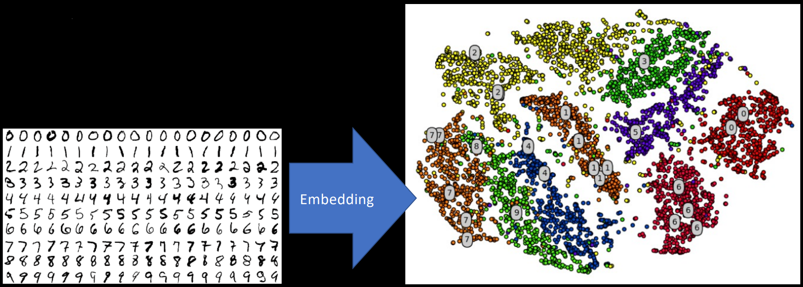
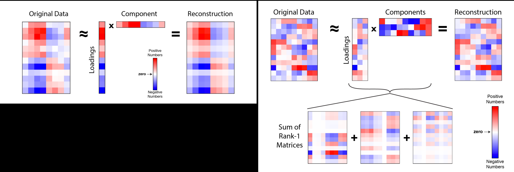
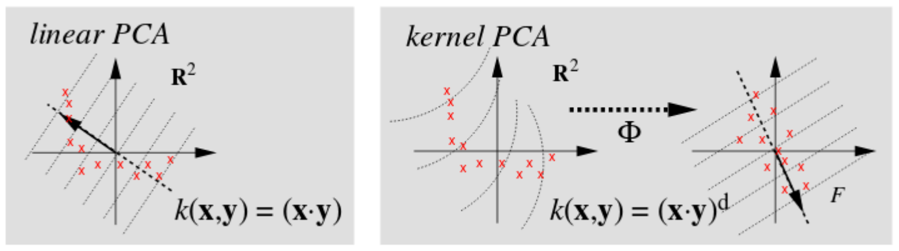
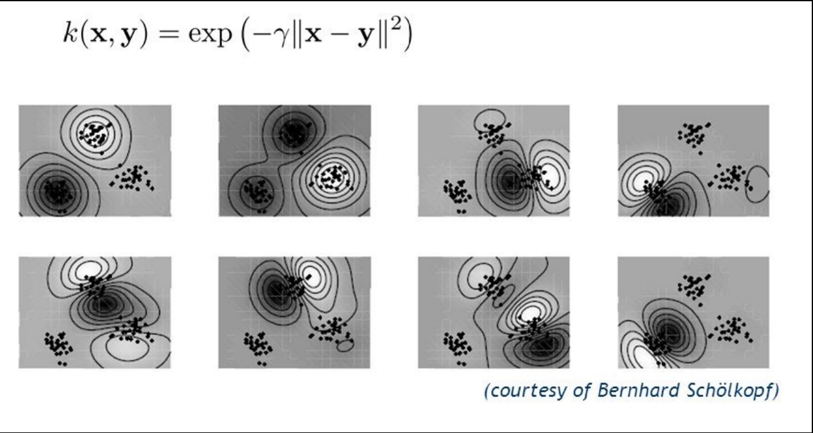
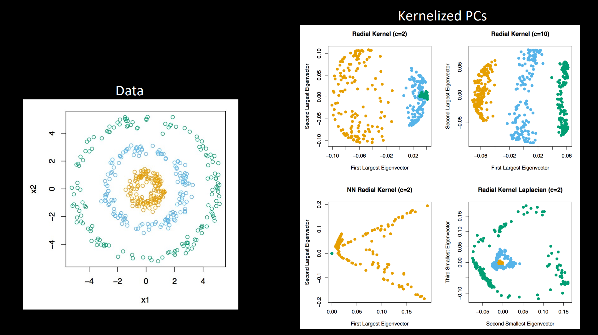
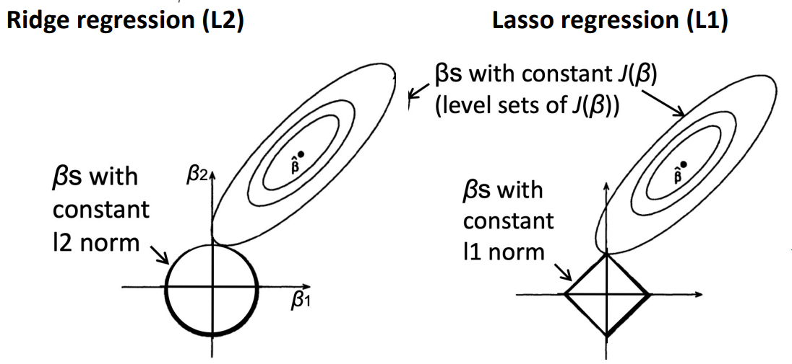
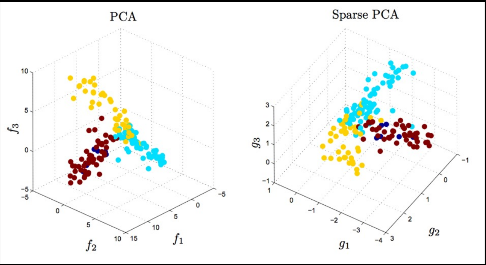
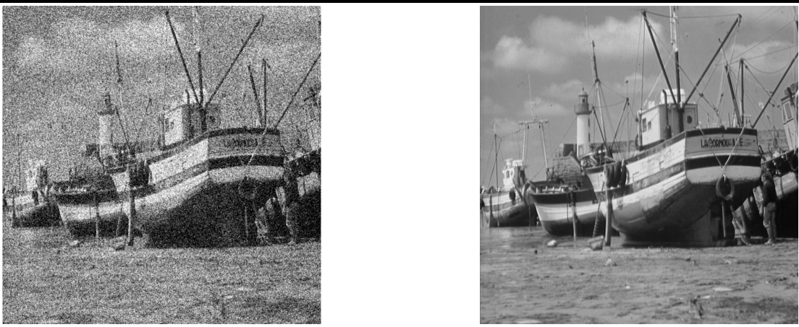

# Embeddings 2: Sparse & Kernel PCA, Dictionary Learning

## Embeddings
- What is an *embedding*?
$$ f : X \to Y $$
    - Mapping
    - Transformation
    - Reveals/preserves "structure"

- “Degrees of freedom” versus “intrinsic dimensionality”
    - Despite 64x64 pixels, only so many ways to draw a 9
    - **Low-dimensional manifold**

## Principal Component Analysis (PCA)
1. Orthogonal projection of data
2. Lower-dimensional linear space known as the *principal subspace*
3. Variance of the projected data is maximized

- Two definitions of PCA:
    - Definition 1: Maximizing variance
    - Definition 2: Minimizing Reconstruction Error
    - Both are essentially "two sides of the same coin"

## Maximizing Variance
- We start with the idea of projection from $D$-dimensions $x$ to $M$-dimensions $u$
    - $u$ is a unit vector, so $u^{T}u = 1$.
- Mean of projected data is $u^{T}\bar{x}$, where $\bar{x} = \frac{1}{N}\sum_{n=1}^{N}x_{n}$
- Variance of the projected data:: $$ \frac{1}{N}\sum_{n=1}^{N}\{ \vec{u}_{1}^{T}\vec{x}_{n} - \vec{u}_{1}^{T}\bar{x} \} = \vec{u}_{1}^{T}S\vec{u}_{1} $$
- where $S$ is the sample covariance matrix of the data: $$ S = \frac{1}{N}\sum_{n=1}^{N}(\vec{x}_{n} - \bar{x})(\vec{x}_{n} - \bar{x})^{T} $$

- We want to maximize projected variance $u_{1}^{T}Su_{1}$ with respect to $u_1$
- Obvious problem: needs to be constrained, or else $\| u_1 \| \rightarrow \infty$
- Appropriate constraint: $u_{1}^{T}u_{1} = 1$, enforced with Lagrange multiplier: $$ \vec{u}_{1}^{T}S\vec{u}_{1} + \lambda_{1}(1 - \vec{u}_{1}^{T}\vec{u}_{1}) $$
- Set derivative with respect to $u_1 = 0$, and a stationary point appears: $$ S\vec{u}_{1} = \lambda_{1}\vec{u}_{1} $$
- Means $u_1$ must be an eigenvector of $S$! Left multiply by $u_{1}^{T}$: $$ \vec{u}_{1}^{T}S\vec{u}_{1} = \lambda_{1} $$

## Minimizing Error
- We want the reconstruction error using the first $M < D$ principal components to be minimal: $$ J = \frac{1}{N}\sum_{n=1}^{N}\| \vec{x}_{n} - \tilde{x}_{n} \|^{2} $$
    - We want to minimize $J$
- This can be written purely in terms of eigenvectors $u_i$: $$ J = \sum_{n = M + 1}^{D}\vec{u}_{i}^{T}S\vec{u}_{i} $$
    - Eigenvectors $u_i$ come out of equation for $\tilde{x}$
- Therefore, the distortion measure of reconstruction using the M eigenvectors of the largest eigenvalues is the sum of the remaining $D - M$ eigenvalues: $$ J = \sum_{n = M + 1}^{D}\lambda_{i} $$

- Left panel: rank-1 approximation
    - Original Data: the full $N \times D$ data matrix (here shown as a heatmap).
    - Loadings: an $N$-vector of projection scores (one score per sample) onto the first principal component.
    - Component: a $D$-vector (the first principal axis or eigenvector).
    - Reconstruction: the outer product of the loadings and the component which is the best single-component approximation minimizing $J$
- Right panel: sum of rank-1 matrices (rank-$M$ approximation)
    - You stack the first $M$ loading vectors into an $N \times M$ Loading matrix and the first $M$ components into an $M \times D$ Component matrix.
    - Their product gives the $N \times D$ Reconstruction using $M$ PCs
    - Equivalently, this is just the sum of $M$ rank-1 matrices
    - Again, this minimizes the total squared reconstruction error
- Notice how in both, the reconstruction looks very similar to the original but "smoother"

## PCA Adv/Disadv
- Advantages
    - Optimal low-rank approximation in terms of squared reconstruction error
    - Completely unsupervised
    - Endless applications
- Disadvantages
    - Principal components are linear combinations (cannot generatenonlinear PCs; struggles to determine PCs in geodesic spaces)
    - Basis vectors are dense and sometimes difficult to interpret

## Kernel PCA
- Whenever we compute a *kernel*, we rely on a scalar (dot) product of the form $x^{T}x$
- Conventional PCA is an outer product (covariance), $XX^{T}$
- What if we replaced this with an inner product, $X^{T}X$
    - This “Gram matrix” is what we compute eigenvectors of in PCA anyway
- If anything, Kernel PCA is a *generalization* of PCA to arbitrary similarity (kernel) functions!
- **First step**: express conventional PCA such that data vectors x appear only in the form of scalar products

- Recall that the principal components are defined by eigenvectors of the covariance matrix $$ S\vec{u}_{i} = \lambda_{i}\vec{u}_{i} $$
    - $i$ is the dimensional index
- and sample covariance matrix defined by $$ S = \frac{1}{N}\sum_{n=1}^{N}\vec{x}_{n}\vec{x}_{n}^{T} $$
    - $N$ is the number of data points
- and eigenvectors are normalized such that $$ \vec{u}_{i}^{T}\vec{u}_{i} = 1 $$

- In kernel PCA, we consider data that have already undergone a nonlinear transformation: $$ \vec{x} \in \mathcal{R}^{D} \to \phi(\vec{x}) \in \mathcal{R}^{M} $$
- **We now perform PCA on this new $M$-dimensional feature space**

- Sample covariance matrix $C$ (now $M \times M$): $$ C = \frac{1}{N}\sum_{n=1}^{N}\phi(\vec{x}_{n})\phi(\vec{x}_{n})^{T}, \quad C\vec{v}_{i} = \lambda_{i}\vec{v}_{i} $$
- **Goal**: solve the eigenvector/eigenvalue equation without having to explicitly operate in the $M$-dimensional feature space
- Combining the two equations: $$ \frac{1}{N}\sum_{n=1}^{N}\phi(\vec{x}_{n})\phi(\vec{x}_{n})^{T} \vec{v}_{i} = \lambda_{i}\vec{v}_{i} $$
- This reduces to $$ \vec{v}_{i} = \sum_{n=1}^{N}a_{in}\phi(\vec{x}_{n}) $$

- Substitute back into eigenvector equation and we get a royal mess: $$ \frac{1}{N}\sum_{n=1}^{N}\phi(\vec{x}_{n})\phi(\vec{x}_{n})^{T} \sum_{m=1}^{N}a_{im}\phi(\vec{x}_{m}) = \lambda_{i}\sum_{n=1}^{N}a_{in}\phi(\vec{x}_{n}) $$
- Remember our goal: work only in terms of $ k(x_{n}, x_{m}) = \phi(x_{n})^{T}\phi(x_{m})$
- Multiply both sides by $\phi(x_{l})$: $$ \frac{1}{N}\sum_{n=1}^{N}k(x_{l}, x_{n}) \sum_{m=1}^{N}a_{im}k(x_{n}, x_{m}) = \lambda_{i}\sum_{n=1}^{N}a_{in}k(x_{l}, x_{n}) $$
- Look familiar?: $$ K^{2}\vec{v}_{i} = \lambda_{i}K\vec{v}_{i} $$
- Which reduces to $$ K\vec{v}_{i} = \lambda_{i}\vec{v}_{i} $$
- (there’s some normalization magic that has to happen but skipping that for now)

- Data in original data space (left subpanel of right panel) projected by nonlinear transformation into feature space (right subpanel of right panel). By performing PCA on feature space, PCs correspond to nonlinear projections in original data space

- Gaussian kernel applied to 2D data
- First 8 kernel PCs
- Contours are lines along which the projection onto the corresponding PC is constant

- Choose the right radial kernel and plot 1st eigenvector against 2nd eigenvector and you get perfectly seperated data, as seen in Radial Kernel (c=10)
- Radial Kernel (c=2) has some overlapping between clusters

## Kernel PCA Adv/Disadv
- Advantages
    - Allows for nonlinear principal components
    - Infinitely flexible in terms of allowed kernel functions
- Disadvantages
    - Requires finding eigenvectors and eigenvalues of $N \times N$ matrix, instead of $D \times D$ (large $N$ is problematic)
    - Cannot project new, unobserved data onto $L$-dimensional manifold of kernel (similar to transductive SSL!)

## Sparse PCA
- remember lasso regularization?

- Regularization, in general, is a penalty to encourage small weights (remember Assignment 2)
- Lasso (or $\ell_1$) forces weights to 0 so they become *sparse*

- We still want to maximize $u_{i}^{T}Su_{i}$, subject to $u_{i}^{T}u_{i} = 1$
    - ...and one more constraint: we want to minimize $\| u_{i} \|_{1}$
- Formalize these constraints using Lagrangian multipliers: $$ \min_{W, U}\| X-WU^{T} \|_{F}^{2} + \gamma\sum_{n=1}^{N}\| \vec{w}_{i} \|_{1} + \gamma\sum_{i=1}^{D}\| \vec{u}_{i} \|_{1} $$

- Qualitatively similar to PCA, but with lots more zeros

## Sparse PCA Adv/Disadv
- Advantages
    - Simpler and more interpretable components
    - Resulting components are very similar to “standard” PCA
- Disadvantages
    - Optimization procedure is nonconvex (often use some version of alternating least-squares)

## Dictionary Learning
- *“Given a set of signals belonging to a certain class, one wishes to extract the relevant information by identifying the generating causes; that is, recovering the elementary signals (atoms) that efficiently represent the data.”*
- Every embedding strategy ever?

- Sparse coding
- $l^p$ sparsity
- Hierarchial sparse coding
- K-SVD
- Elastic net

## Dictionary Learning Motivations

- Dictionary learning is ideally formulated for image denoising (and this is indeed a major application of dictionary learning)
- $y$ are the measurments (image), $x_{\text{orig}}$ is the original image, and $w$ is noise: $$ y = x_{\text{orig}} + w $$
- Easily converted to an energy minimization problem: $$ E(\vec{x}) = \| \vec{y} - \vec{x} \|_{2}^{2} + \Pr(\vec{x}) $$
    - Energy minimization becomes a MAP estimation!
- Some classical priors
    - Smoothness: $$ \lambda\| \mathcal{L}\vec{x} \|_{2}^{2} $$
    - Total variation: $$ \lambda\| \nabla\vec{x} \|_{1}^{2} $$
    - Wavelet sparsity: $$ \lambda\| W\vec{x} \|_{1} $$
    - Lasso: $$ \lambda\| \vec{x} \|_{1} $$
    - ...

## Dictionary Learning
- We have our data $X$: $$ X = [\vec{x}_{1}, \vec{x}_{2}, \ldots, \vec{x}_{n}]^{T} \in \mathbb{R}^{n \times m} $$
- and wish to represent it using some small number $k$ atoms ($ k \lll n $): $$ \vec{x}_{i} \cong \sum_{j=1}^{k}\theta_{ji}\vec{b}_{j},\;\;\forall i=1,\ldots,n $$
- When combined with coefficients, the linear combinations with the atims should yield a nearly complete representation of $X$
    $$ B = [\vec{b}_{1}, \vec{b}_{2}, \ldots, \vec{b}_{k}]^{T} \in \mathbb{R}^{k \times m} $$
    $$ \Theta = [\vec{\theta}_{1}, \vec{\theta}_{2}, \ldots, \vec{\theta}_{n}]^{T} \in \mathbb{R}^{n \times k} $$

- This gives the minimization $$ \min_{B, \Theta}\sum_{i=1}^{n}(\| \vec{x}_{i} - B\vec{\theta}_{i} \|_{q}^{q} + h(\vec{\theta}_{i})) $$ where $h$ promotes sparsity in the coefficients, and $B$ is chosen from a constraint set
- The general dictionary learning problem then follows $$ \phi(\Theta, B) = \frac{1}{2}\| X - B\Theta \|_{F}^{2} + h(\Theta) + g(B) $$ where specific choices of $h$ and $g$ are what differentiate the different kinds of dictionary learning (e.g. hierarchical, K-SVD, etc)

## Dictionary Learning vs. PCA
- Remember the operational definition of PCA?
    1. Orthogonal projection of data
    2. Lower-dimensional linear space known as the *principal subspace*
    3. Variance of the projected data is maximized
- While for Dictionary Learning (sparse coding):
    1. Minimize reconstruction error
    2. Linear combination of atoms
    3. Sparse, overcomplete basis
- Objectives are reconstruction, sparsity, and redundancy

## Dictionary Learning
$$ \Pr(x) = \lambda\| \alpha \|_{0} \quad \text{for} \quad x \approx D_{\alpha} $$
$$
\underbrace{
\begin{pmatrix}
x
\end{pmatrix}
}_{x \in \mathbb{R}^{m}}
\;=\;
\underbrace{
\begin{pmatrix}
d_{1} & d_{2} & \dots & d_{p}
\end{pmatrix}
}_{D \in \mathbb{R}^{m \times p}}
\;
\underbrace{
\begin{pmatrix}
\alpha[1]\\[4pt]
\alpha[2]\\[4pt]
\vdots\\[4pt]
\alpha[p]
\end{pmatrix}
}_{\alpha \in \mathbb{R}^{p},\ \text{sparse}}
$$

## Dictionary Learning Applications
- Image denoising
    - Sparse basis forces out noise
- Identification of functional networks of neurons
- Image, video, audio processing
- Clustering
- Bag-of-words modeling for object categorization
- Image restoration & inpainting

## Dictionary Learning
- General formulation: $$ \phi(\Theta, B) = \frac{1}{2}\| X - B\Theta \|_{F}^{2} + h(\Theta) + g(B) $$
- It is more common to set $g$ to identity*, and $h$ to $\ell_1$ norm: $$ \phi(\Theta, B) = \min_{B \in \mathcal{C}}\frac{1}{2}\sum_{i=1}^{n}\| \vec{x}_{i} - B\vec{\theta}_{i} \|_{2}^{2} + \lambda\| \vec{\theta}_{i} \|_{1} $$
    - $B$ is typically implicitly constrained to fall within a *convex set* $\mathcal{C}$ of the $k \times m$ reals, to make optimization traceable

## Optimization
- Problems with the objective function $$ \phi(\Theta, B) = \min_{B \in \mathcal{C}}\frac{1}{2}\sum_{i=1}^{n}\| \vec{x}_{i} - B\vec{\theta}_{i} \|_{2}^{2} + \lambda\| \vec{\theta}_{i} \|_{1} $$
    - squared loss is convex
    - regularlization is convex
    - put them together, and squared loss + regularlization is **not convex**
    - Even worse, often **non-smooth**

- Alternating minimization algorithm
    - Two block Gauss-Seidel
    $$ A\vec{x} = \vec{b} $$
    $$ A = L_{*} + U $$
    $$ L_{*}\vec{x}^{(k+1)} = \vec{b} - U\vec{x}^{(k)} $$
- Streaming online learning
    - At iteration (or minibatch) $t$, signal $x_t$ and sparse code $\theta_t$ are computing using the current dictionary: $$ \theta_{t} = \arg\min_{\vec{\theta}}\frac{1}{2}\| \vec{x}_{t} - B_{t-1}\vec{\theta} \|_{2}^{2} + \lambda\| \vec{\theta} \|_{1} $$
    - Which can then be used to update the dictionary: $$ g_{t}(B) = \frac{1}{t}\sum_{i=1}^{t}\frac{1}{2}\| \vec{x}_{i} - B\vec{\theta}_{i} \|_{2}^{2} + \lambda\| \vec{\theta}_{i} \|_{1} $$
    - $g$ can be efficiently solved using block coordinate descent on columns of $B$

## Rank-1 Dictionary Learning (R1DL)
- KDD 2016: Scalable Fast Rank-1 Dictionary Learning for fMRI Big Data Analysis
    - "Scalable fast"

- Reformulates dictionary learning as an alternating least-squares problem
    - (embraces the optimization procedure)
- Uses 0-"norm" instead of $\ell_1$
    - Given rank-1 formulation, this is an inexpensive way of guaranteeing sparsity
- Iteratively learns rank-1 dictionary atoms until $k$ have been found
    - "Deflates" data matrix on each iteration

- Energy function $L$: $$ L(\vec{u}, \vec{v}) = \| S - \vec{u}\vec{v}^{T} \|_{F} $$
- Data matrix $S$, vectors $u$ and $v$
    - $ \| u \| = 1 $
    - $ \| v \|_{0} \le r $, where $r$ is the sparsity constraint (literally, # of nonzero elements in $v$)
- Iterate until convergence of $u$ (atoms) and $v$ (sparse codes)
    $$ \vec{v} = \arg\min_{\vec{v}}\| S - \vec{u}\vec{v}^{T} \|_{F} $$
    $$ \vec{u} = \arg\min_{\vec{u}}\| S - \vec{u}\vec{v}^{T} \|_{F} = \frac{S\vec{v}}{\| S\vec{v} \|} $$
    $$ \| \vec{u}^{(j+1)} - \vec{u}^{(j)} \| < \epsilon $$
- "Deflate" data matrix $ S^{(t+1)} = S^{(t)} - \vec{u}\vec{v}^{T} $
- Repeat until $k$ atoms & sparse codes are learned

## Summary
- Principal Components Analysis
    - Classic dimensionality reduction technique
- Kernel PCA
    - Introduces nonlinearities into component vectors
    - Permits use of arbitrary similarity functions
    - Can capture much richer and more complex interactions in data
    - Much more expensive to compute than PCA
- Sparse PCA
    - Qualitatively similar results to PCA
    - Components are sparse, improving interpretability
    - Learning procedure is non-convex, typically requiring ALS
- Dictionary learning is focused on developing a basis of *atoms* and *coefficients*
    - Coefficients are *sparse*
    - Atoms form an *overcomplete* representation of the data
    - Chosen to minimize *reconstruction error*
- Explicitly factorizes out noise
    - Can be customized in the form of a prior
- Optimization is often non-convex and non-smooth, requiring alternating minimization strategies or online learning
- R1DL focuses on leveraging optimization strategies to iteratively learn the basis, one atom at a time
- Other variants include K-SVD, Hierarchical DL, and Elastic Net
