# Kernel Methods and Support Vector Machines

## Parametric Statistics
- Assume some functional form (Gaussian, Bernoulli, Multinomial, logistic, linear) for
    - $P(X_{i} \mid Y)$ and $P(Y)$ as in Naive Bayes
    - $P(Y \mid X)$ as in Logistic Regression
- Estimate parameters ($\mu$, $\sigma^{2}$, $\theta$, $w$, $\beta$) using MLE/MAP
    - Plug-n-chug
- Advantages: need relatively few data points to learn parameters
- Drawbacks: Strong assumptions rarely satisfied in practice

## Embeddings
- Again!
- MNIST, projected into 2D embedding space<br>
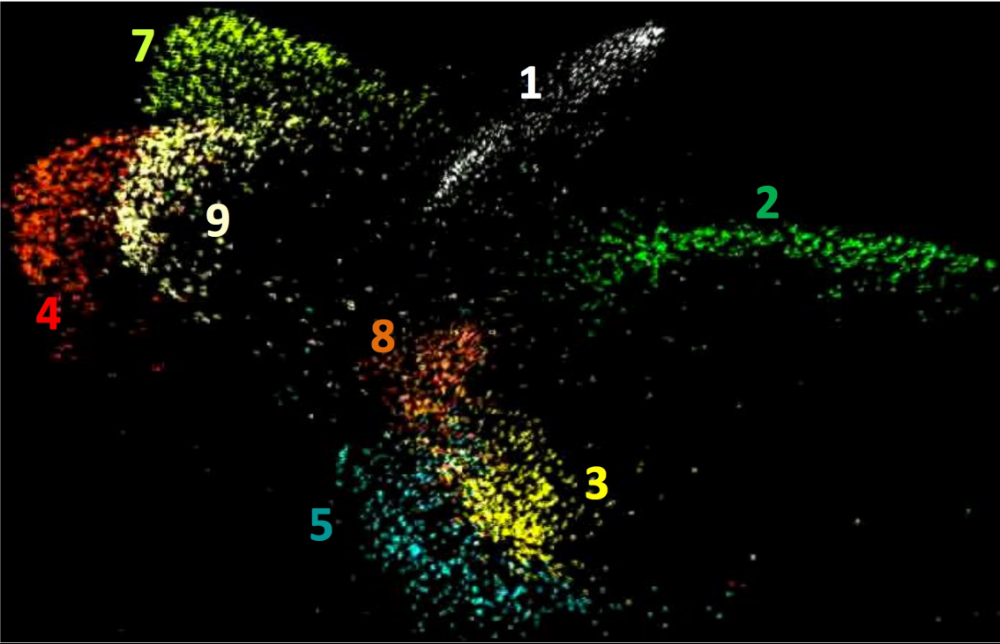
- What distribution do these follow?
    - **Highly nonlinear**

## Nonparametric Statistics
- Typically very few, if any, distributional assumptions
- Usually requires more data
- Let number of parameters scale with the data

- Today
    - Kernel density estimation
    - K-nearest neighbors classification
    - Kernel regression
    - Support Vector Machines (SVMs) $\rightarrow$ not exactly nonparametric, but kernels are involved!

## Density Estimation
- You’ve done this before—histograms!
- Partition feature space into distinct bins with specified widths and count number of observations $n_i$ in each bin: $$ \hat{p}(x) = \frac{n_{i}}{n\Delta_{i}}1_{x \in \mathrm{Bin}_{i}} $$
- Same width is often used for all bins
- Bin width acts as **smoothing parameter**


## Effect of $\Delta$
- Number of bins = $1/\delta$
$$ \hat{p}(x) = \frac{n_{i}}{n\Delta_{i}}1_{x \in \mathrm{Bin}_{i}} = \frac{1}{\Delta}\frac{\sum_{j=1}^{n}1_{X_{j} \in \mathrm{Bin}_{x}}}{n} $$
- Bias of histogram density estimate: $$ \mathbb{E}[\hat{p}(x)] = \frac{1}{\Delta}P(X \in \mathrm{Bin}_{x}) = \frac{1}{\Delta}\int_{z \in \mathrm{Bin}_{x}}p(z)dz \approx \frac{p(x)\Delta}{\Delta} = p(x) $$
> $\frac{1}{\Delta}\int_{z \in \mathrm{Bin}_{x}}p(z)dz$ is approximatley equal to $\frac{p(x)\Delta}{\Delta}$ assuming density is roughly constant in each bin (roughly true, if $\Delta$ is small)

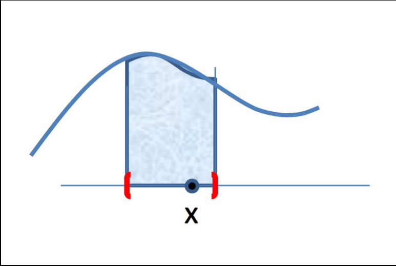

## Bias-Variance Trade-off
- Choice of # of bins
    - If $\Delta$ is small: $$ \mathbb{E}[\hat{p}(x)] \approx p(x) $$
        > $p(x)$ approximately constant per bin
    - If $\Delta$ is large: $$ \mathbb{E}[\hat{p}(x)] \approx \hat{p}(x) $$
        > More data per bin stabalizes estimate
- Bias: how close is mean of estimate to the truth
- Variance: how much does estimate vary around the mean
- Small $\Delta$, large #bins $\leftrightarrow$ "Small bias, Large Variance"
- Large $\Delta$, small #bins $\leftrightarrow$ "Large bias, Small Variance"

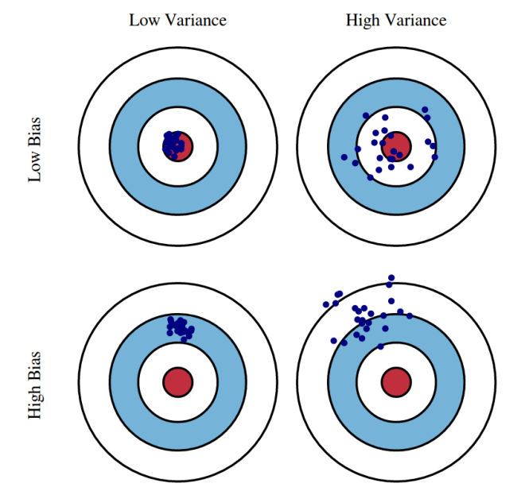

## Choice of number of bins
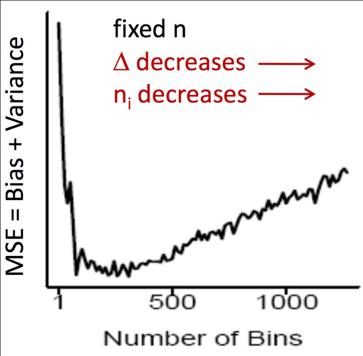
- At very few bins (large $\Delta$) there is high bias meaning high MSE.
- As bins are added (decrease $\Delta$) bias falls faster than variance rises meaning MSE drops.
- Beyond the optimum bin count, variance (because each $n_i$ is small) dominates meaning MSE climbs again.

## Kernel Density Estimation
- Histograms are “blocky” estimates: $$ \hat{p}(x) = \frac{1}{\Delta}\frac{\sum_{j=1}^{n}1_{X_{j} \in \mathrm{Bin}_{x}}}{n} $$
- Kernel density estimate, aka “Parzen / moving window” method: $$ \hat{p}(x) = \frac{1}{\Delta}\frac{\sum_{j=1}^{n}1_{\| X_{j} - x \| \le \Delta}}{n} $$

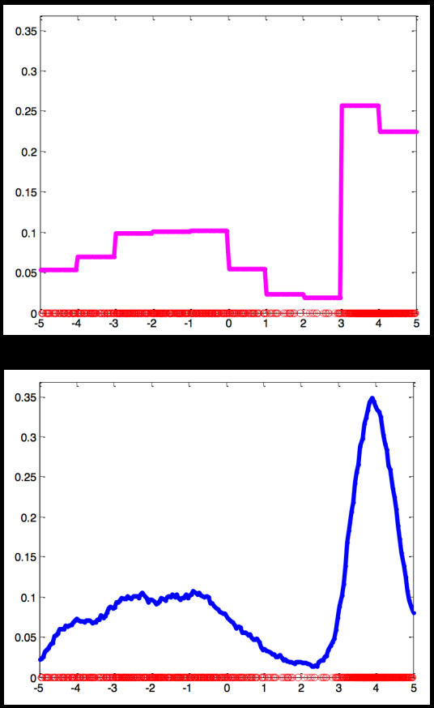

- More generally: $$ \hat{p}(x) = \frac{1}{\Delta}\frac{\sum_{j=1}^{n}K(\frac{X_{j} - x}{\Delta})}{n} $$
- $K$ is the kernel function
    - Much like kernels in Kernel PCA or SVMs: model a relationship between two data points
- Embodies any number of possible kernel functions


- Place small “bumps” at each data point, determined by $K$
- Estimator itself consists of a [normalized] “sum of bumps”
- Where points are denser, density estimate will be higher

## Kernels
- Any function that satisfies
    $$ K(x) \ge 0 $$
    $$ \int K(x)dx = 1 $$
- SciPy has a ton
    - See `signal.get_window`

- Boxcar kernel<br>
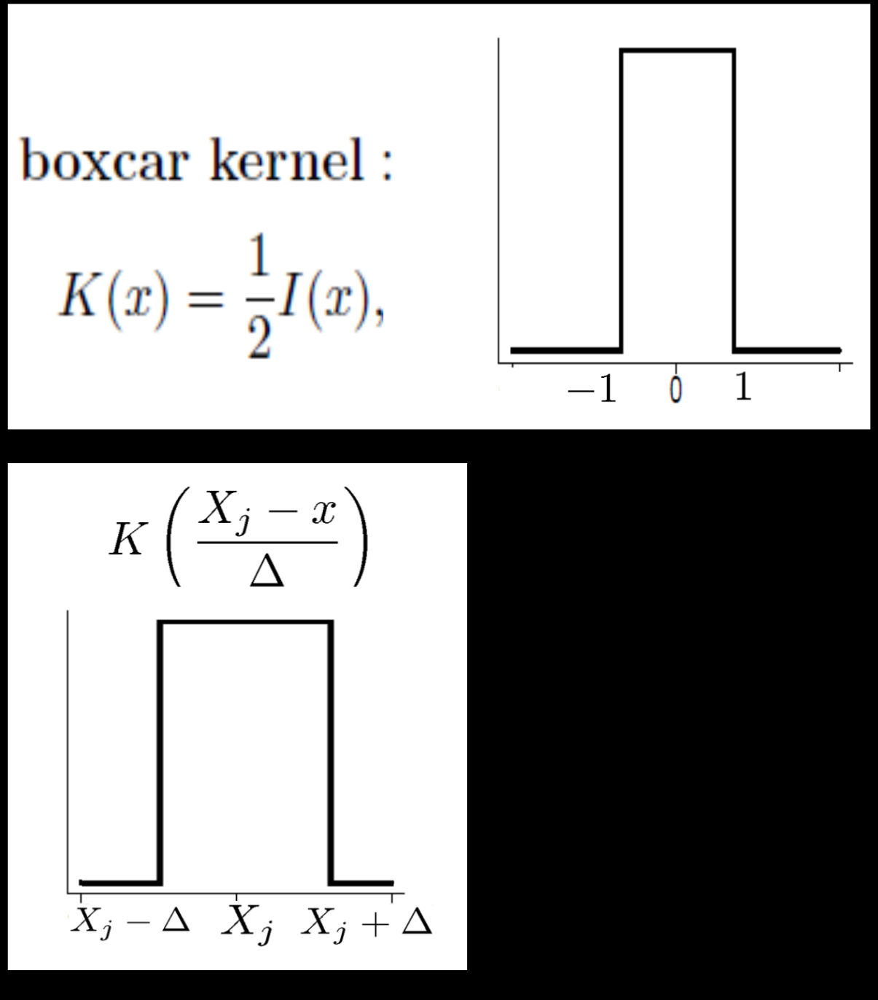
    - Finite support: only need local points to compute estimate
- Gaussian kernel<br>
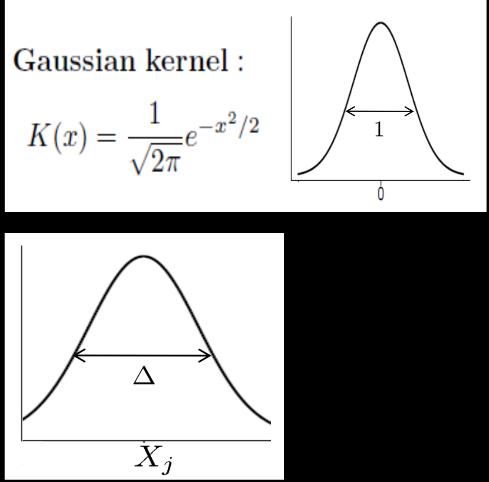
    - Infinite support: need all points to compute estimate. **But quite popular**.

- Deep theory associated with kernels and kernel functions
- Touched on in Kernel PCA lecture
- Foundational to Support Vector Machines and Deep Neural Networks
- Excerpt from Elements of Statistical Learning, Chpt. 5:
    - Regularization and reproducing Kernel Hilber Spaces: In this section we cast splines into the larger context of regularization methods and reproducing kernel Hilbert spaces. This section is quite technical and can be skipped by the disinterested or intimidated reader

## Choice of Kernel Bandwith


## Histogram vs KDE


## KNN Density Estimation
- Recall
    - Histograms: $$ \hat{p}(x) = \frac{n_{i}}{n\Delta_{i}}1_{x \in \mathrm{Bin}_{i}} $$
    - KDE: $$ \hat{p}(x) = \frac{n_{x}}{n\Delta} $$
- Fix $\Delta$, estimate number of points within $\Delta$ of $x$ ($n_i$ or $n_x$) from the data
- Fix $n_{x} = k$, estimate $\Delta$ from data (volume of ball around $x$ with $k$ data points)
- **KNN Density Estimation**: $$ \hat{p}(x) = \frac{k}{n\Delta_{k,x}} $$

- $k$ acts as a smoother
- Not very popular for density estimation
    - Computationally expensive
    - Estimates are poor
- **But related version for classification is very popular**


## KNN Classification
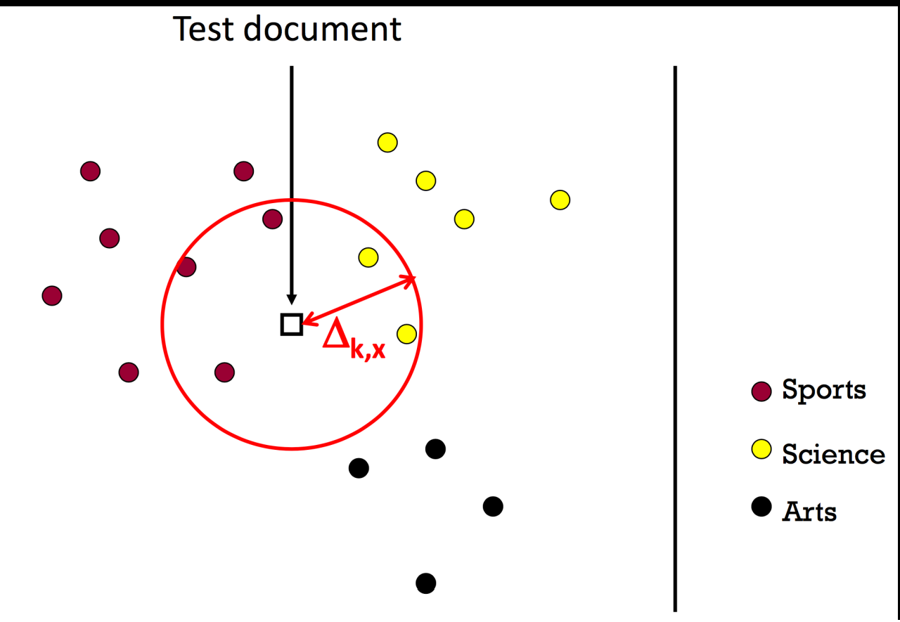
- $k = 4$
```
What should we predict?
    a. Average
    b. Majority  // correct
```

- Optimal classifier: $$ f^{*}(x) = \arg\max_{y}P(y \mid x) = \arg\max_{y}P(x \mid y)P(y) $$
- KNN classifier: $$ \hat{f}_{kNN}(x) = \arg\max_{y}\hat p_{kNN}(x \mid y)\hat P(y) = \arg\max_{y}k_{y} $$

$$ \hat p_{kNN}(x \mid y)\hat P(y) = \frac{k_{y}}{n_{y}\Delta_{k,x}} $$
> where $n_{y}$ is the number of training points in class $y$<br>
> and where $k_{y}$ is the # of training points in class $y$ that lie within $\Delta_{k}$ ball

$$ \sum_{y}k_{y} = k $$
$$ \hat P(y) = \frac{n_{y}}{n} $$


## What is the best $k$?
- Bias-variance trade-off
- Large $k$ = predicted label is more stable
- Small $k$ = predicted label is more accurate
- **Similar to density estimation**

## KNN Decision Boundaries

- 1-NN classification amounts to labeling by the Voronoi cell you fall into


- **Guarantee**: For $n \to \infty$, error rate of 1-NN is never more than 2x optimal error rate

## Temperature Sensing
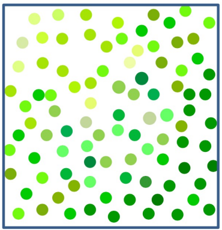
- What is the temperature in the room? Average: $$ \hat T = \frac{1}{n}\sum_{i=1}^{n}Y_{i} $$

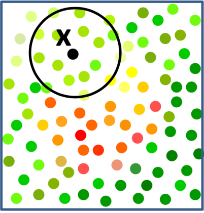
- At location x? "Local" Average: $$ \hat T = \frac{\sum_{i=1}^{n}Y_{i}1_{\| X_{i} - x \| \le h}}{\sum_{i=1}^{n}1_{\| X_{i} - x \| \le h}} $$

## Kernel Regression
- Or “local” regression
- Nadaraya-Watson Kernel Estimator: $$ \hat f_{n}(X) = \sum_{i=1}^{n}w_{i}Y_{i} $$ where $$ w_{i}(X) = \frac{K(\frac{X  -X_{i}}{h})}{\sum_{i=1}^{n}K(\frac{X  -X_{i}}{h})} $$
- Weight each training point on distance to test point
- Boxcar kernel yields local average

## Choice of kernel bandwidth
![noisy scatter of “power vs. multipole” data (the little dots) being smoothed by a Nadaraya–Watson kernel smoother with h=1, 10, 50, 200; heavy black curve in each is the fitted regression line. h=1: the bandwidth is far too small, so the fit chases every little wiggle (high variance, under-smoothed). h=10: still under-smoothed, but you see lots of spurious bumps. h=50: “just right”, the smoother captures the main peak and shoulders without overreacting to noise. h=200: too large, and the curve is overly flat (high bias, you’ve washed out the true shape)](./pics/kernelBW_visual.png)
- Choice of *kernel* is not terribly important!

## Kernel Regression as WLS
- Weighted Least Squares (WLS) has the form: $$ \min_{f}\sum_{i=1}^{n}w_{i}(f(X_{i})-Y_{i})^{2} $$
- Compare to Nadaraya-Watson form: $$ w_{i}(X) = \frac{K(\frac{X  -X_{i}}{h})}{\sum_{i=1}^{n}K(\frac{X  -X_{i}}{h})} $$
- Kernel regression corresponds to locally constant estimator obtained from [locally] weighted least squares
- Set $$ f(X_{i}) = \beta $$ **where $\beta$ is constant**

$$ \min_{f}\sum_{i=1}^{n}w_{i}(\beta - Y_{i})^{2} $$
> $\beta$: constant value

$$ w_{i}(X) = \frac{K(\frac{X  -X_{i}}{h})}{\sum_{i=1}^{n}K(\frac{X  -X_{i}}{h})} $$

$$ \frac{\partial J(\beta)}{\partial\beta} = 2\sum_{i=1}^{n}w_{i}(\beta - Y_{i}) = 0 $$
> $w_i$: individual weights have to sum to 1

$$ \to  \hat f_{n}(X) = \hat\beta = \sum_{i=1}^{n}w_{i}Y_{i} $$

## Support Vector Machines

- Linear classifiers—which is better?
- Pick the one with the **largest margin**

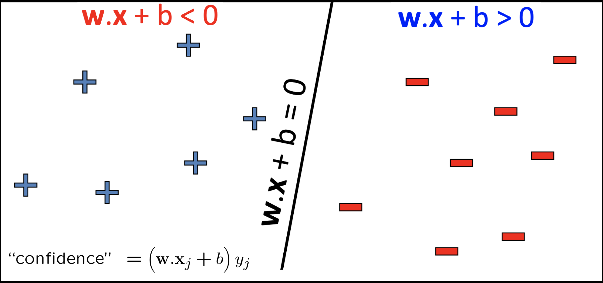
- The black line is the hyperplane $w \cdot x + b = 0$ splitting space into two half-spaces:
    - $w \cdot x + b \lt 0$ which is one class
    - $w \cdot x + b \gt 0$ which is the other class
- For a labeled training point $(x_j, y_j)$ with $y_j \in \{\pm 1\}$, "confidence" = $(w \cdot x_j + b)y_j$
- SVMs choose $w$, $b$ to maximize the minimum of these confidences over all support vectors.

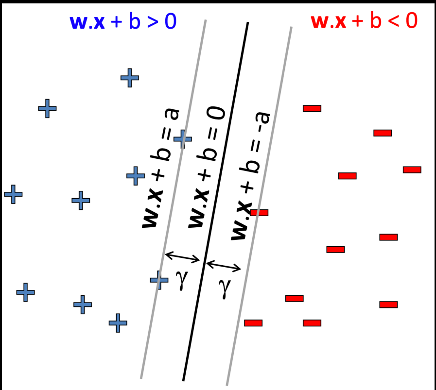
- Maximize the margin
- Distance of closest example / data point from the decision boundary / hyperplane: $$ \text{margin} = \gamma = \frac{2a}{\| w \|} $$

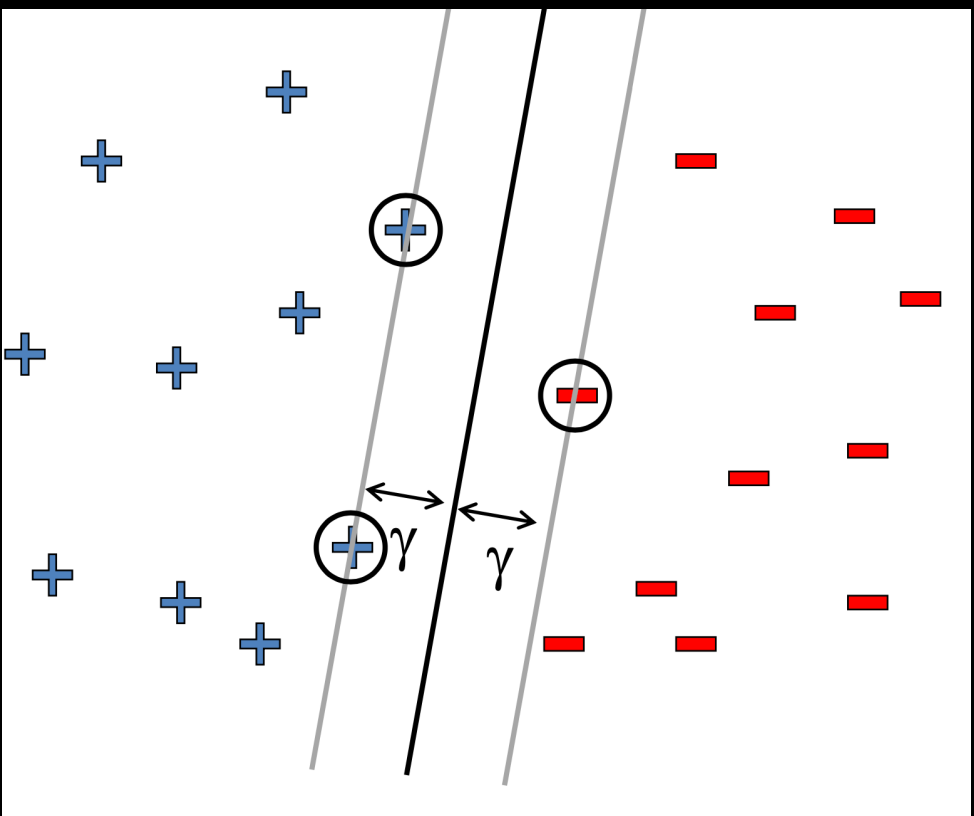
- Rewrite the equation (drop $a$ in favor of 1): $$ \min_{w, b}w \cdot w \quad \text{s.t.} \quad (w \cdot x_{j} + b)y_{j} \ge 1 \; \forall j $$
- Solve via quadratic programming
- Data points along margin = **support vectors**

- What if the data aren’t linearly separable?
- Allow for “errors”: $$ \min_{w, b}w \cdot w + C \quad \text{s.t.} \quad (w \cdot x_{j} + b)y_{j} \ge 1 \; \forall j $$
- Maximize margin AND minimize mistakes
    -  $C$: tradeoff parameter (number of mistakes)

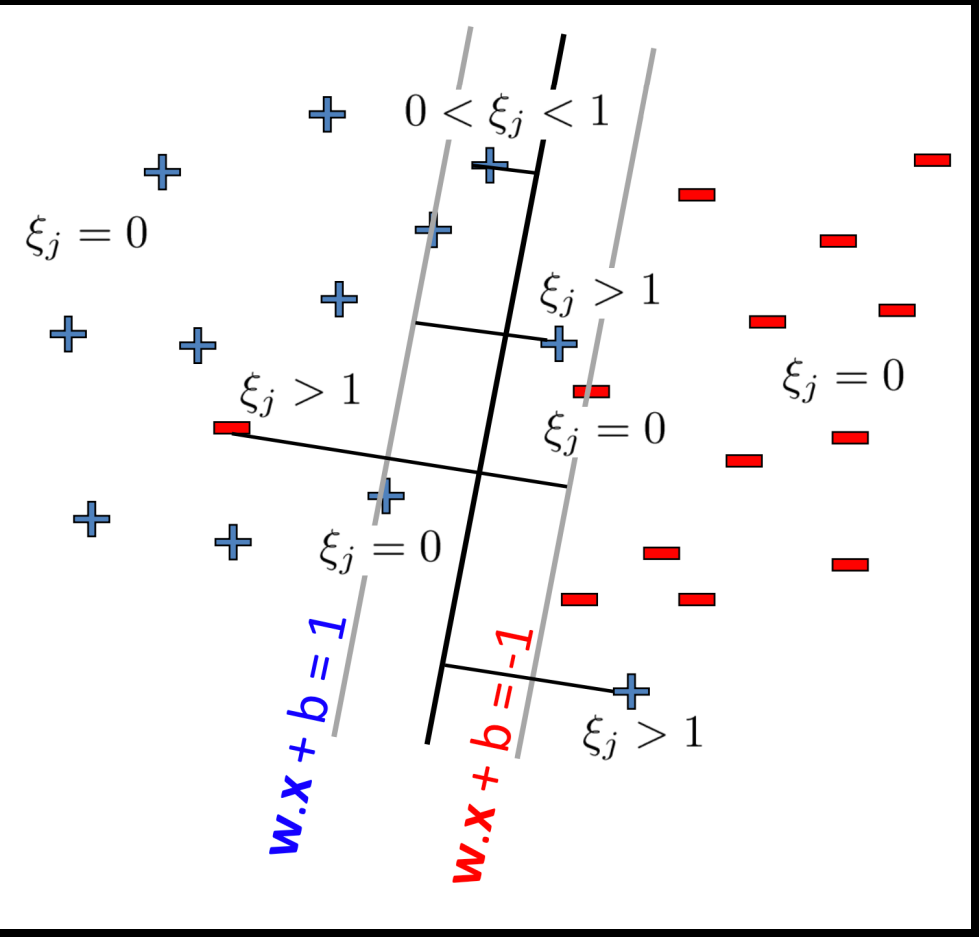
- What if the data *still* aren’t linearly separable?
- **"Soft" margin**
    - penalize misclassified data by how far it is from the margin
    $$ (w \cdot x_{j} + b)y_{j} \ge 1 - \xi_{j} \; \forall j $$
    $$ \xi_{j} \ge 0 \; \forall j $$
    - Misclassification penalty: $C$ $\xi_{j}$
    - Recover “hard” margin: Set $C = \infty$

## SVMs are great, but...
- Where is this going?
- **First**, SVMs were the “big thing” right before deep learning
    - Neural network research had been dead for 10+ years
    - SVMs were showing immense promise, especially with high-dim data
- **Second**, SVMs share a lot of theory with deep learning
    - Much of this theory found a second life in the Transformer architecture that powers all the modern large language models!

- (Excerpt) 12.2.1 Computing the Support vector classifier: The problem (12.7) is quadratic with linear inequality constraints, hence it is a convex optimization problem. We describe a quadratic programming solution using Lagrange multipliers. Computationally it is convenient to re-express (12.7) in the equivalent form.
- Start with core parameterization of SVM: $$ \min_{\beta, \beta_{0}}\frac{1}{2}\| \beta \|^{2} + C\sum_{i=1}^{N}\xi_{i} \quad \text{subject to} \quad \xi_{i} \ge 0,\; y_{i}(x_{i}^{T}\beta + \beta_{0}) \ge 1 - \xi_{i} \; \forall i$$
- Write "primal" objective (Lagrange) function: $$ L_{P} = \min_{\beta, \beta_{0}}\frac{1}{2}\| \beta \|^{2} + C\sum_{i=1}^{N}\xi_{i} - \sum_{i=1}^{N}\alpha_{i}[y_{i}(x_{i}^{T}\beta + \beta_{0}) - (1 - \xi_{i})] - \sum_{i=1}^{N}\mu_{i}\xi_{i} $$
- Differentiate with respect to $\beta$, $\beta_{0}$, and $\xi_{i}$ and set to 0:
    $$ \beta = \sum_{i=1}^{N}\alpha_{i}y_{i}x_{i} $$
    $$ 0 = \sum_{i=1}^{N}\alpha_{i}y_{i} $$
    $$ \alpha_{i} = C - \mu_{i} \; \forall i $$
- Substitute back into primal equation, and get the Lagrangian **Dual**: $$ L_{D} = \sum_{i=1}^{N}\alpha_{i} - \frac{1}{2}\sum_{i=1}^{N}\sum_{i'=1}^{N}\alpha_{i}\alpha_{i'}y_{i}y_{i'}x_{i}^{T}x_{i'} $$
- Notice anything?
    - **Kernel!**
$$ L_{D} = \sum_{i=1}^{N}\alpha_{i} - \frac{1}{2}\sum_{i=1}^{N}\sum_{i'=1}^{N}\alpha_{i}\alpha_{i'}y_{i}y_{i'}\langle h(x_{i}), h(x_{i'})\rangle $$
$$ K(x, x') = \langle h(x), h(x')\rangle $$

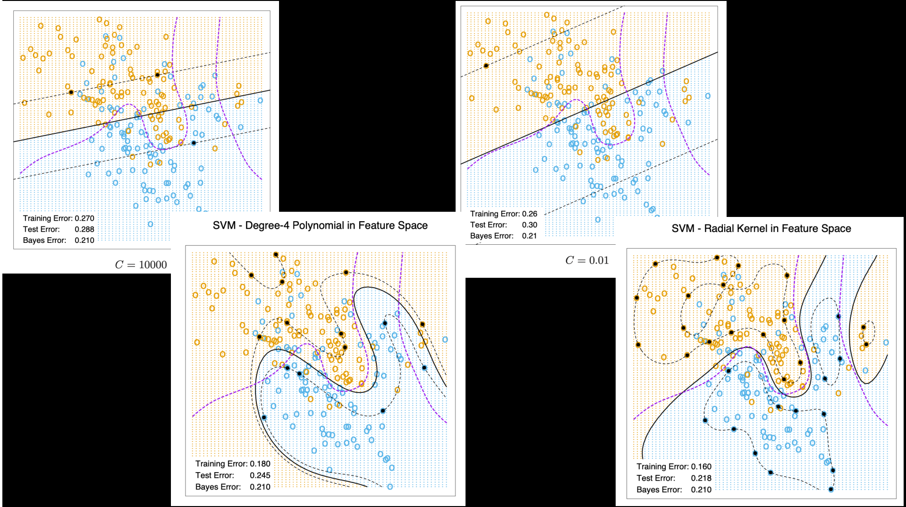

## Summary
- Nonparametric places mild assumptions on data; good models for complex data
    - Usually requires storing & computing with full dataset
- Parametric models rely on very strong, simplistic assumptions
    - Once fitted, they are much more efficient with storage and computation
- Effects of bin width & kernel bandwidth
    - Bias-variance trade-off
- Kernel regression
    - Comparison to weighted least squares
- Support Vector Machines
    - Powerful “shallow” models
    - Dual formulation of objective allows for kernel functions

## Case Study: Newsgroups Classification
- 20 Newsgroups
- 61,118 words
- 18,774 documents
- Class label descriptions

| Category    | Newsgroups                                                                                  |
|-------------|---------------------------------------------------------------------------------------------|
| **Computing**   | comp.graphics<br>comp.os.ms-windows.misc<br>comp.sys.ibm.pc.hardware<br>comp.sys.mac.hardware<br>comp.windows.x |
| **Recreation**  | rec.autos<br>rec.motorcycles<br>rec.sport.baseball<br>rec.sport.hockey                   |
| **Science**     | sci.crypt<br>sci.electronics<br>sci.med<br>sci.space                                      |
| **Misc**        | misc.forsale                                                                              |
| **Politics**    | talk.politics.misc<br>talk.politics.guns<br>talk.politics.mideast                         |
| **Religion**    | talk.religion.misc<br>alt.atheism<br>soc.religion.christian                              |


- Training/Testing
    - 50%-50% randomly split
    - 10 runs
    - Report average results
- Evaluation Criteria: $$ \text{Accuracy} = \frac{\sum_{i \in \text{text set}}I(\text{predict}_{i} = \text{true label}_{i})}{\text{number of test samples}} $$
