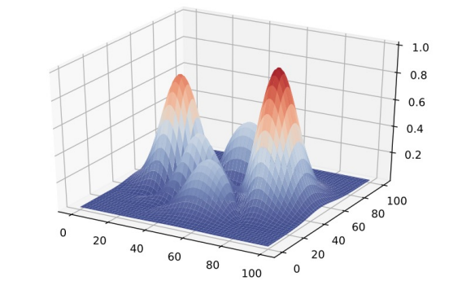
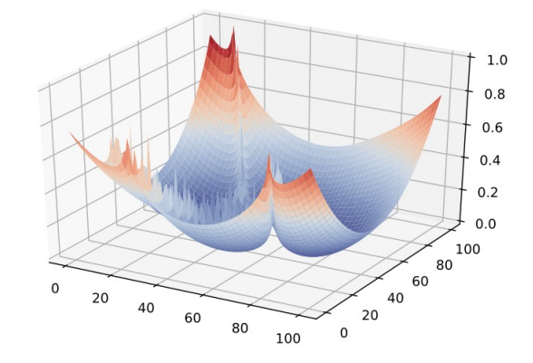
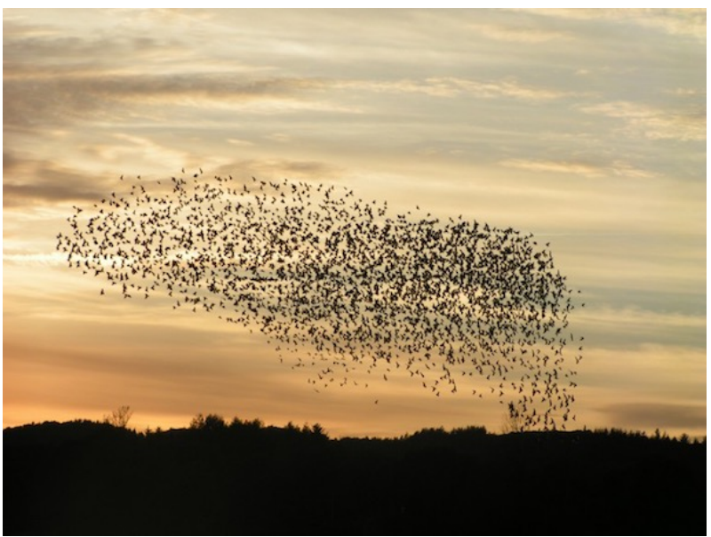

# Biologically-Inspired Computing 1: Optimization

## What is optimization?
$$ \theta^{*} \in \arg\min_{\theta \in \Theta}\mathcal{L}(\theta) $$
- Formal: “Find a specific value of theta for which L is minimized”
- Colloquial: "Give me the parameters that result in the function’s minimum"

# Tried and true
- Where do we start?
$$ \frac{\partial}{\partial a_{1}}f(a_{1}, a_{2}) $$
- Partial derivative
- Set partial to zero
- Solve for the minimum
- **Why doesn't this work in modern ML?** (even logistic regression!)
    - Non-convex, high-dimensional losses
    - Scale of data and parameters
    - Stochastic and streaming settings
    - Non-differentiabilities and architectural quirks

## Automatic Differentiation
- Aka, "autodiff"
- Core to TensorFlow, Keras, PyTorch
    - AUTOMATIC DIFFERNTIATION WITH `TORCH.AUTOGRAD`
- Requires a computational graph
    - Computes gradients during backpropogation

## Stochastic Differentiation
- aka, Stochastic Gradient Descent (SGD)!
$$ \mathbb{E}[g_{t}] = \nabla_{\theta}\mathcal{L}(\theta)|_{\theta_{t}} $$
- The source of noise in this case: the data (or lack thereof)
    - Partials w.r.t. a sample, or even a single data point
- Other versions to reduce the noise
    - Preconditioned SGD
    - Variance reduction

## What do all these methods require?
- Plenty of other optimization strategies along these lines
- One thing they all share: **require derivatives**
    - Requires the function we’re optimizing $\mathcal{L}$ to have an explicit or known form
    - Requires evaluation of the derivative to be fairly inexpensive
- Are there alternatives? **Yes**

## Derivative-free optimization (DFO)
- Hill-climbing
- Stochastic local search
- Random search
- Optimal transport (e.g., Wasserstein)
- Today
    - Simulated Annealing
    - Evolutionary Algorithms
    - Particle Swarm

## Annealing
- Physical process of heating a solid until thermal stresses are released, then cooling it (very slowly) until crystals are perfectly arranged
    - Corresponds to a **minimum energy state**
- Define an *energy function*: $$ p_{T}(x) = \exp{(\frac{-\mathcal{E}(x)}{T})} $$
- Temperature $T$ is slowly decreased over time

- A function we want to optimize   
- Its corresponding energy function   

- Annealed versions of the energy function at different temperatures   
    - $T \ggg 1$, energy landscape is flatter
    - As $T \to 0$, landscape becomes sharper, highlighting high-probability global extrema

- The longer the experiment, the more confident the annealing will be
- (Theoretically) Guaranteed to final global optimum
    - Run long enough
    - Good cooling schedule
    - etc

![Top panel plots probability against number of iterations, with a red dashed curve showing the temperature schedule decaying exponentially from 1.0 toward 0.0 and a the jagged green line tracking the instantaneous acceptance probability; as the system "cools" probability climbs towards 1.0. Bottom panel: a 2D view of the search space, with the colored background indicating the annealed probability density (higher values in yellow/green). The small white dots are the successive sample points visited during optimization, and the large red dot marks the final chosen solution sitting at the highest-probability (lowest-energy) region.](./pics/annealing_plot.png)

## Evolutionary / Genetic Algorithms (EA)
- Annealing = (technically) guaranteed to find global optimum
- EA = (technically) NOT guaranteed to find global optimum
- Lots of caveats, on both
- EA is a form of "stochastic local search"
    - Balance exploitation (local search) and exploration (global search)
    - Can find you a good local optimum quickly, with good chance of global optimum in a reasonable time frame

![diagram illustrating the basic components and a crossover operation in a binary‐encoded genetic algorithm. Left side: a “population” (purple box) of four individual bit‐string “chromosomes” (A1–A4), each made up of multiple “genes” (individual bits, one of which is highlighted in red). Right side: two parent chromosomes (A1, A2) undergoing a single‐point crossover at the red vertical line. Bits to the left of that point are swapped (green arrows), producing two new offspring chromosomes (A5 and A6).](./pics/geneAlgo_diagram.png)

![figure that lays out one full generation of a classic genetic‐algorithm loop: (a) Initial Population: Four candidate solutions (here, eight-digit strings) are randomly generated. (b) Fitness Evaluation: Each string is scored by a fitness function and converted into selection probabilities (e.g. 31%, 29%, etc.). (c) Selection: Two pairs of parents are drawn at random but weighted by those probabilities (dotted line marks the crossover point). (d) Crossover: Each parent pair swaps the segment left of the cut, producing two new offspring strings. (e) Mutation: A single digit in each child is randomly changed (boxed) to introduce fresh genetic diversity.](./pics/geneAlgo_generation.png)

- One way to conceptualize EAs/GAs: search!
- Goal: find an optimal (or nearly-optimal) parameter combination *without* having to evaluate all possible parameter values
- GA trade-offs exploration vs exploitation through population size, number of generations, cross-over, mutation

## Particle Swarm Optimization (PSO)

- The inspiration comes from watching large swarms of birds or schools of fish moving somewhat in unison, but with a few members taking some unexpected deviations.
- A single particle in PSO compares well to a single individual in EA

- *Exploration*: breadth over depth
    - Trying out a large range of values quickly
    - "Building an intuition" phase
- *Exploitation*: depth over breadth
    - Zeroing in on a high-probability area
    - "Deep dive" phase
- **Pretty much every optimization strategy involves some trade-off between these two**
    - If you notice your optimization procedure starting fast and then slowing down, it’s shifting from exploration into exploitation

- Like EA, you have a population of particles
- Unlike EA, these particles remain the same
    - Each particle tracks its own search progress
    - Some global parameters to track
    - Hyperparameters modulating the exploration/exploitation trade-off
- Some stochasticity (analogous to mutation) to prevent getting stuck
- Simulate

## Advantages of Derivative-free methods
- Can optimize pretty much anything
    - No need for a known or closed form derivative (“black box optimization”)
    - Just need some way of evaluating whether or not a specific guess is “good” (e.g., a fitness function)
- Straightforward to implement
- Only real constraint (usually) is time
    - Fairly resource-light, can scale up to use available resources

## Disadvantages of Derivative-free methods
- Often no convergence guarantees
    - EA is guaranteed to find a local optimum
    - Annealing is *theoretically* guaranteed to find a global optimum (but could be waiting until the heat death of the universe)
- Relies heavily on hand-tuned hyperparameters
    - Temperature protocol, mutation rate, cognitive / social parameters
- "Long tail" convergence
    - Can usually find a decent solution quickly, but optimal solutions may take a very long time

## Stay tuned
- More biologically inspired computing methods: **neural networks**!
