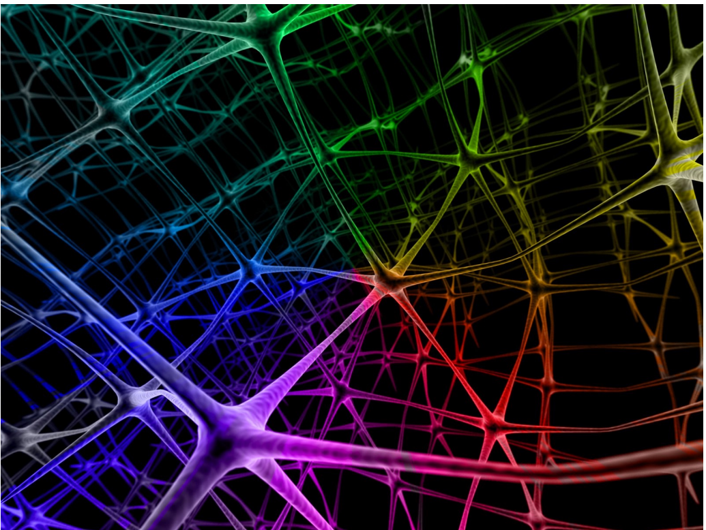
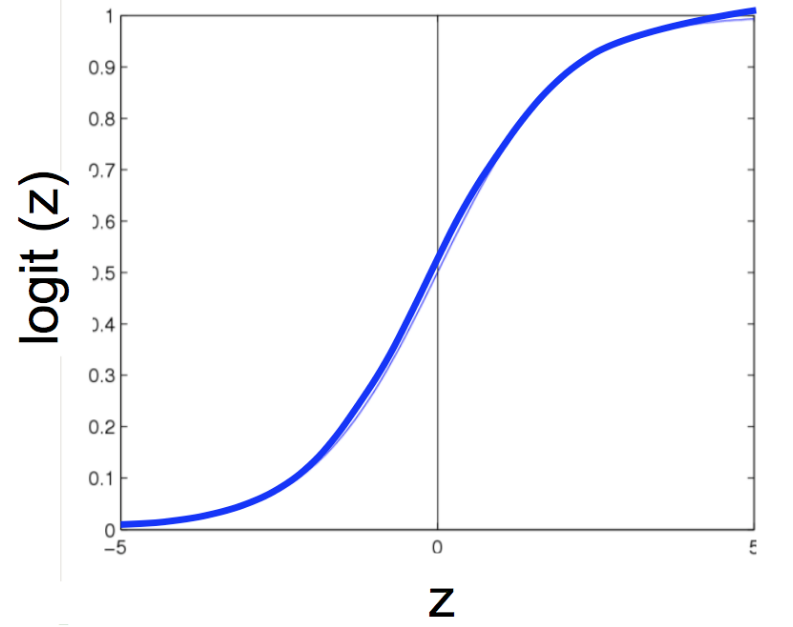
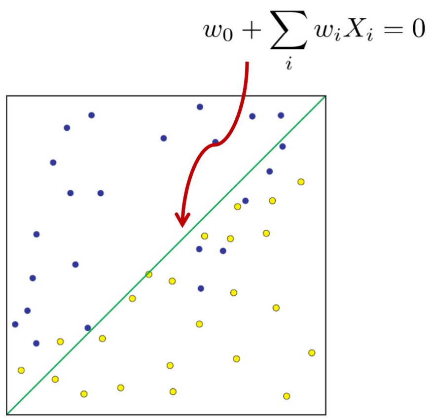
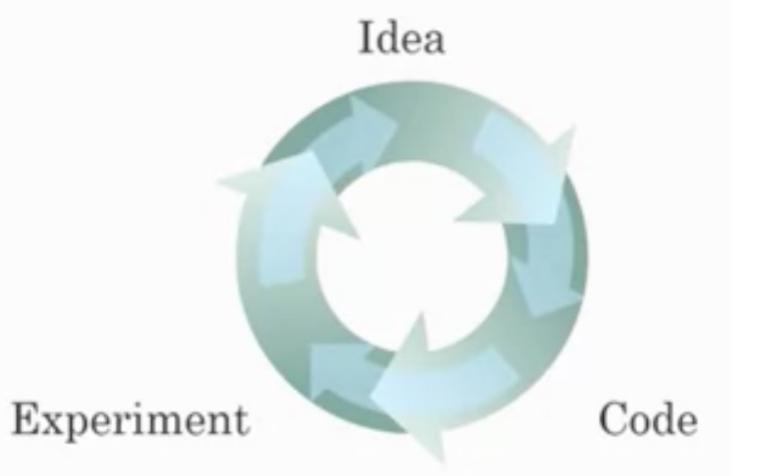

# Biologically-inspired Computing 2: Neural Networks

## History of Neural Networks
```
When was the theory of deep neural networks conceptualized?
    a. 2010s, with AlexNex
    b. 1990s, with Multilayer perceptrons
    c. 1980s, with Artificial Neural Networks
    d. 1940s, with unsupervised learning    // correct
    e. None of the above
```

## Artifical Neural Networks

- Not a new concept!
    - Roots as far back as 1940s work in unsuperivsed learning
    - Took off in 1980s and 1990s
    - Waned in 2000s
- "Biologically-inspired" computing
    - May or may not be true
- **Shift from rule-based to emergent learning**

- Kind-of modeled after biological brains <br> ![comparison of real neurons with their artificial analogues: (a) A single biological neuron, showing its dendrites (inputs), cell body, axon, and terminal axon; (b) An abstract "neuron" in a computational model with multiple inputs x_1-x_n fed into some function f(x) that produces an output y_i; (c) Two biological neurons linked by a synapse, illustrating how signals pass from one cell to the next; (d) A multilayer artificial neural network with input nodes (gray squares) connected through layers of "neurons" (circles) via weighted edges (synapses) to produce outputs (dark circles)](./pics/annBioNN_comparison.png)
    - Hence: "artificial"
- **Neurons**: basic unit of thought and computation
- **Synapses**: connections between neurons
- **Activation functions**: determine whether or not a neuron "fires", given firings (or not) of previous connected neurons


- ANNs organized into *layers*
- Each layer is a collection of neurons
- Each neuron has an activation function that determines whether to "fire"
- Signal is propagated to the next layer

![composite figure illustrating several examples of feed-forward artificial neural network architectures. Top left: A stylized three-layer network overlaid on a brain silhouette, showing how raw inputs (dendrite-like nodes) connect through a hidden layer to produce outputs. Bottom left: A more detailed MLP with two hidden layers—here labeled with tensor dimensions (e.g. input [N,4], hidden weights W_1 of size [4,5], etc.—emphasizing how data flows and transforms through each layer. Right: A schematic of a single hidden-layer network, with input nodes A_i feeding via weights W_{ij} into hidden activations B_j , which in turn connect by weights W_{jk} into output nodes C_k; Summation-and-activation operators are shown inside each neuron.](./pics/ann_arch.png)
- Types of layers
    - Input
    - Output
    - Hidden
- Types of activation functions
    - Identity
    - Step (threshold)
    - Linear
    - tanh
    - sigmoid
    - Rectified Linear (ReLU)
    - [Comparison of activation functions](https://en.wikipedia.org/wiki/Activation_function#Comparison_of_activation_functions)

## Activation functions
- Among the most important architectural decisions to be made
- **Nonlinear**: two-layer ANN can be proven to be a universal function approximator
- **Continuously differentiable**: essential to gradient-based training of the ANN (which we use in backpropagation)
- **Range**: gradient-based methods are more stable when range of activation function is finite (i.e., tanh is [-1, 1])

## Single Neuron

- Input neurons
- Each incoming value from previous layer has a *weight*
- Weighted sum in neuron
- Activation function with a threshold
- Output from neuron sent to next layer


- Neuron pre-activation (or input activation): $$ a(x) = b + \sum_{i}w_{i}x_{i} = b + w^{T}x $$
- Neuron (output) activation: $$ h(x) = g(a(x)) = g(b + \sum_{i}w_{i}x_{i}) $$
> $w$ are the connection weights <br>
> $b$ is the neuron bias <br>
> $g(\cdot)$ is called the activation function

## "Emergent Behavior" Perspective

- ANNs embody the principle of "emergent behavior": from relatively simple structure and rules comes remarkably complex phenomena
- Intelligence and intelligent life
- Relationship to ANNs
    - No central network processor
    - "Knowledge" is stored in the network itself (weights)
    - "Hierarchies" of concepts in deep networks

- Also called "connectionist" models
- **Humans**
    - Neuron switching time: ~0.001s
    - Number of neurons: ~$10^{10}$
    - Connections per neuron: ~$10^4$ - $10^5$
    - Scene recognition time: ~0.1s
    - Significant parallel computation
- **ANNs**
    - Neuron-*like* switching units (usually ~$10^4$; GPT-4 has 1012 parameters)
    - Weighted interconnections among units (usually $10^2$ - $10^3$)
    - Some parallel computation (limited by hardware, networks, etc)
- Upshot: ANN-based artificial intelligence isn’t going to emerge anytime soon

## Logistic Regression

- Remember logistic regression?
- Functional form classifier: $$ P(Y=1 \mid X) = \frac{1}{\exp{(-(w_{0} + \sum_{i}w_{i}X_{i}))}} $$
- Logit function applied to a weighted linear combination of the data: $$ \frac{1}{1 + \exp{(-z)}} $$


- LR is a linear classifier
$$  P(Y=0 \mid X) \overset{0}{\underset{1}{\gtrless}} P(Y=1 \mid X) $$
$$ 0 \overset{0}{\underset{1}{\gtrless}} w_{0} + \sum_{i}w_{i}X_{i} $$

## LR as a graph
- Define output $o(x)$: $$ o(x) = \sigma(w_{0}+\sum_{i}w_{i}X_{i}) = \frac{1}{1 + \exp{(-(w_{0} + \sum_{i}w_{i}X_{i}))}} $$


## Properties of ANNs
- ANNs learn some $f: X \to Y$
- $X$ and $Y$ can be continuous/discrete variables
- Focus on *feed-forward neural networks*
    - Form *directed acyclic graphs*, or DAGS
    - **Will break this focus when we reach recurrent neural networks**


## ANN in practice
- Learn to differentiate homonyms using frequencies in audio

![figure showing a toy speech‐recognition task tackled by a simple feed-forward neural net. Left panel: a three-layer network whose two input nodes are the first two formant frequencies (F1, F2), a hidden layer of feature detectors, and nine output nodes—one for each vowel stimulus ("head," "hid," "hod," "haved,” "heard," "heed," "hud," "who'd," "hood"). Right panel: the raw data in F1–F2 space, with each point labelled by which vowel it actually is and the network’s learned decision boundaries overlaid; Points cluster by vowel, and the contour lines show how the net partitions the plane into regions corresponding to each word.](./pics/ann_audioApp.png)

## Deep learning
- Really a reformulation of neural networks to be "deep"
- Original conception called for multilayer neural networks ("multilayer perceptrons")
- Ran into numerous problems:
    - Theoretical (how to optimize over parameters of deep networks?)
    - Empirical (gradients vanish / explode over deep networks)
    - Engineering (hardware isn’t capable of training deep networks)

## Why is "deep learning" a thing?
- Concepts have been around for decades
- 1950s: didn’t have backpropagation theory to efficiently train perceptrons of more than 1 layer
- 1980s: didn’t have hardware to efficiently compute gradients for more than 2-3 hidden layers
- 1990s: didn’t have enough data to make deep learning feasible
- 2000s: too depressed with previous failures to look into neural networks; pursued e.g. SVMs instead
- 2010s: Deep Learning<sup>TM</sup>
- 2020s: Large Language Models (Transformers)

## Deep learning catalysts

- Scaling of **data** and **computation**
- **Data**
    - "Big data"
- **Computation**
    - Specialized hardware
    - Open sourceframeworks
- **Algorithms**
    - Efficient implementations
    - New paradigms


- Switching from sigmoid to ReLU activation functions
- Sigmoid becomes "saturated" at tails, resulting in very slow learning progress


- Hardware efficiency (i.e. Moore’s Law)
- Faster prototyping of
    - New ANN architectures
    - New datasets
    - New activation functions
    - ...
- Practitioners and researchers benefit

## Tensorflow Playground
- Observe the process ANN training (concentric circles dataset)
- 2 inputs, 1 hidden layer (4 neurons), Sigmoid activation, L1 regularization
- 2 inputs, 1 hidden layer (4 neurons), ReLU activation, L1 regularization
- 4 inputs, 0 hidden layers, ReLU activation, L1 regularization
- **How many training epochs are needed?**
- **What are the weights?**

## Deep Learning: Caveats
1. You forgot to normalize your data
2. You forgot to check your results
3. you forgot to preprocess your data
4. you forgot to use any regularlization
5. you used a too large batch size
6. you used an incorrect learning rate
7. you used the wrong activation function on the final layer
8. your network contains bad gradients
9. you initialized your network weights incorrectly
10. you used a network that was too deep
11. you used the wrong number of hidden units

## Deep Learning: More caveats
- (along the lines of "don't use Hadoop if your data isn't that big")
- At smaller data sizes, no discernible performance bump from deep learning versus "traditional" methods
- "Traditional" methods likely more interpretable and simpler to use


## Deep Learning: Even more caveats
- Fizz Buzz (the classic interview question)
    - “Print numbers 1 through 100, except: if the number is divisible by 3 print ‘fizz’; if it’s divisible by 5 print ‘buzz’; if it’s divisible by 15 print ‘fizzbuzz’.”
- ...in Tensorflow!

> interviewer: OK, so I need you to print the numbers from 1 to 100, except that if the number is divisible by 3 print "fizz", if it's divisible by 5 print "buzz", and if it's divisible by 15 print "fizzbuzz".

> me: I'm familiar with it.

> interviewer: Great, we find that candidates who can't get this right don't do well here.

> me: ...

> interviewer: Here's a marker and an eraser.

> me: [thinks for a couple of minutes]

> interviewer: Do you need help getting started?

> me: No, no, I'm good. So let's start with some standard imports:
```python
import numpy as np
import tensorflow as tf
```
> interviewer: Um, you understand the problem is *fizzbuzz*, right?

> me: Now we need to set up our model in tensorflow. Off the top of my head I'm not sure many hidden units to use, maybe 10?

> interviewer: ...

> me: Yeah, possibly 100 is better. We can always change it later.
```python
NUM_HIDDEN = 100
```
> We'll need an input variable with width NUM_DIGITS, and an output variable with width 4:
```python
X = tf.placeholder("float", [None, NUM_DIGITS])
Y = tf.placeholder("float", [None, 4])
```
> interviewer: How far are you intending to take this?

> me: Oh, just two layers deep -- one hidden layer and one output layer. Let's use randomlyinitialized weights for our neurons:
```python
def init_weights(shape):
    return tf.Variable(tf.random_normal(shape, stddev=0.01))
w_h = init_weights([NUM_DIGITS, NUM_HIDDEN])
w_o = init_weights([NUM_HIDDEN, 4])
```
> So each training pass looks like
```python
            for start in range(0, len(trX), BATCH_SIZE):
                end = start + BATCH_SIZE
                sess.run(train_op, feed_dict={X: trX[start:end], Y: trY[start:end]})
```
> and then we can print the accuracy on the training data, since why not?
```python
            print(epoch, np.mean(np.argmax(trY, axis=1) == 
                sess.run(predict_op, feed_dict={X: trX, Y: trY})))
```
> interviewer: Are you serious?

> me: Yeah, I find it helpful to see how the training accuracy evolves.

> interviewer: ...

> me: And then our output is just our fizz_buzz function applied to the model output:
```python
    teY = sess.run(predict_op, feed_dict={X: teX})
    output = np.vectorize(fizz_buzz) (numbers, teY)

    print(output)
```
> interviewer:...

> me: And that should be your fizz buzz!

> interviewer: Really, that's enough. We'll be in touch.

> me: In touch, that sounds promising.

> interviewer: ...

- I didn't get the job. So I tried actually running this (code on GitHub), and it turned out it got
some of the outputs (for 21 and 42) wrong! Thanks a lot, machine learning!
```
In [185]: output
Out [185]:
array(['1', '2', 'fizz', '4', 'buzz', 'fizz', '7', '8', 'fizz', 'buzz',
    '11', 'fizz', '13', '14', 'fizzbuzz', '16', '17', 'fizz', '19',
    'buzz', '21', '22', '23', 'fizz', 'buzz', '26', 'fizz', '28', '29',
    'fizzbuzz', '31', 'fizz', 'fizz', '34', 'buzz', 'fizz', '37', '38',
    'fizz', 'buzz', '41', '42', '43', '44', 'fizzbuzz', '46', '47'
    'fizz','49', 'buzz', 'fizz', '52', 'fizz', 'fizz', 'buzz', '56',
    'fizz', '58', '59', 'fizzbuzz', '61', '62', 'fizz', '64', 'buzz',
    'fizz', '67', '68', '69', 'buzz', '71', 'fizz', '73', '74'
    'fizzbuzz', '76', '77', 'fizz', '79', 'buzz', '81', '82', '83',
    '84', 'buzz', '86', '87', '88', '89', 'fizzbuzz', '91', '92', '93',
    '94', 'buzz', 'fizz', '97', '98', 'fizz', 'fizz'],
    dtype='<U8')
```
- I guess maybe I should have used a deeper network.

## Next:
- A walkthrough of various architectures (CNNs, RNNs, autoencoders, GANs, Transformers, etc)
- Swappable architectural units
- Theory
- Application strengths and weaknesses
