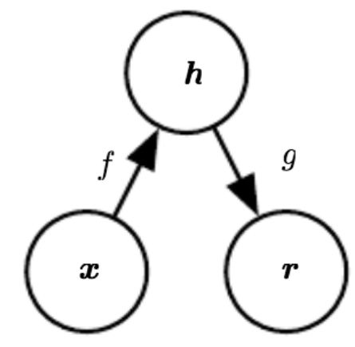

# Autoencoders

## [The Neural Network Zoo](http://www.asimovinstitute.org/neural-network-zoo/)

- Autoencoders: Auto Encoder, Variational Ae, Denoising AE, Sparse AE


## Dimensionality Reduction
- Reduce the number of random variables under consideration
    - Reduce computational cost of downstream analysis
    - Remove sources of noise in the data
    - Define an embedding of the data
    - Elucidate the manifold of the data
- **We’ve covered several strategies so far**
    - PCA
    - Kernel PCA
    - Sparse PCA
    - Stochastic SVD
    - Dictionary Learning

## Principal Component Analysis (PCA)
1. Orthogonal projection of data
2. Lower-dimensional linear space known as the *principal subspace*
3. Variance of the projected data is maximized

- Two definitions of PCA:
    - Definition 1: Maximizing variance
    - Definition 2: Minimizing Reconstruction Error
    - Both are essentially "two sides of the same coin"

## Kernel PCA
- In kernel PCA, we consider data that have already undergone a nonlinear transformation: $$ \vec{x} \in \mathcal{R}^{D} \to \phi(\vec{x}) \in \mathcal{R}^{M} $$
- **We now perform PCA on this new $M$-dimensional feature space**

## Sparse PCA
- We still want to maximize $u_{i}^{T}Su_{i}$, subject to $u_{i}^{T}u_{i} = 1$
    - ...and one more constraint: we want to minimize $\| u_{i} \|_{1}$
- Formalize these constraints using Lagrangian multipliers: $$ \min_{W, U}\| X-WU^{T} \|_{F}^{2} + \gamma\sum_{n=1}^{N}\| \vec{w}_{i} \|_{1} + \gamma\sum_{i=1}^{D}\| \vec{u}_{i} \|_{1} $$

## Stochastic SVD (SSVD)
- Uses **random projections** to find close approximation to SVD
- Combination of probabilistic strategies to maximize convergence likelihood
- Easily scalable to *massive* linear systems

## Dictionary Learning
- This gives the minimization $$ \min_{B, \Theta}\sum_{i=1}^{n}(\| \vec{x}_{i} - B\vec{\theta}_{i} \|_{q}^{q} + h(\vec{\theta}_{i})) $$
    > where $h$ promotes sparsity in the coefficients, and $B$ is chosen from a constraint set
- The general dictionary learning problem then follows $$ \phi(\Theta, B) = \frac{1}{2}\| X - B\Theta \|_{F}^{2} + h(\Theta) + g(B) $$
    > where specific choices of $h$ and $g$ are what differentiate the different kinds of dictionary learning (e.g. hierarchical, K-SVD, etc)

## Autoencoders
- "Self Encode"
- ANNs with output = input
- Identical to the LSTM's encoder-decoder architecture




$$ \phi: \mathcal{X} \to \mathcal{F} $$
$$ \psi: \mathcal{F} \to \mathcal{X} $$
$$ \phi, \psi = \arg\min_{\phi, \psi}\| X - (\psi \circ \phi)X \|^{2} $$

- Learn a “non-trivial” identity function 
- Low-dimensional “code”
- **No other assumptions**
- PCA: maximize variance / minimize reconstruction
    - Linearly independent
    - Gaussian
- Dictionary Learning: sparse code / minimize reconstruction
    - Nonlinear
- Kernel / Sparse PCA

- Pros of AE
    - Very compact representation
    - Not a strong *a priori* form (flexible)
- Cons of AE
    - Difficult to interpret
    - Prone to "collapse"

- Key point: autoencoders should be **undercomplete**
    - Code dimension $\lt$ input dimension

$$ L(\vec{x}, g(f(\vec{x})) $$
> $L$ is some loss function penalizing $g(f(\vec{x}))$ for being dissimilar from $\vec{x}$ <br>
- If $f$ and g are linear, and $L$ is mean squared error, undercomplete AE learns to span the same subspace as PCA
$$ \phi, \psi = \arg\min_{\phi, \psi}\| X - (\psi \circ \phi)X \|^{2} $$
$$ U = \arg\min_{U}\| X - U\Lambda U^{T} \|^{2} $$

## Sparse Autoencoders
$$ L(\vec{x}, g(f(\vec{x})) + \Omega(\vec{h})$$
> $g(h)$ is decoder output <br>
> $h = f(x)$, encoder output <br>
> $\Omega$ is sparsity penalty <br>
- Note on regularizer
    - No straightforward Bayesian interpretation of regularizer
    - “Typical” penalties can be viewed as a MAP approximation to Bayesian inference, with regularizers as priors over parameters
    - Regularized MAP then maximizes: $$ p(\vec{\theta}, \vec{x}) \equiv \log{p(\vec{x} \mid \vec{\theta})} + \log{\vec{\theta}} $$
    - But autoencoder regularization relies only on the data. **It’s more of a “preference over functions” than a prior**.

## Denoising Autoencoders
- Instead of learning: $$ L(\vec{x}, g(f(\vec{x})) $$
- Learn: $$ L(\vec{x}, g(f(\tilde{x})) $$
    > where $\tilde{x}$ is a corrupted version of $x$
- Forces the autoencoder to learn the structure of $p_{\text{data}}(x)$
- **Form of "stochastic encoder/decoder**

- No longer deterministic!
- Given a hidden code $h$, minimize: $$-\log{p_{\text{decoder}}(x \mid h)}$$


- Generalize encoding function to *encoding distribution*: $$ p_{\text{encoder}}(\vec{h} \mid \vec{x}) = p_{\text{model}}(\vec{h} \mid \vec{x}) $$
- Same with the *decoding distribution*: $$ p_{\text{decoder}}(\vec{x} \mid \vec{h}) = p_{\text{model}}(\vec{x} \mid \vec{h}) $$
- Together, these comprise a *stochastic encoder and decoder*


- Define a corruption process, $C$: $$ C(\tilde{x} \mid \vec{x}) $$
- Autoencoder learns a *reconstruction distribution* $$ p_{\text{reconstruct}}(x \mid \tilde{x}) $$
1. Sample a training sample $x$
2. Sample a corrupted version $\tilde{x}$ from $C$
3. Use $(x, \tilde{x})$ as a training pair

- Optimize: $$ -\mathbb{E}_{\vec{x} \sim \hat{p}_{\text{data}}}(\vec{x})\mathbb{E}_{\vec{x} \sim C(\tilde{x} \mid \vec{x})}\log{p_{\text{decoder}}(\vec{x} \mid \vec{h}=f(\tilde{x}))} $$
    > $-\mathbb{E}_{\vec{x} \sim \hat{p}_{\text{data}}}(\vec{x})$: Sample from training set and compute expectation <br>
    > $\mathbb{E}_{\vec{x} \sim C(\tilde{x} \mid \vec{x})}$: Expectation over corrupted examples <br>
    > $\log{p_{\text{decoder}}(\vec{x} \mid \vec{h}=f(\tilde{x}))}$: ...with respect to learning *uncorrupted data* from the encoded corrupted data
- Easy choice of $C$: $$ C(\tilde{x} \mid \vec{x}) = \mathcal{N}(\tilde{x}; \mu = \vec{x}, \Sigma = \sigma^{2}I) $$

- DAEs train to map $\tilde{x}$ back to uncorrupted $x$
- Gray circle = equiprobable $C$
- Vector from $\tilde{x}$ points approximately to nearest $x$ on manifold
- **DFA learns a vector field around a manifold**

![geometric illustration of what a denoising autoencoder actually learns. Black curve: the true data manifold in input space. Red ×’s: clean data samples lying exactly on that manifold. Gray circle around one red ×: the region from which noisy points \tilde{x} are drawn by the corruption process C(\tilde{x} \mid x). Green arrows: the “denoising vectors” g(f(\tilde{x})) - \tilde{x}. Each arrow shows how the autoencoder maps a corrupted point \tilde{x} back toward the nearest spot on the manifold. Taken together, those arrows form a vector field around the manifold that points inward. In fact, that field approximates the score function i.e. the gradient of the data density. by training to undo small corruptions, a denoising autoencoder learns a vector field that “flows” noisy points back onto the data manifold.](./pics/denoisingAE_manifold.png)


## Embeddings
- Manifolds would seem to imply *representation learning* beyond a simple low-dimensional code
- Autoencoders can learn powerful relationships in this regard
    - Pose
    - Position
    - Affine transformations

![examples of the “manifold” structure learned by an encoder over complex data. Left: Each small circle is a single face image; Arrows connect each face to its nearest neighbors in latent‐space, forming a tangled “sheet” that encodes smooth changes in pose/expression; Together, they show that nearby points on the manifold correspond to visually similar faces. Right: The blue curve is a continuous path through the latent space for MNIST “9”s; At various points along the curve, reconstructed digit thumbnails are shown; As you move along the path, the “9” smoothly morphs in stroke width, rotation, and style—demonstrating that the embedding captures those continuous transformations.](./pics/denoisingAE_ex.png)

## Generative Models
- Go beyond learning $x \to h$, instead focus on learning $p(x, h)$
- Manifold learning with Autoencoders
- Variational Autoencoders (VAEs)
- Deep Belief Networks (DBNs)
- Deep Restricted Boltzmann Machines (DBMs)
- Generative Adversarial Networks (GANs)

```
If X is your data and Y are your labels, which of the following represents a generative distribution?
    a. P(X | Y)
    b. P(X)
    c. P(X, Y)
    d. None of the above
    e. All of the above // correct
```

## Conclusions
- Autoencoders
    - Multilayer perceptron (ANN) that is symmetric
    - Output = input
    - Goal is to learn a non-trivial identity function, or an undercomplete code $h$
- Sparse Autoencoders
    - Include a sparsity constraint on the code
- Denoising Autoencoders
    - Learn a mapping to de-corrupt data
    - Include a corruption process $C$
    - Equates to a traversal of the data manifold $\to$ **generative modeling primer**
