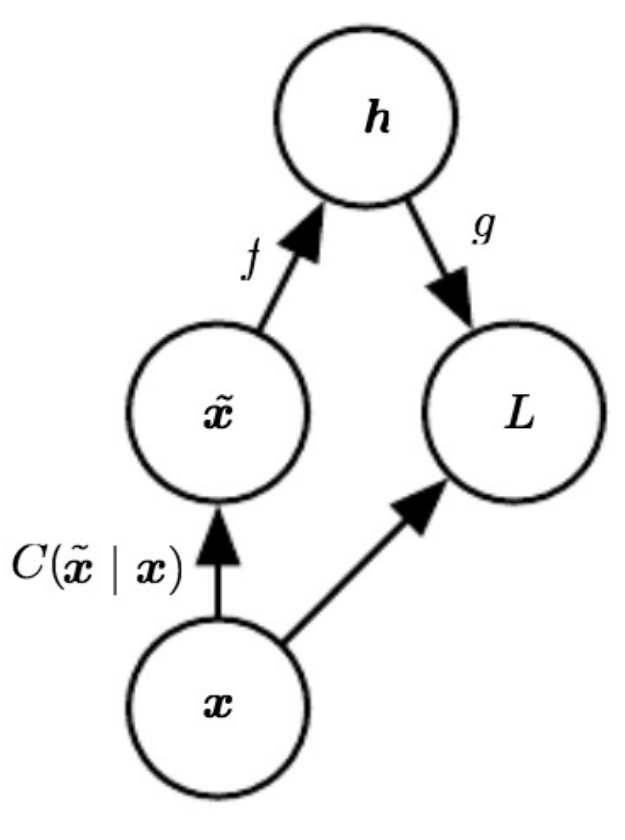
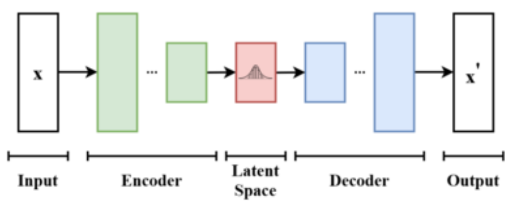
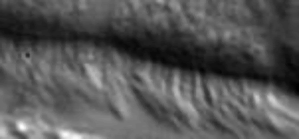
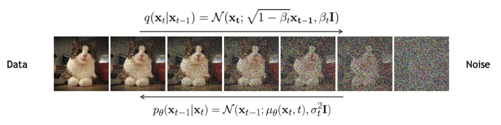
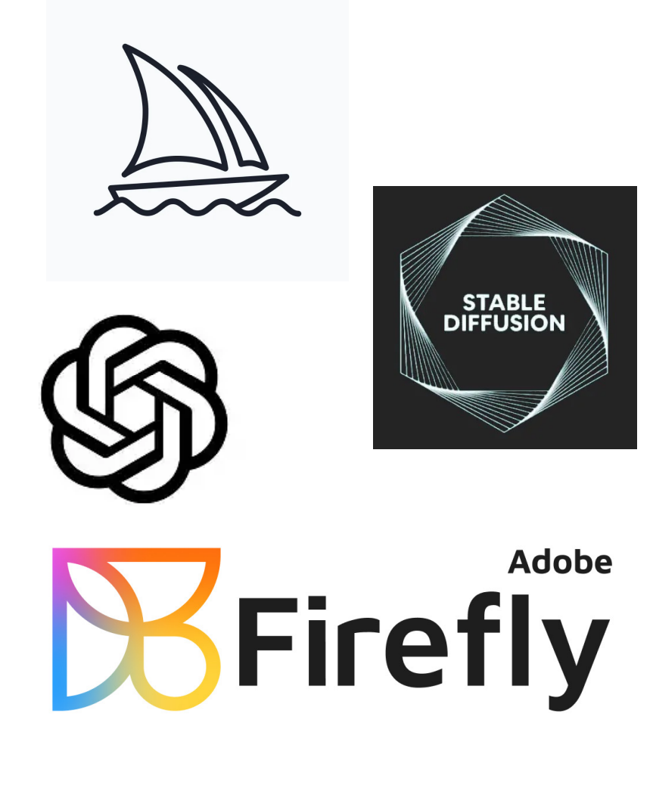
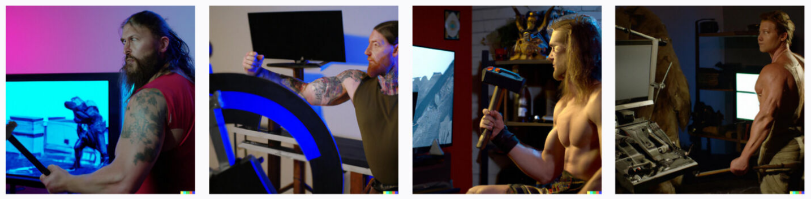
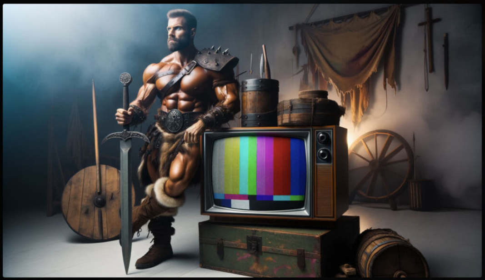
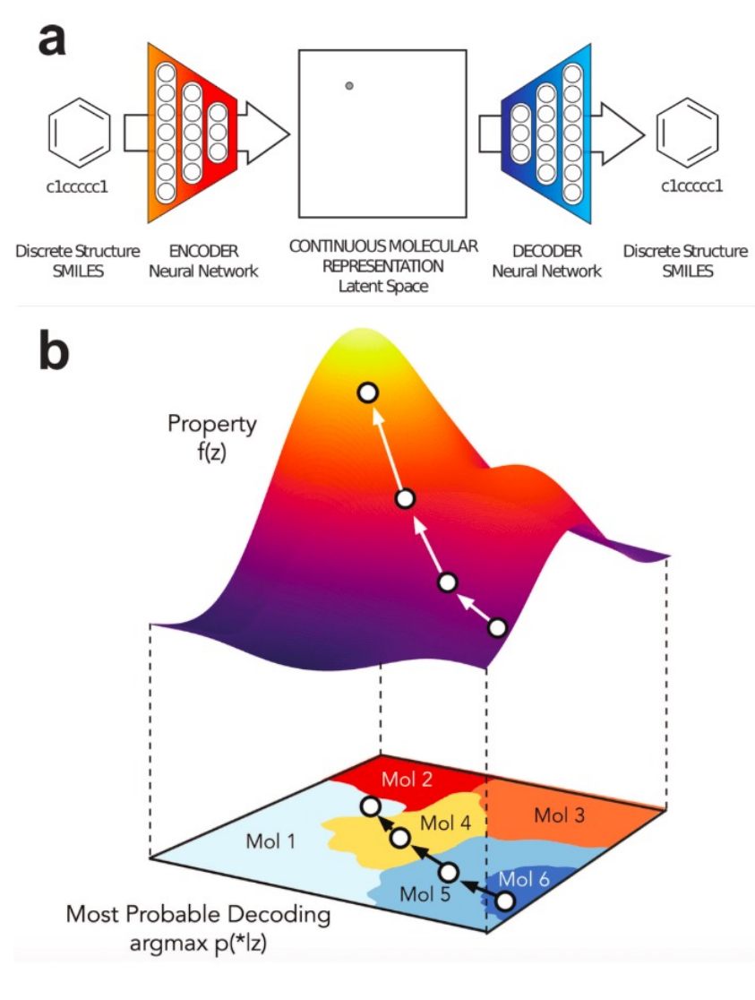
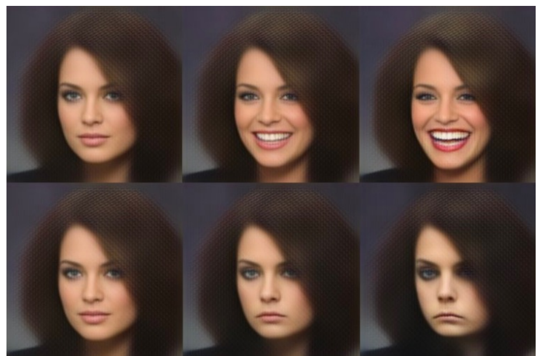

# Generative AI

## [The Neural Network Zoo](http://www.asimovinstitute.org/neural-network-zoo/)

- Gen AI: generative adversial network, liquid state machine, extreme learning machine, echo state network

## Caveat Empire


## What is a "generative model"?

- Discriminative
    - Logistic regression
    - Support vector machines
    - Random forests
    - $P(Y \mid X)$
- Generative
    - Gaussian Naive Bayes
    - Variational Autoencoders
    - Adversarial networks
    - $P(X, Y)$ and $P(Y)$

## Generative Models
![visual of the generative approach. Right panel (true data distribution): The blue shape shows the true support of the data, p(x), in the high-dimensional “image space,” with black dots marking actual samples. Left panel (model’s generated distribution): The green shape is the model’s estimate \hat{p}(x), i.e. the distribution from which it can draw new samples. Loss arrow: The red, dashed arrow indicates that learning proceeds by minimizing some divergence or loss between \hat{p}(x) and the true p(x).](./pics/genModeling_visual.png)


- Learning a *distribution* or *manifold*
    - Statistical notion of *how the data were generated*
- $P(X)$ asks: how *likely* is the data point $X$?
    - If likely $\rightarrow$ $X$ was **generated** by this process
- Compare to $P(Y)$, which asks: how likely is the *label*?
    - If likely $\rightarrow$ $X$ has label $Y$

![Top panel: denoising autoencoder learns a vector field that “flows” noisy points back onto the true data manifold; the black curve is the manifold, red ×’s are clean samples, the gray circle marks where corruptions occur, and green arrows show the denoising vectors that point corrupted inputs inward—approximating the gradient of the data density. Bottom panel: Each small circle is a single face image; Arrows connect each face to its nearest neighbors in latent‐space, forming a tangled “sheet” that encodes smooth changes in pose/expression; Together, they show that nearby points on the manifold correspond to visually similar faces.](./pics/genModeling_learning.png)

## Types of Generative Models

### Probabilistic Graphical Models
- Arrows represent conditional dependencies between random variables
$$ P(X_{1}, \ldots, X_{n}) = \prod_{i=1}^{n}P(X_{i} \mid \text{parents}_{i}) $$
$$ P(A, B, C, D) = P(A)P(B)P(C,D \mid A,B) $$
- Structure is used in generative models
    - Laten generating distribution (hidden)
    - Observed variables (influenced by laten vars)


### Variational Inference
- What is variational inference?
- Good for learning latent variable models (i.e., generating distributions of data)
- For each observation $x$ we assign a hidden variable $z$; our model $p$ describes the joint distribution between $x$ and $z$

- $p_{\theta}(z)$ is very easy
- $p_{\theta}(x \mid z)$ is easy
- $p_{\theta}(x, z)$ is easy
- $p_{\theta}(x)$ is super-hard
- $p_{\theta}(z \mid x)$ is mega hard
- Of course, $p_{\theta}(x)$ and $p_{\theta}(z \mid x)$ are the things we want to calculate
    - Inference is $p(z \mid x)$
    - Learning involves $p(x)$

- Rather than learning $p(z \mid x)$ directly, variational inference approximates with $q(z \mid x)$
- Maximize the evidence lower bound (ELBO): $$ \text{ELBO}(\theta, \psi) = \sum_{n}\log{p(x_{n})} - \text{KL}[q_{\psi}(z \mid x_{n}) || p_{\theta}(z \mid x_{n})] $$

### Recall: Autoencoders


### Denoising Autoencoders

- Define a corruption process, $C$: $$ C(\tilde{x} \mid \vec{x}) $$
- Autoencoder learns a *reconstruction distribution* $$ p_{\text{reconstruct}}(x \mid \tilde{x}) $$
1. Sample a training sample $x$
2. Sample a corrupted version $\tilde{x}$ from $C$
3. Use $(x, \tilde{x})$ as a training pair

- De-corruption process results in learning a *distribution* <br> 

### Variational Autoencoders (VAEs)
- Associated with autoencoders by virtue of architecture
    - Goal is to map inputs to latent space
- Encoder: Learn parameters of variational distribution, $q(z \mid x)$
- Decoder: Sample (generate!) from learned distribution to reconstruct input



![Variational Autoencoder diagram, showing both its inference and generative paths in probabilistic terms. Dataset D in "data space" (x-space): real data lives on a complex manifold (the squiggly shape). Encoder q_{\psi}(z|x): Maps each observed x up into a region of latent space (z-space), producing an approximate posterior. Prior p_{\theta}(z): A simple, fixed distribution (e.g.\ a standard Gaussian) over the entire latent space (the big grey ball). Decoder p_{\theta}(x|z): Takes a sample z (either from the encoder or drawn from the prior) and maps it back down to data space, reconstructing or “generating” an x. The arrows thus illustrate the two halves of a VAE: Inference and Generation with the goal of making q_{\psi}(z|x) align with the prior p_{\theta}(z) while reconstructing samples accurately.](./pics/vae_visual.png)

### Restricted Boltzmann Machines (RBMs)
- Wholly undirected deep network
    - Implementation of a probabilistic graphical model
    - Each variable conditionally independent given neighboring nodes
- Parameterized by energy function: $$ P(v, h^{(1)}, h^{(2)}, h^{(3)}) = \frac{1}{Z(\theta)}\exp{(-E(v, h^{(1)}, h^{(2)}, h^{(3)}; \theta))} $$
- Sampling from deep RBMs is hard, but training is paradoxically easy


### Deep Belief Nets (DBNs)
- Connections *between* layers, but not units *within* a layer
- Arguably one of the first successful applications of modern deep learning
    - Hinton 2006 and 2007
- Often built from an RBM template
- Training is nearly intractable
    - Posterior has to be approximated through annealed importance sampling (AIS)
 


### Generative Adversarial Networks (GANs)
- Yann LeCun: "There are many interesting recent development in deep learning... The most important one, in my opinion, is adversarial training (also called GAN for Generative Adversarial Netowkrs). This, and the variations that are now being proposed, is the most interesting idea in the last 10 years in ML."

- Game-theoretic approach to generative modeling
- Two deep networks: a **generator** ($G$) and **discriminator** ($D$)


- **Generator**
    - Input: a random vector $z$
    - Output: something as close to a “real” data point as possible
- **Discriminator**
    - Input: a "real" data point OR a synthetic example from $G$
    - Output: 1 or 0 (real or fake)

- Minimax "game:
    - Generator and Discriminator have competing objectives
    - Goal is to find an equilibrium point
    $$ \min_{G}\max_{D} \mathbb{E}_{x\sim P_{\text{real}}}\log{D(x)} - \mathbb{E}_{z}\log{(1 - D(G(z)))} $$
        > $\max_{D}\mathbb{E}_{x\sim P_{\text{real}}}\log{D(x)}$: Maximize the discriminator's likelihood of identifying a real data example <br>
        > $\min_{G}\mathbb{E}_{z}\log{(1 - D(G(z)))}$: Minimize the discriminator's ability to differentiate real data from the Generator exemplars


### VAEs versus GANs
- VAEs: expectation over learned distribution results in blurring
- GANs: samples from learned distribution, resulting in sharper images

### Autoregressive (AR) Models
- DALLE-1, in January 2021, was an autoregressive Transformer
- Our good friends Appearance and State
    $$ y_{t} = Cx_{t} + u_{t} $$
    $$ x_{t} = Ax_{t-1} + Wv_{t} $$
- Once you've learned A_{i}, you can generate a new x_{t}!



### Latent Diffusion
- Closely related to VAEs, normalizing flows, and energy-based models
- **Hard** to convert noise into structured data
- **Easy** to convert structured data into noise


$$ \text{Data} \quad \xrightarrow{q(x_{t} \mid x_{t-1}) = \mathcal{N}(x_{t}; \sqrt{1-\beta_{t}}x_{t-1}, \beta_{t}I)} \quad \text{Noise} $$
$$ \text{Noise} \quad \xrightarrow{p_{\theta}(x_{t-1} \mid x_{t}) = \mathcal{N}(x_{t-1}; \mu_{\theta}(x_{t}, t), \sigma_{t}^{2}I)} \quad \text{Data} $$

- Similar to hierarchical VAE
    - BUT all latent states have same dimensionality as input
    - BUT encoder is a linear Gaussian model, rather than being learned
- Results in a very simple objective
    - No risk of posterior collapse (unlike GANs)
- Numerous variations of LD
    - Denoising Diffusion Probabilistic Models (DDPM)
    - Noise-conditioned Score Networks (NCSN)
    - Stochastic Differential Equations (SDE)


### Large Language Models (LLMs)
- Not unique generative models per se
    - LLMs = very, very large Transformers
    - Usually with autoregressive blocks at inference / decoding (multimodal LLMs have started integrating diffusers, e.g. GPT-4.1)
    - Trained on city blocks’ worth of GPUs
- Sometimes called “Foundation Models”
    - ”Foundation Models” are only found on Terminus; elsewhere in the galaxy, they’re just “Sparkling Language Models”

## Commercial generative models

### Probably screaming into the void here, but...
- There’s AI, and there’s AI
- AI
    - Large language or image models
    - Trained on massive amounts of data with large numbers of parameters
    - Does a frighteningly good job of mimicking humans at very specific tasks
    - **Not intelligent**
- AI
    - Intelligence that isn’t human but made by humans, aka artificial
    - Mimics humans very well at all possible tasks, even those it wasn’t trained on
    - Nowhere in the 5-10 year roadmap

### DALL-E, Midjourney, Stable Diffusion, Firefly

- Corporate backed text-to-image generators
- Subscription fees
- Open source options
- Training data

### Evolution of Image generators
- DALL-E given the prompt “a muscular barbarian with weapons beside a CRT television set, cinematic, 8K, studio lighting.”
    - April 2022: <br> 
    - October 2023 <br> 

### GPT-4
- Powers ChatGPT
- “Attention is All You Need”, 2017: A “Transformer-style model pre-trained to predict the next token in a document, using both publicly available data (such as internet data) and data licensed from third-party providers.”
- “Deep reinforcement learning from human preferences”, 2017: “The model was then fine-tuned using Reinforcement Learning from Human Feedback (RLHF).”
- Several thousand GPUs + petabytes of data = ChatGPT

### PaLM, Cerebras, LLaMA, Falcon, OpenHermes
- Similar underlying architecture to ChatGPT
- Billions (to trillions?) of parameters
    - GPT-5 rumored to have ~2T parameters
- Billions to trillions of training tokens
    - PaLM 2 and LLaMA 2: 3.6T and 2T, respectively
- Varying levels of openness
    - Some pre-trained models on Huggingface
    - An open LLM + RLHF (reinforcement learning from human feedback) + RLAIF (reinforcement learning from AI feedback) + DPO (direct preference optimization) = best bang for buck, outside of ChatGPT or similar

## Technical, Ethical, and Legal Considerations

### This is not unique to Generative AI
- **We should always be considering the ethical and legal ramifications of our work**
- But: given how widely available and easily accessed tools like ChatGPT are, and the hype surrounding them
    - **There’s never been a better time to have these conversations**

### Advantages of Generative AI
- Already legion!
- Democratize access to art and figure generation
- Interactive, natural-language interfaces
    - As opposed to arcane tricks and query optimization hacks with traditional search engines
- Revealed clear weaknesses in our assessment protocols
    - Educational assessment (i.e., grading) should not be contingent on whether or not you had access to a chatbot


- New scientific discoveries around medicine, biology, chemistry, and biochemistry
- Design new compounds (drugs, antibiotics, treatments) by teaching generative models about known ones
- Keynote speaker at IOB Symposium in 2023 spoke about using LLMs to discover new proteins

- Accessibility and interactivity
- Original image (top left) interpolated along VAE latent distribution, producing different facial expressions <br> 
- Virtual avatars, assistants, video gaming

### Technical Issues

- Recursive model training
    - As more information on the internet (images, text) is AI-generated, LLMs will ingest this data as part of their training, creating a recursive training loop
    - [“The Curse of Recursion: Training on Generated Data Makes Models Forget”](https://arxiv.org/abs/2305.17493)

- Examples of recursive model training

![This composite visualization demonstrates how repeatedly sampling from a generative model and then retraining it on its own outputs causes the learned distribution to collapse. In the top histograms, two symmetric peaks gradually converge and lose one mode after successive resampling. The middle row of scatter plots shows two clusters merging into a single point as iterations increase. Finally, the MNIST grids at the bottom reveal that, by the twentieth generation, diversity disappears and the model produces essentially the same digit over and over.](./pics/recTrain_ex.png)

### Legal issues
- Copyright
    - OpenAI, Midjourney most likely training on image datasets **without** permission from authors
    - Currently in the US, AI-generated art cannot be copyrighted $\rightarrow$ **potential boon for public domain!**
- Plagiarism
    - Simply: if you didn’t write/code/create it yourself, and you didn’t otherwise specify where it came from (and sometimes, even if you did), it’s plagiarism
    - Is getting the answer from ChatGPT and presenting it as your own any different from getting the answer from your classmate and presenting it as your own?
- Huge implications in professional fields, given current chatbot accuracy levels

### Ethical and moral issues
- Disinformation
- Enabling/scaling abuse
- Environmental concerns
- Worker exploitation
- Hidden costs of AI
| Model name | Number of parameters | Datacenter PUE | Carbon intensity of grid used | Power consumption | CO₂eq emissions | CO₂eq emissions × PUE |
|------------|----------------------|----------------|-------------------------------|-------------------|-----------------|-----------------------|
| GPT-3      | 175B                 | 1.1            | 429 gCO₂eq/kWh                | 1,287 MWh         | *502 tonnes*      | 552 tonnes            |
| Gopher     | 280B                 | 1.08           | 330 gCO₂eq/kWh                | *1,066* MWh         | *352 tonnes*      | 380 tonnes            |
| OPT        | 175B                 | *1.09^2*          | *231 gCO₂eq/kWh*                | *324 MWh*           | 70 tonnes       | *76.3 tonnes^3*           |
| BLOOM      | 176B                 | 1.2            | 57 gCO₂eq/kWh                 | 433 MWh           | 25 tonnes       | 30 tonnes             |
- Comparison of carbon emissions between BLOOM and similar LLMs. Number in *italics* have been inferred based on data provided in papers describing the models.

![iceberg metaphor for AI: the small “tip” above the water lists flashy, consumer-facing capabilities (chat on any topic, realistic image generation, homework help, even hints of AGI), while the vast submerged portion reveals the deeper, hidden downsides—misinformation, propaganda and bias, cultural homogenization, privacy and copyright violations on one side, and on the other the systemic costs: mass data harvesting, underpaid labor, environmental impact (huge energy, water, carbon and rare-metal footprints), rising barriers to entry, and the erosion of human practices.](./pics/iceberg_genAI.png)

### Philisophical issues
- Novelty
- Is the content generated from ChatGPT / Midjourney **new**?
- The “tool” analogy
    - Generative AI is inherently neither good nor bad, but dependent on its application
- In 1999, French cultural theorist Paul Virilio wrote, *"When you invent the ship, you also invent the shipwreck; when you invent the plane you also invent the plane crash; and when you invent electricity, you invent electrocution... Every technology carries its own negativity, which is invented at the same time as technical progress."*

### I don’t have answers
- But we **have to** think about the pitfalls, and especially about **who the technology will impact**

```
Which of the following is NOT a generative model?
    a. VAEs
    b. GANs
    c. AR Models
    d. Logistic Regression // correct
    e. Transformers
    f. Gaussian Naive Bayes
    g. RBMs
    h. DBNs
```

## Conclusions
- Generative modeling
    - Learn a *distribution* instead of a decision boundary
    - Can still be used for classification
    - Usually requires more data than discriminative models
- Deep generative modeling
    - DBNs, RBMs, Denoising & Variational Autoencoders, GANs, AR models, LD
    - All ways of learning a generating distribution from data in deep neural architectures
- Deployments of generative AI
    - Commercial products (ChatGPT, Stable Diffusion, Midjourney, DALL-E)
    - Possibilities, advantages, moral/ethical/legal/philosophical considerations
    - Consider the possible use-cases
