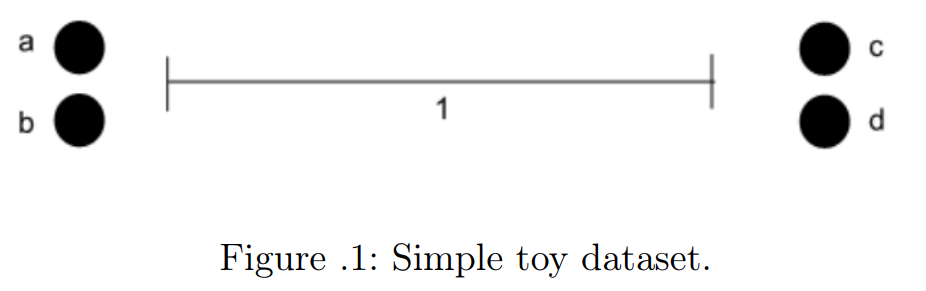

# Homework 3: I Heard You Like Math

### 1. Regularization in Linear Regression
Recall our high-dimensional linear regression equation from the previous homework assignment, where we needed to find the $\beta$ that minimized the squared-error loss function: $$ J(\beta) = \sum_{i=1}^{n}(y_{i} - \vec{x}_{i}^{T})^{2} $$
Or more simply in matrix form: $$ J(\beta) = (X\beta - Y)^{T}(X\beta - Y) $$

When the number of features $m$ is much larger than the number of training examples $n$, or very few of the features are non-zero (as we saw in Homework 1), the matrix $X^{T}X$ is not full rank, and therefore cannot be inverted. This wasn’t a problem for logistic regression which didn’t have a closed-form solution anyway; for “vanilla” linear regression, however, this is a show-stopper.

Instead of minimizing our original loss function $J(\beta)$, we minimize a new loss function $J_{R}(\beta)$ (where the $R$ is for “regularized” linear regression): $$ J_{R}(\beta) = \sum_{i=1}^{n}(y_{i} - \vec{x}_{i}^{T})^{2} + \lambda\sum_{j=1}^{m}\beta_{j}^{2}$$
Which can be rewritten as: $$ J_{R}(\beta) = (X\beta - Y)^{T}(X\beta - Y) + \lambda\| \beta \|^{2} $$

##### a. Explain what happens as $\lambda \to 0$ and $\lambda \to \infty$ in terms of $J$, $J_{R}$, and $\beta$.


```python

```

Rather than viewing $\beta$ as a fixed but unknown parameter (i.e. something we need to solve for), we can consider $\beta$ as a random variable. In this setting, we can specify a prior distribution $P(\beta)$ on $\beta$ that expresses our prior beliefs about the types of values $\beta$ should take. Then, we can estimate $\beta$ as: $$ \beta_{\mathrm{MAP}} = \arg\max_{\beta}\prod_{i=1}^{n}P(Y_{i} \mid X_{i};\beta)P(\beta) $$ where MAP is the *maximum a posteriori* estimate.

(aside: this is different from the MLE, which is the frequentist strategy for solving for a parameter. think of MAP as the Bayesian version.)

##### b. show that maximizing $\beta_{\mathrm{MAP}}$ can be expressed as minimizing $J_{R}(\beta)$ with the assumption of a Gaussian prior on $\beta$, i.e. $P(\beta) \sim \mathcal{N}(0, I\sigma^{2} / \lambda)$. In other words, show that the $L_2$-norm regularization term $\lambda\| \beta \|^{2}$ in $J_{R}(\beta)$ is effectively imposing a Gaussian prior assumption on the parameter $\beta$.
*Hint 1*: Start by writing out the equation for $\beta_{\mathrm{MAP}}$ and filling in the probability terms.

*Hint 2*: Logarithms nuke pesky terms with exponents without changing linear relationships

*Hint 3*: Multiplying an equation by $-1$ will switch from “argmin” to “argmax” and vice versa.


```python

```

##### c. What is the probabilistic interpretation of $\lambda \to 0$ under this model? What about $\lambda \to \infty$? Take note: this is asking a related but *different* question than **part a** of this problem!
*Hint*: Consider how the prior $P(\beta)$ is affected by changing $\lambda$.


```python

```

We have two data points in $\mathbb{R}^{3}$:
$$ \vec{x}_{1} = [2, 1]^{T},\quad y_{1} = 7 $$
$$ \vec{x}_{2} = [1, 2]^{T},\quad y_{2} = 5 $$

We know that for linear regression with a bias/intercept term and mean-squared objective function, there are *infinite* solutions with these two points (i.e., any line in $\mathbb{R}^{3}$ can be made to cross through these two points).

##### d. Give a specific third point $\langle \vec{x}_{3},\, y_{3} \rangle$ such that, when included with the first two above, will cause linear regression to *still have infinite solutions*. Your $\vec{x}_{3}$ should not equal $\vec{x}_{1}$ nor $\vec{x}_{2}$, nor should your $y_{3}$ equal either $y_{1}$ or $y_{2}$.


```python

```

### 2. Spectral Clustering
The general idea behind spectral clustering is to construct a mapping of data points to an eigenspace of a graph-induced affinity matrix $A$, with the hope that the points are well-separated in the eigenspace to the point where something simple like $k$-means will work well on the embedded data.

A very simple affinity matrix can be constructed as follows: 
$$
A_{i,j} = A_{j,i} =
\begin{cases}
1, & \text{if}\;\; d(\vec{x}_{i},\, \vec{x}_{j}) \le \Theta\\
0, & \text{otherwise}
\end{cases}
$$
where $d(\vec{x}_{i},\, \vec{x}_{j})$ denotes the Euclidian distance between points $\vec{x}_{i}$ and $\vec{x}_{j}$.



As an example, consider forming an affinity matrix for the dataset in **Figure 1** using the affinity equation above, using $\Theta = 1$. Then we get the affinity matrix in **Figure 2**. Specifically for **Figure 1**, the clusters $\{a,\, b\}$ and $\{c,\, d\}$ show up as nonzero blocks in the affinity matrix. This is, of course, artificial since we could have constructed the matrix A using any ordering of {a, b, c, d}. For example, another possible affinity matrix $A$ could have been as in **Figure 2b**.
<br><br>
$$
\begin{aligned}
A &= 
  \left[\begin{array}{c|cccc}
     & a & b & c & d \\ \hline
   a & 1 & 1 & 0 & 0 \\
   b & 1 & 1 & 0 & 0 \\
   c & 0 & 0 & 1 & 1 \\
   d & 0 & 0 & 1 & 1
  \end{array}\right]
&
\quad
\tilde A &= 
  \left[\begin{array}{c|cccc}
     & a & b & c & d \\ \hline
   a & 1 & 0 & 1 & 0 \\
   b & 0 & 1 & 0 & 1 \\
   c & 1 & 0 & 1 & 0 \\
   d & 0 & 1 & 0 & 1
  \end{array}\right]
\end{aligned}
$$
**Figure 2: Affinity matrices of Fig. 1 with $\Theta = 1$.**
<br><br>
The key insight here is that the eigenvectors of both $A$ and $\tilde{A}$ have the same entries, just permuted. The eigenvectors with nonzero eigenvalues of $A$ are $\vec{e}_{1} = [0.7, 0.7, 0, 0]^{T}$ and $\vec{e}_{2} = [0, 0, 0.7, 0.7]^{T}$. Likewise, the nonezero eigenvectors of $\tilde{A}$ are $\vec{e}_{1} = [0.7, 0, 0.7, 0]^{T}$ and $\vec{e}_{2} = [0, 0.7, 0, 0.7]^{T}$.

Spectral clustering embeds the original data points in a new space by using the coordinates of these eigenvectors. Specifically, it maps the point $\vec{x}_{i}$ to the point $[e_{1}(i), e_{2}(i), \ldots, e_{k}(i)]$, where $\vec{e}_{1}, \ldots, \vec{e}_{k}$ are the top $k$ eigenvectors of $A$. We refer to this mapping as the spectral embedding. See **Figure 3** for an example.


In this problem, we’ll analyze how spectral clustering works on the simple dataset shown in **Figure 4**.


##### a. For the dataset in **Figure 4**, assume that the first cluster has $m_{1}$ points in it, and the second cluster has $m_{2}$ points. If we use the affinity equation from before to compute the affinity matrix $A$, what $\Theta$ value would you choose and why?


```python

```

##### b. The second step is to compute the first $k$ dominant eigenvectors of the affinity matrix, where $k$ is the number of clusters we want to have. For the dataset in the above figure, and the affinity matrix defined by the previous equation, is there a value of $\Theta$ for which you can analytically compute the first two eigenvalues and eigenvectors? If not, explain why not. If yes, compute and record these eigenvalues and eigenvectors. What are the other $((m_{1} + m_{2}) − k)$ eigenvalues? Explain briefly.


```python

```

Spectral clustering algorithms often make use a graph Laplacian matrix, $L$. A favorite variant is the normalized graph Laplacian, $L = D^{−1/2}AD^{−1/2}$, as this formulation has many convenient properties ($D$ is a diagonal matrix whose $i$th diagonal element, $d_{i\,i}$, is the sum of the $i$th row of $A$).

##### c. Show that a vector $\vec{v} = [\sqrt{d_{1\,1}}, \sqrt{d_{2\,2}}, \ldots, \sqrt{d_{n\,n}}]^{T}$ is an eigenvector of $L$ with corresponding eigenvalue $\lambda = 1$.


```python

```

One of the convenient properties of normalized graph Laplacians is the eigenvalue $\lambda_{1}$ of the leading eigenvector is, at most, $1$; all other eigenvalues $\lambda_{2}, \ldots, \lambda_{n}$ have values strictly smaller than 1.

Consider a matrix $P$, where $P = D^{−1}A$, where $A$ is our affinity matrix and $D$ is the diagonal matrix. Each $p_{ij} = a_{ij}/d_{ii}$. Note the intuition of this operation: we are normalizing each edge by the total degree of the incoming vertex, essentially creating a “transition probability” $p_{ij}$ of transitioning from vertex $i$ to vertex $j$. In other words, each row of $P$ sums to $1$, so it is therefore a valid probability transition matrix. Hence, $P^{t}$ is a matrix whose $\{i,\, j\}$th element shows the probability of being at vertex $j$ after $t$ number of steps, if one started at vertex $i$.

##### d. Show that $P^{\infty} = D^{-1/2}\vec{v}_{1}\vec{v}_{1}^{T}D^{1/2}$. This property shows that if points are viewed as vertices according to a transition probability matrix, then $\vec{v}_1$ is the only eigenvector needed to compute the probability distribution over $P^{\infty}$.


```python

```

### Coding
In this question, you’ll be implementing a slightly simplified version of the MultiRankWalk (MRW) semi-supervised learning algorithm discussed in lecture.

The basic procedure of MRW is similar to other graph-based random walk algorithms such as PageRank. For a graph $G$ defined by the set of vertices $V$ and edges $E$, the MRW procedure is as follows: $$ \vec{r} = (1 - d)\vec{u} + dW\vec{r} $$ where $W$ is the weighted transition matrix of graph $G$ from vertex $i$ to $j$ is given by $W_{ij} = A_{ij}/d_{ii}$, where $d_{ii}$ is the degree of the $i$th vertex. $\vec{u}$ is the normalized teleportation vector, where $| \vec{u} | = | V |$ and $\| \vec{u} \|_{1} = 1$. $d$ is a constant damping factor, controlling how often random jumps are made.

The value $A_{ij}$ comes from our use of an affinity matrix in representing the graph. **This is a deviation from the MRW paper**, which assumes a simple adjacency matrix. The affinity matrix $A$ will be determined using the radial-basis function kernel, also known as the Gaussian kernel or heat kernel. It has the form $A_{ij} = A_{ji} = e^{-\gamma\| \vec{x}_{i} - \vec{x}_{j} \|^{2}}$, and is implemented in scikit-learn’s `sklearn.metrics.pairwise` module as `rbf_kernel()`. Once you have the affinity matrix $A$, the diagonal (degree) matrix $D$ can be found by summing the rows of $A$, i.e. $D_{ii} = \sum_{j}A_{ij}$. Finally, the weighted transition probability matrix W can be found using $A$ and $D$ and the above formulation.

Your task is to solve for the ranking vector $\vec{r}$ by iteratively substituting $\vec{r}^{t−1}$ with $\vec{r}^{t}$ until convergence or a set number of iterations.

In this implementation, the $\vec{u}$ vector actually functions as a *seed vector*: this identifies vertices that are labeled and function as seeds for the subsequent label-spreading. “Seeds” are labeled data points used to initiate the label-spreading of the MRW algorithm and predict classes for unlabeled data. The original MRW paper cites several methods, including using PageRank to initially rank labeled vertices in terms of preference as seed vertices to MRW. Your code will need to implement both random seed selection, and degree-based seed selection. In the former, you’ll randomly pick $k$ labeled data points from each class and use them as seeds. In the latter, you’ll rank the labeled vertices of each class by their degree (i.e. sums of the rows of $A$) and select the top $k$ in each class.

Critically, you will need to perform MRW for **each distinct class $c$ in the data**. Specifically, when initializing the labeled seeds in $\vec{u}$, you need to set each corresponding element $\vec{u}_{i} = 1$ such that $\vec{y}_{i} = c$. All other entries of $\vec{u}$ should be $0$. Once this step is completed, you will need to normalize $\vec{u}$ such that $\| \vec{u} \|_{1} = 1$. Next, you can proceed with MRW. Finally, you will repeat this process again for all unique labels $c$ in your dataset, so that at the end you’ll have a set of ranking vectors $\vec{r}_{c_1}, \vec{r}_{c_2}, \ldots, \vec{r}_{c_q}$ for each of your data’s $q$ classes.

Once you have generated a ranking vector $\vec{r}$ for each class, you’ll then assign labels to all your unlabeled data. For the $i$th vertex, whichever ranking vector $\vec{r}$'s $i$th element is largest, assign the corresponding class label represented by that ranking vector to the unlabeled data point. Continue for all unlabeled data.

Your code should be able to process: an input file containing the $n$ $m$-dimensional data points, the number of labeled data points $k$ to use from each class as seeds, whether to choose seeds randomly or by vertex degree, the damping factor $d$, and an output file to write the predicted classes for all data.

You’ll also be provided the boilerplate to:
- read in an input file containing the data
- initialize:
    - `d`, the damping factor (float between 0 and 1)
    - `k`, the number of data points per class to use as seeds
    - `t`, type of seed selection to use ("random" or "degree)
    - `e`, the epsilon threshold or squared difference of $\vec{r}^{t}$ and $\vec{r}^{t+1}$ to determine convergence
    - `g`, value of gamma for the pairwise RBF affinity kernel
- write to an output file where predicted labels will be written.

The format of the input file will be tab-delimited, where a single data point will be on one line. The first column will be the labels: any unlabeled data will have a label of $-1$. Functions are already written in the homework3.py-TEMPLATE file that will handle reading in data and parsing command-line arguments.

The format of the output file should be one label prediction per line; therefore, the number of lines in the input file and the output file should match exactly (so for the labeled data, you can either use the labels you read in from the file or the labels that are predicted from your ranking vectors, though in theory they should be the same). Essentially, fill in the $-1$ values in your initial label vector, then just write the vector to a text file, such that each element of the vector is on its own line. For your convenience, the ground-truth label files `y_easy.txt` and `y_hard.txt` for the full datasets are provided; you can use these to check how well your code is predicting the $-1$ labels.

Prefabricated solutions (e.g. scikit-learn, OpenCV) are NOT allowed! But you can use the pairwise metrics in scikit-learn, as well as the vector norm in SciPy.

*Hint 1*: The value of gamma can substantially affect the accuracy of your method. Larger values shrink the neighborhoods and isolate points from each other; smaller values expand the neighborhoods and make everything look the same distance. If in doubt, plot the affinity matrix using `matplotlib.pyplot.imshow`, and you should see a block-diagonal-ish structure. For the easy dataset, try values around $0.5$. For the harder dataset, try values in the $10$-$50$ range.

*Hint 2*: At the same time, adding more seeds per class can help immensely. The default value in the template script is only $1$ seeded value per class; while you can still attain high-90s accuracy with proper values of gamma on the hard dataset, it’s almost impossible to hit perfect accuracy without increasing the number of seeds.

*Hint 3*: The two test datasets provided should not require any more than $100$ iterations to converge using the default epsilon.


```python
# Data exploration
files = [
    # input files
    "./Z_easy.txt",
    "./Z_hard.txt",
    # ground truth files
    "./y_easy.txt",
    "./y_hard.txt",
]

for path in files:
    print(f"\n--- {path} ---")
    with open(path) as f:
        for _ in range(5):
            line = f.readline()
            if not line:
                break
            print(line.rstrip())
```

    
    --- ./Z_easy.txt ---
    0.000000 -2.242962 -5.788541
    0.000000 -3.942493 -6.526879
    0.000000 -4.387511 -5.062824
    0.000000 -3.622292 -5.979988
    0.000000 -3.238115 -6.515914
    
    --- ./Z_hard.txt ---
    -1.000000 0.986183 -0.110410
    -1.000000 1.009577 -0.055180
    -1.000000 1.073983 0.086554
    0.000000 1.054400 0.071809
    -1.000000 0.986797 0.079353
    
    --- ./y_easy.txt ---
    0
    0
    0
    0
    0
    
    --- ./y_hard.txt ---
    0
    0
    0
    0
    0


```python
# ------------------------------------------------------------------
# 0. Initialize variables
# ------------------------------------------------------------------
infile  = "./Z_easy.txt"               # or "./Z_hard.txt"
outfile = "./pred_labels_zEasy.txt"    # where predictions will be written
groundTruth = "./y_easy.txt"           # or "./y_hard.txt"

d = 0.95        # the damping factor (float between 0 and 1)
k = 1           # the number of data points per class to use as seeds
t = "random"    # type of seed selection to use ("random" or "degree)
g = 0.5         # value of gamma for the pairwise RBF affinity kernel
e = 1e‑2        # the epsilon threshold or squared difference of $\vec{r}^{t}$ and $\vec{r}^{t+1}$ to determine convergence

# ------------------------------------------------------------------
# 1. Imports & helpers
# ------------------------------------------------------------------
import numpy as np
from sklearn.metrics.pairwise import rbf_kernel
import sklearn.metrics.pairwise as pairwise                
import matplotlib as plt

def read_data(filepath: str):
    Z = np.loadtxt(filepath)
    y = Z[:, 0].astype(np.int64)       # labels are in the first column
    X = Z[:, 1:].astype(np.float64)    # features are in the remaining columns
    return [X, y]

def save_data(filepath: str, Y):
    np.savetxt(filepath, Y, fmt="%d")

# ------------------------------------------------------------------
# 2. Load data
# ------------------------------------------------------------------
X, y = read_data(infile)

# FINISH ME
```
