# Dense Motion Analysis

## Motion analysis
- Our world is in motion 
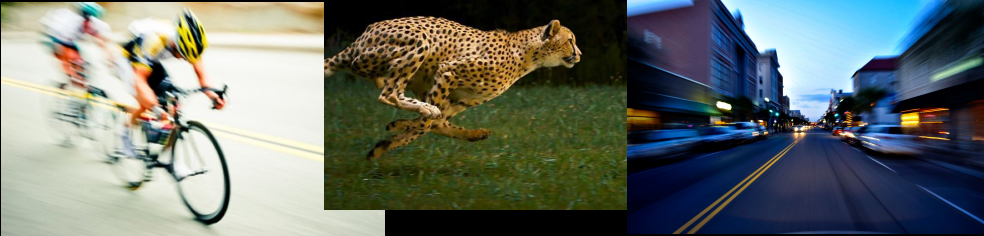
- Core problem in computer vision
- Examples:
  - Object tracking
  - Trajectory analysis
  - Object finding
  - Video enhancement, stabilization, 3D reconstruction, object recognition 
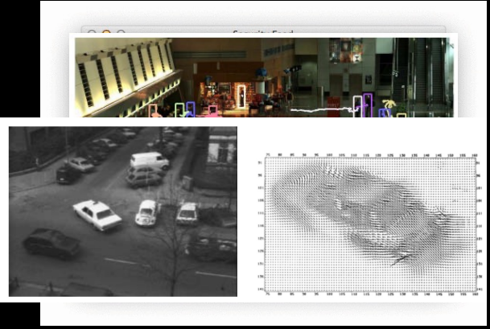
 
 ## Perception vs Representation
 - We can *perceive* motion where none exists, or not perceive motion where motion exists 
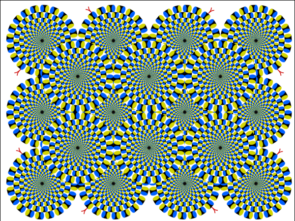
 - Shapeless or transparent objects, or limited sight, are problematic
 - Computer would not see motion in the previous images (which is good)
 - … computer doesn’t “see” in the human sense
 - Point being: **computers only analyze motion of opaque, solid objects**
 - Key: **motion representation**

## Representing Motion
- We perceive optic flow
- Pattern of flow (vectors)
- Ecological optics – J.J. Gibson 
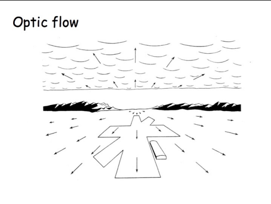
- Deviations
  - 3D motion of object is represented as 2D projection—losing 1 dimension of information
  - Optical flow = 2D velocity describing *apparent* motion 
 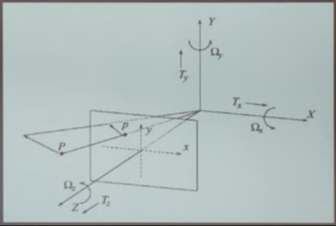

## Thought Experiments
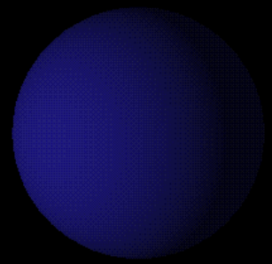

### Thought Experiment 1
- We have a matte ball, rotating
- **What does the 2D motion field look like?**
- **What does the 2D optical flow field look like?**

### Thought Experiment 2
- We have a matte ball, *stationary*
- **What does the 2D motion field look like?**
- **What does the 2D optical flow field look like?**

## Just to throw a wrench in things…
- The **Aperture Problem**: lighting is not the only source of error 
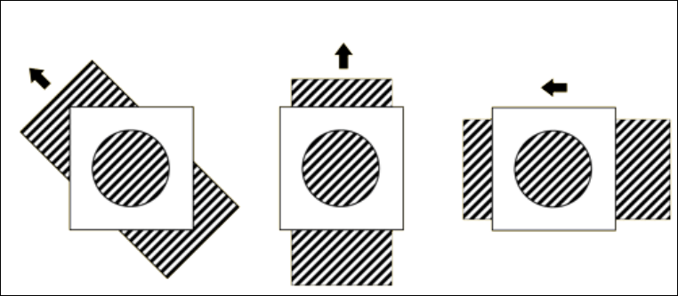

## Aside
- With all these limitations and pitfalls, it’s important to keep the following items in mind (with thanks to Dr. Michael Black):
  - We are, more or less, intentionally forgetting any physics we might know
  - We are dealing with **images**
  - We’re hoping the 2D flow is *related* to the structure of the world and can be a viable proxy for the motion field
  - Fixing the above is important—**you could work on it!**

## Optical Flow
- Motion, or *displacement*, at all pixels
  - Magnitude: saturation
  - Orientation: hue

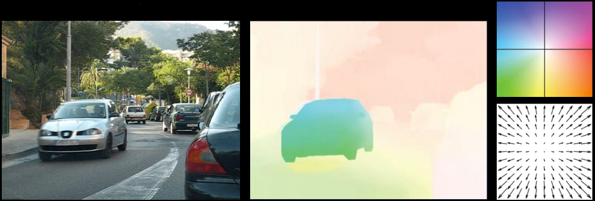

## Optical Flow Goals
- Find a mapping for each pixel $(x1, y1) \rightarrow (x2, y2)$
  - Seems simple enough…?
- Motion types
  - Translation
$$
\begin{bmatrix}
x_2 \\
y_2
\end{bmatrix}
=
\begin{bmatrix}
x_1 + a \\
y_1 + b
\end{bmatrix}
$$
  - Similarity
$$
\begin{bmatrix}
x_2 \\
y_2
\end{bmatrix}
=
s
\begin{bmatrix}
\cos(\alpha) & \sin(\alpha) \\[6pt]
-\sin(\alpha) & \cos(\alpha)
\end{bmatrix}
\begin{bmatrix}
x_1 + a \\
y_1 + b
\end{bmatrix}
$$
  - Affine
$$
\begin{bmatrix}
x_2 \\
y_2
\end{bmatrix}
=
\begin{bmatrix}
a x_1 + b y_1 + c \\
d x_1 + e y_1 + f
\end{bmatrix}
$$
  - Homography
$$
\begin{bmatrix}
x_2 \\
y_2
\end{bmatrix}
=
\frac{1}{z}
\begin{bmatrix}
a x_1 + b y_1 + c \\
d x_1 + e y_1 + f
\end{bmatrix}
,\quad
z = g x_1 + h y_1
$$
- This is known as **parametric motion**: powerful in its expressivity, but limited in its ability to describe arbitrary motion in videos. 
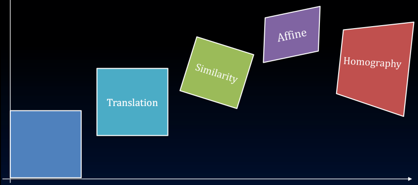

## Optical Flow Definition
- Image pixel value at time t and location $x = (x, y)$
- Horizontal $u$ and vertical $v$ components of the flow

$$ I(x, y, t) $$
$$ u(x, y) $$
$$ v(x, y) $$

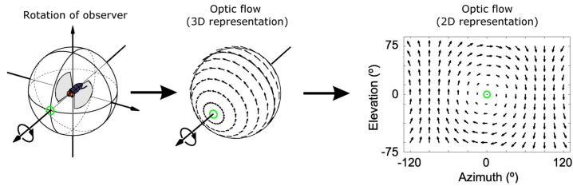

## Optical Flow Assumptions
- **Brightness Constancy**
- Any one patch from frame 1 should look more or less the same as a corresponding spatial patch from frame 2
$$ I(x+u, y+v, t+1) = I(x, y, t) $$
- Spatial Smoothness
- Neighboring pixels in an image are likely to belong to the same surface
    - Surfaces are mostly smooth
    - Neighboring pixels have similar flow
$$ u_p = u_n $$
$$ n \in G(p) $$

Objective Function
- Brightness constancy (”data term”)
$$
E_D(u, v)
=
\sum_{s}
\bigl(
I(x_{s} + u_{s},\,y_{s} + v_{s},\,t + 1)
-
I(x, y, t)
\bigr)^{2}
$$
- New developments?
    - Squared error implies Gaussian noise!
- Spatial term for the flow fields $u$ and $v$
$$
E_{S}(u, v)
=
\sum_{n \in G(s)} \bigl(u_{s} - u_{n}\bigr)^{2}
\;+\;
\sum_{n \in G(s)} \bigl(v_{s} - v_{n}\bigr)^{2}
$$
- New developments?
    - Flow field is smooth
    - Deviations from smooth are Gaussian
    - First-order smoothness is all that matters
    - Flow derivative is approximated by first differences
$$ E(u, v) \;=\; E_{D}(u, v) \;+\; \lambda\,E_{S}(u, v) $$
$$
E(u,v)
=
\sum_{s}\bigl(I(x_{s}+u_{s},\,y_{s}+v_{s},\,t+1)\;-\;I(x,y,t)\bigr)^{2}
\\[6pt]
\quad
+\;\lambda
\Bigl(
\sum_{n\in G(s)}(u_{s}-u_{n})^{2}
\;+\;
\sum_{n\in G(s)}(v_{s}-v_{n})^{2}
\Bigr)
$$
- So to solve for flow field, we just take derivative, set to 0, and solve for $u$ and $v$, right?
$$
E_{D}(u,v)
=
\sum_{s}
\bigl(
I(x_{s} + u_{s},\,y_{s} + v_{s},\,t + 1)
-
I(x,y,t)
\bigr)^{2}
$$
> Reaction: **???**

## Linear approximation
- Taylor series expansion
    - $dx = u$, $dy = v$, $dt = 1$
$$
E_{D}(u,v)
=
\sum_{s}
\bigl(
I(x_{s} + u_{s},\,y_{s} + v_{s},\,t + 1)
-
I(x,y,t)
\bigr)^{2}
$$

$$
I(x,y,t)
+ dx\,\frac{\partial}{\partial x}I(x,y,t) \\[6pt]
+ dy\,\frac{\partial}{\partial y}I(x,y,t) \\[6pt]
+ dt\,\frac{\partial}{\partial t}I(x,y,t)
- I(x,y,t)
= 0
$$ 
$$
u\;\frac{\partial}{\partial x}I(x,y,t) \\[6pt]
+\,v\;\frac{\partial}{\partial y}I(x,y,t) \\[6pt]
+\,\frac{\partial}{\partial t}I(x,y,t)
=0
$$

## Constraint Equation
$$
u\;\frac{\partial}{\partial x}I(x,y,t) \\[6pt]
+\,v\;\frac{\partial}{\partial y}I(x,y,t) \\[6pt]
+\,\frac{\partial}{\partial t}I(x,y,t)
=0
$$
- …but really, we write it this way:
$$ I_xu + I_yv + I_t = 0 $$
- More new developments
    - Flow is small
    - Image is a differentiable function
    - First-order Taylor series is a good approximation

## Form of the constraint equation
- One equation, two unknowns
    - At each single image pixel, we get a line $ I_xu + I_yv = - I_t$
    - Only the normal component is observed
- We know the solution is somewhere along the line
- **Ill-posed problem: hence, the Aperture Problem**

## Nevertheless, they persisted
- Horn and Schunck, 1981
$$
E(u,v)
=
\sum_{s}
\bigl(I_{x,s}\,u_{s} + I_{y,s}\,v_{s} + I_{t,s}\bigr)^{2}
\\[6pt]
\quad
+\,\lambda
\sum_{n \in G(s)}
\Bigl(
(u_{s} - u_{n})^{2}
\;+\;
(v_{s} - v_{n})^{2}
\Bigr)
$$
- Take partial derivatives with respect to u and v; set to 0
$$
0 
=
\sum_{s}
\Bigl(
I_{x,s}^{2}\,u_{s}
\;+\;
I_{x,s}I_{y,s}\,v_{s}
\;+\;
I_{x,s}I_{t,s}
\Bigr)
\;+\;
\lambda
\sum_{n\in G(s)}
\bigl(u_{s}-u_{n}\bigr)
$$
$$
0
=
\sum_{s}
\bigl(
I_{x,s}I_{y,s}\,u_{s}
\;+\;
I_{y,s}^{2}\,v_{s}
\;+\;
I_{y,s}I_{t,s}
\bigr)
\\[6pt]
\quad
+\;\lambda
\sum_{n\in G(s)}
\bigl(v_{s}-v_{n}\bigr)
$$

## Revisiting assumptions
- Many of the Horn & Schunck ‘81 problems can be attributed to the fact that they were attempting dense image processing on 1981 computers
- Still, the problems outlined by the assumptions can cause problems in the real-world (aperture problem, ill-posed optimization, assumption of small motion, etc)
- Lots of these assumptions are still outstanding problems but have been addressed, at least in part
- (Check out the 2013 talk by Dr. Michael Black!)

## Coarse-to-fine
- Build an image “pyramid”
    - Exactly how this is done varies considerably
- Bottom line: flow calculated in original image is **much smaller** at top of pyramid (i.e., assumptions hold)
- Most optical flow algorithms do something like this: 
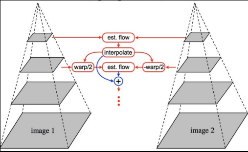
- This one “small” modification to Horn & Schunck actually gives pretty good results! 
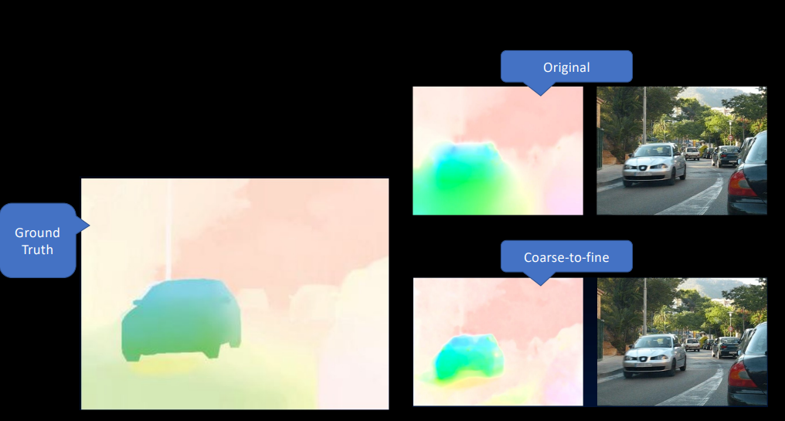

## “Flow is smooth”
- Does brightness constancy hold?
- Are spatial derivatives of optical flow *actually* Gaussian?
- As machine learning practitioners, how would we answer these questions?
- **Need ground truth—very recent developments**

## Durien Open Movie Project
- *Sintel* (full movie—go watch!)
- Made with Blender
- All assets openly available—**including ground truth optical flow fields**
    - 1628 frames of ground truth flow
    - 1024x436 resolution
    - max velocity over 100 ppf
    - separated into training/testing

## CS Mantra
- We solve one problem (need of ground-truth optical flow) by adding an additional abstraction layer (assume flow statistics of Sintel will generalize)
- …which usually introduces a new problem
- **Will these flow statistics be at all useful for optical flow models outside of action movies?**

## Flow Statistics
- In general, optical flow fields are sparse (i.e., most flow fields are 0) 
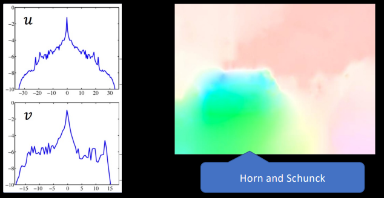
- Using the flow statistics from training data, we can determine that brightness constancy **usually holds**
$$ I_{1}(i,j)\;-\;I_{2}\bigl(i + u_{i,j},\,j + v_{i,j}\bigr)  $$
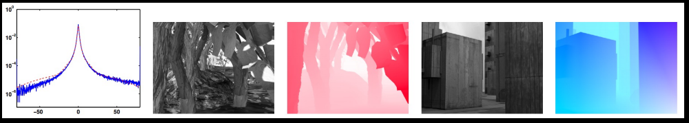
- Spark peak at 0
- Heavy tails are violations of brightness constancy

## “Neighboring pixels move together”
- Except when they don’t
- Could consider these pixels as “spatial outliers”
- But want to consider themas part of **different surfaces with different motions** 
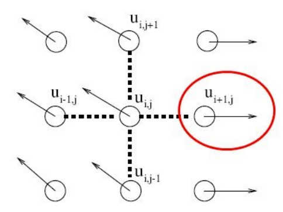

## Spatial statistics
- Spatial derivatives of the optical flow field $u$ and $v$ 
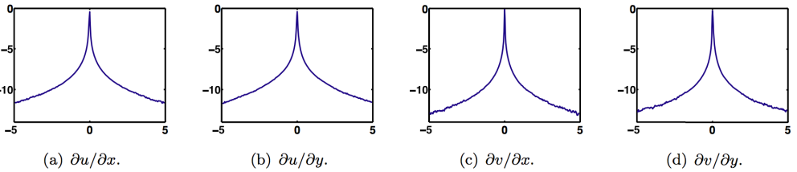
- Similar story: flow is *usually* smooth, but motion boundaries create have heavy tails

## Markov Random Fields
- The heavy tails on the spatial statistics are why optical flow has such problems with *object boundaries*
    - Quadratic smoothness term in objective
- Horn & Schunck \[inadvertently?\] kicked off 30+ years of research into Markov Random Fields
- Need a “robust” formulation that can handle multiple surfaces moving distinctly from each other

## Robust Formulation
- Replace quadratic terms in original energy function with a new error function that gives *less* weight to *large* errors
$$
E(u,v)
=
\sum_{s}
\rho\!\bigl(I_{x,s}\,u_{s} \;+\; I_{y,s}\,v_{s} \;+\; I_{t,s},\;\sigma_{D}\bigr)
\;+\;\lambda
\sum_{n\in G(s)}
\Bigl(
\rho(u_{s}-u_{n},\,\sigma_{S})
\;+\;
\rho(v_{s}-v_{n},\,\sigma_{S})
\Bigr)
$$
- Note the rho functions and sigmas:
$$
\rho(x, \sigma) \;=\; \frac{x^2}{x^2 + \sigma^2}
$$
- Previous L2 (squared error) is sensitive to outliers
    - Outliers = occasional large flow derivatives
- New error function **saturates** at larger magnitudes
    - Is **robust** to outliers

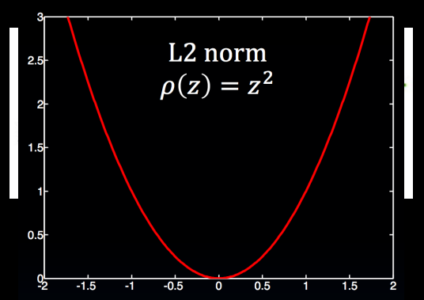
- Object boundaries are considerably sharper 
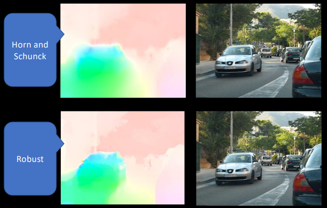
- Optimization is considerably more difficult
- Non-linear in the flow term
- No closed-form solution
- Approaches
    - Gradient descent
    - Graduated non-convexity
    - Iteratively re-weighted least squares

## Current Methods
- Current methods employ a combination of:
 - Coarse-to-fine (image pyramids)
 - Median filtering (convolutions)
 - Graduated non-convexity
 - Image pre-processing
 - Bicubic interpolation (sparse to dense)
- Layers and segmentation (Sevilla-Lara et al 2016, CVPR)
- Pyramid networks (Ranjan et al 2016, CVPR)
- Deep convolutional networks (Dosovitskiy and Fischer et al 2015, ICCV)
