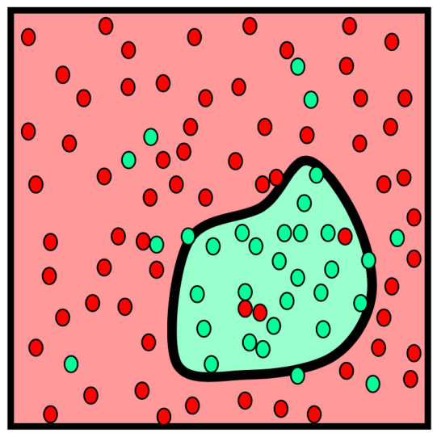

# Linear and Ensemble Methods

### In general, the goal:
- Construct a predictor $f: X \rightarrow Y$ that minimizes risk $R(f)$  

- Classification:
$$R(f) = P(f(X) \neq Y)$$
(Probability of error)
- Regression:
$$R(f) = \mathbb{E}[(f(X) - Y)^2]$$
(Mean squared error)

### Optimal [regression] predictor
$$ f^{*} = \arg\min_{f} \mathbb{E}\bigl[(f(X) - Y)^{2}\bigr] = \mathbb{E}[Y | X] $$
(conditional mean)

### We can prove this!
$$ f^{*} = \arg\min_{f} \mathbb{E}\bigl[(f(X) - Y)^{2}\bigr] = \mathbb{E}[Y | X] $$
- Therefore, for any prediction rule $f$, $R(f) \geq R(f^*)$
- We define $ R(f) = E_{XY}[(f(X) - Y)^2] $
- Expand $R(f)$ according to axiom of conditional probability: $$ = \mathbb{E}_{X}\Bigl[\mathbb{E}_{Y\mid X}\bigl[(f(X)-Y)^{2}\mid X\bigr]\Bigr] $$
- It escalates quickly… (dropping subscripts for convenience): $$ = E\Bigl[E\bigl[(\,f(X)-E[Y\mid X]\,)+\bigl(E[Y\mid X]-Y\bigr)\bigr]^{2}\;\bigm|\;X\Bigr] $$
- Multiplying out the quadratic term: $$ = E[ E[(f(X)-E[Y|X])^2|X] + 2E[(f(X)-E[Y|X])(E[Y|X]-Y)|X] + E[(E[Y|X]-Y)^2|X] ] $$
- Finally:
$$ = E[f(X)-E[Y|X])^2]+R(f^*)$$
>  $ E[f(X)-E[Y|X])^2] \geq 0 $
- Intuition: Signal plus (zero-mean) Noise model $$Y = f^*(X) + \epsilon$$ depends on **unknown** distribution $P_{XY}$

### Empirical Risk Minimization (EMR)
- Since we don’t have direct access to the unknown distribution $P(X, Y)$, we rely on statistics
- **Optimal Predictor:** $$ f^{*} \;=\; \arg\min_{f}\;\mathbb{E}\bigl[(\,f(X)\;-\;Y\,)^{2}\bigr] $$
- **Empirical Risk Minimizer:** $$ \hat f_{n} = \arg\min_{f \in \mathcal{F}}\frac{1}{n}\sum_{i=1}^{n}\bigl(f(X_{i}) - Y_{i}\bigr)^{2} $$

> $ \mathcal{F} $: Class of predictors

> $ \frac{1}{n}\sum_{i=1}^{n} $: Emperical Mean

$$
\frac{1}{n}\sum_{i=1}^n \bigl[\mathrm{loss}(Y_i, f(X_i))\bigr]
\;\xrightarrow{\text{Law of Large Numbers}}\;
\mathbb{E}_{X,Y}\bigl[\mathrm{loss}(Y, f(X))\bigr]
$$

## Part 1: Linear Models
- Means each $f$ in $F_L$ is restricted to a class of *linear* functions (in $X$)

$$ \hat f_n^{L} = \arg\min_{\,f \in \mathcal{F}_{L}}\;\frac{1}{n}\sum_{i=1}^{n}\bigl(f(X_{i}) - Y_{i}\bigr)^{2} $$

### Univariate Case
- You've seen this a million times: $f(X) = \beta_1 + \beta_2X$

### Multivariate Case
$$ f(X) = f(X^{(1)}, \ldots, X^{(p)}) = \beta_1X^{(1)} + \beta_2X^{(2)} + \ldots + \beta_pX^{(p)} = X\beta $$
- where $$ X = [X^{(1)}, \ldots, X^{(p)}], \beta=[\beta_1, \ldots, \beta_p]^T $$

### Finding the estimator
- Back to our original equation
$$ \hat f_n^{L} = \arg\min_{\,f \in \mathcal{F}_{L}}\;\frac{1}{n}\sum_{i=1}^{n}\bigl(f(X_{i}) - Y_{i}\bigr)^{2} $$
- Substitute in our line parameter: $$ \hat{\beta} = \arg\min_{\beta}\frac{1}{n}\sum_{i=1}^{n}\bigl(X_{i}\,\beta - Y_{i}\bigr)^{2} $$
- Expand the square: $$ = \arg\min_{\beta}\frac{1}{n}\,(A\beta - Y)^{T}(A\beta - Y) $$
- where
$$
A = 
\begin{bmatrix}
X_{1} \\[6pt]
\vdots \\[6pt]
X_{n}
\end{bmatrix}
=
\begin{bmatrix}
X_{1}^{(1)} & \dots & X_{1}^{(p)} \\[6pt]
\vdots      & \ddots & \vdots      \\[6pt]
X_{n}^{(1)} & \dots & X_{n}^{(p)}
\end{bmatrix},
\quad
Y = 
\begin{bmatrix}
Y_{1} \\[6pt]
\vdots \\[6pt]
Y_{n}
\end{bmatrix}
$$
 
$$ \hat{\beta} = \arg\min_{\beta}\frac{1}{n}\,(A\beta - Y)^{T}(A\beta - Y) $$
$$ J(\beta) = (A\beta - Y)^{T}(A\beta - Y) = \arg\min_{\beta} J(\beta) $$

### Normal Equations
$$ (A^TA)\hat{\beta} = A^TY $$
> $A^TA$: $p \times p$

> $\hat{\beta}$: $p \times 1$

> $A^TY$: $p \times 1$

- If ($A^TA$) is invertible, this is easily solved!
$$\hat{\beta} = (A^TA)^{-1}A^TY$$
- **When is ($A^TA$) invertible?**
    - When A is full rank
---
#### Geometric Interpretation
$$ \hat f_{n}^{L}(X) = X\,\hat\beta = X\,(A^{T}A)^{-1}A^{T}Y $$

- $f_n(A)$ is the orthogonal projection of $Y$ onto the linear subspace spanned by the columns of $A$ (aka $X$)
---
- We saw how to solve when $(A^TA)$ is invertible
    - Unspoken was the assumption that is is also *small*
- What about when $(A^TA)$ is invertible, but very large?
- **Gradient descent!** $J(\beta)$ is convex!

Initialize: $\beta^0$

Update:
$$\beta^{t+1}\;=\;\beta^{t}\;-\;\frac{\alpha}{2}\left.\frac{\partial J(\beta)}{\partial \beta}\right|_{t}\;=\;\beta^{t} \;-\;\alpha\,A^{T}\bigl(A\beta^{t} - Y\bigr)$$

> $(A\beta^{t} - Y) = 0$ if $\beta^t = \hat\beta$
- what about when $(A^TA)$ is **not** invertible?
- **Prior + regularization**
$$
\hat{\beta}_{\mathrm{MAP}}
=
\arg\max_{\beta}
\Bigl[
\log p\bigl(\{(X_i, Y_i)\}_{i=1}^{n}\;\big|\;\beta, \sigma^{2}\bigr)
\;+\;
\log p(\beta)
\Bigr]
$$

> $\log p\bigl(\{(X_i, Y_i)\}_{i=1}^{n}\;\big|\;\beta, \sigma^{2}\bigr)$: log likelihood

> $\log p(\beta)$: log prior

### Non-invertible case
- What kind of priors?
- Gaussian prior
$$
\hat{\beta}_{\mathrm{MAP}}
=
\arg\min_{\beta}
\sum_{i=1}^{n}\bigl(Y_{i} - X_{i}\beta\bigr)^{2}
\;+\;
\lambda\,\|\beta\|_{2}^{2}
$$
    - (Ridge regression)
- Laplace prior
$$
\hat{\beta}_{\mathrm{MAP}}
=
\arg\min_{\beta}
\sum_{i=1}^{n}\bigl(Y_{i} - X_{i}\beta\bigr)^{2}
\;+\;
\lambda\,\|\beta\|_{1}
$$
    - (Lasso regression)
- **What's the difference?**
    - Ridge shrinks all coefficients smoothly toward zero but rarely makes any of them exactly zero
    - Lasso encourages sparsity, often driving many coefficients exactly to zero and thus performing variable selection

### Types of Regularization
$$
\min_{\beta}\;
\bigl(A\beta - Y\bigr)^{T}\bigl(A\beta - Y\bigr)
\;+\;
\lambda\,\mathrm{pen}(\beta)
$$

- Ridge ($\ell_2$)
    - The big circular region is the set $\{\beta \;:\; \|\beta\|_{2} = \text{constant}\}$
    - The ellipses are level sets of the unregularized loss $\bigl(A\beta - Y\bigr)^{T}\bigl(A\beta - Y\bigr)$
    - Their first tangent (black dot) gives the ridge solution $\hat\beta$
- Lasso ($\ell_1$)
    - The diamond is the set $\{\beta \;:\; \|\beta\|_{1} = \text{constant}\}$
    - Again the ellipses are loss contours, and the corner‐tangent enforces sparsity (some coefficients exactly zero).
    - results in *sparse* solutions
    - very good for high-dimensional problems!

## Part 2: Ensemble Models
### Nonlinear decision boundaries
- Sometimes we encounter problems that linear models can’t solve

### Bias-variance trade-off
- Bias
    - $E[\theta - X]$
    - Deviation of the estimator from the true value on average
- Variance
    - $E(X^2)-E(X)^2$
    - Spread of data from the average
- As one decreases, the other rends to increase
- Low-bias, low-variance is not generally possible

### Ensemble Models
- Collections of “weak learners”
    - Decision Trees $\rightarrow$ Random Forests
    - Logistic Regression $\rightarrow$ Pool of Logistic Regressors
    - Naïve Bayes -> Ensemble of Naïve Bayes
    - Support Vector Machine $\rightarrow$ Ensemble of SVMs
- Each is trained independently on a subset of the training data
- Decisions are made by pooling all the individual models’ predictions
- **Instead of learning a single (weak) classifier, learn many (weak) classifiers that are good at different parts of the input space**

### Boosting
- Given a weak learner, run it multiple times on (reweighted) training data, then let learned classifiers vote
- On each iteration $t$:
    -  weight each training example by how incorrectly it was classified
    - learn a weak hypothesis (classifier) $h_t$
    - a strength of the hypothesis $a_t$
- Final classifier: $$ H(X) \;=\; \operatorname{sign}\!\Bigl(\sum\alpha_{t}\,h_{t}(X)\Bigr) $$

### Boosting example

## Part 3: xgboost
### XGBoost
- eXtreme Gradient Boosting
- 29 Kaggle challenges with winners in 2015
    - 17 used XGBoost
    - 8 of these solely used XGBoost; the others combined XGBoost with DNNs
- KDDCup 2015
    - Every single top 10 finisher used XGBoost

### XGBoost Applications
- Store sales prediction
- High energy physics event classification
- Web text classification
- Customer behavior prediction
- Motion detection
- Ad click through rate prediction
- Malware classification
- Product categorization
- Hazard risk prediction
- Massive on-line course dropout rate prediction

### Properties of XGBoost
- Single most important factor in its success: **scalability**
-  Due to several important systems and algorithmic optimizations

1. Highly scalable end-to-end tree boosting system
2. Theoretically justified weighted quantile sketch for efficient proposal calculation
3. Novel sparsity-aware algorithm for parallel tree learning
4. Effective cache-aware block structure for out-of-core tree learning

### What is “tree boosting”?
- Given a dataset (n examples, m features)
$$
\mathcal{D} = \{(\mathbf{x}_i, y_i)\}
\quad
\bigl(|\mathcal{D}| = n,\;\mathbf{x}_i \in \mathbb{R}^m,\;y_i \in \mathbb{R}\bigr)
$$
- Tree ensemble uses $K$ additive functions to predict output
$$
\hat{y}_{i} \;=\; \phi(\mathbf{x}_{i})
\;=\;
\sum_{k=1}^{K} f_{k}(\mathbf{x}_{i}),
\quad
f_{k}\in\mathcal{F},
$$

### What is “gradient boosting”?
- Statistical view on boosting
    - $\Rightarrow$ Generalization of boosting to arbitrary loss functions
- Residual fitting  

1. Ground truth: The true underlying function and noisy sample points
2. Tree 1: The first regression tree fit to the raw data.
3. Tree 2: A second tree fit to the residuals left over after Tree 1
4. Tree 3: A third tree fit to the new residuals after adding Tree 1 + Tree 2
- In combination, you get an additive model which very quickly approaches the true function much more closely than any single tree alone

### Split-finding algorithms
- Exact
    - Computationally demanding
    - Enumerate all possible splits for continuous features
- Approximate
    - Algorithm proposes candidate splits according to percentiles of feature distributions
    - Maps continuous features to buckets split by candidate points
    - Aggregates statistics and finds best solution among proposals

### Comparison of split-finding
- Two variants
    - Global
    - Local

- Comparison of test AUC convergence on Higgs 10M dataset. The eps parameter corresponds to the accuracy of the approximate sketch. This roughly translates to 1 / eps buckets in the proposal. Local proposals require fewer buckets, because it refine split candidates.

### Sparsity-aware split finding
- Equates sparsity with missing values
- Defines a “default” direction: follow the observed paths
- Compare to “dense” method

- Impace of the sparsity aware algorithm on Allstate-10K. The dataset is sparse mainly due to one-hot encoding. The sparsity aware algorithm is more than 50 times faster than the naive version that does not take sparsity into consideration.

### How does this work?
- Features need to be in sorted order to determine splits
-  Concept of *blocks*
    - Compressed column (CSC) format
    - Each column sorted by corresponding feature value
- Exact greedy algorithm: all the data in a single block
-  Data are sorted once before training and used subsequently in this format

### Feature transformations in blocks

1. Layout transform of one feature column
    - On the left you see a raw column of feature values (the red boxes) each paired with its example’s gradient stats (the orange circles).
    - We then sort that column by feature value, keeping only the non-missing entries (so you implicitly treat zeros or NAs as missing and don’t store them).
2. Input layout of three columns
    - Next you see three separate CSC-style columns, each individually sorted by its feature values, with pointers from each sorted value back to its example’s gradient statistics.
    - Missing values (dashed slots) literally aren’t stored at all.
3. Linear scan over presorted blocks
    - On the right is a toy “people” example showing how a single pass down that sorted column accumulates the left-side gradient sum $G_L$ and the right-side sum $G_R$ in constant time per value:
        - As you move the split threshold past each value, you add that example’s gradient stats to $G_L$ (and subtract from $G_R$) and compute the split gain.
    - The faces and labels (g₁,h₁, etc.) just illustrate summing up gradients/hessians of the examples to the left vs.\ right of the candidate threshold.
- By pre-sorting each feature into its own block and storing only non-missing entries, you can find the exact best split in one linear sweep per column—no re-sorting or random access needed.

### More on blocks
- Data is stored on multiple blocks, and these blocks are stored on disk
- Independent threads pre-fetch specific blocks into memory to prevent cache misses
- **Block Compression**
    - Each column is compressed before being written to disk, and decompressed on-the-fly when read from disk into a prefetched buffer
    - Cuts down on disk I/O
- **Block Sharding**
    - Data is split across multiple disks (i.e. cluster)
    - Pre-fetcher is assigned to each disk to read data into memory

### Cache-aware access
- **Exact Greedy Algorithm**
    - Allocate an internal buffer in each thread
    - Fetch gradient statistics
    - Perform accumulation in mini-batch
    - Reduces runtime overhead when number of rows is large
- **Approximate Algorithms**
    - Choice of block size is critical
    - Small block size results in small workloads for each thread
    - Large block size results in cache misses as gradient statistics do not fit in cache

- Exact greedy plot: can see that even at 1 thread, the cache-aware version is ~2$\times$ faster than the baseline, and both scale nicely up to 16 threads.
- Approximate greedy plot: 
    -  each curve is an $\epsilon$-approximation using presorted blocks of different sizes ($2^{12}$, $2^{16}$, $2^{20}$, $2^{24}$)
    -  Smaller blocks give lighter per-thread workloads but at some point pay for more cache‐miss overhead; larger blocks need so much data they thrash the cache
    -  The middle block sizes hit the sweet spot—fastest overall and good scaling

### Results: out of core

- by compressing each feature block and processing the data in manageable disk‐resident shards, you achieve robust out-of-core scaling: you can keep building trees on datasets far larger than RAM without the severe slowdowns or crashes that the basic method suffers
### Results: distributed

- XGBoost runs fastest overall and scales most gently with data size for both End-to-end time (including data loading) and Per-iteration cost (excluding data I/O)

### Results: scalability

- Scaling of XGBoost with different number of machines on criteo full 1.7 billion dataset. Using more machines results in more file cache and makes the system run faster, causing the trend to be slightly super linear. XGBoost can process the entire dataset using as little as four machines, and scales smoothly by utilizing more available resources.

## Conclusions
- Most (all?) supervised models are predicated on *minimizing risk*
- Linear models do this by fitting coefficients
    - Can be solved directly (with an inverse)
    - Can be solved iteratively (with gradient descent)
- Regularization can help with fitting but has trade-offs
- Linear models are inherently limited but their utility need not be sacrificed thanks to ensemble models
- Bias-variance trade-off
- Boosting; not to be confused with gradient-boosted trees (xgboost)
    - Combination of algorithmic design and clever hardware implementations make for an easy-to-use and extremely performant ensemble model

## Regularized objective function

- Structure score calculation. We only need to sum up the gradient and second order gradient statistics on each leaf, then apply the scoring formula to get the quality score.
- The smaller this structure‐score is, the better that split pattern is deemed by XGBoost’s learning objective

$\mathcal{L}(\phi)\;=\;\sum_{i} l\bigl(\hat{y}_{i},\,y_{i}\bigr)\;+\;\sum_{k} \Omega\bigl(f_{k}\bigr)\;$ where $\;\Omega(f)\;=\;\gamma\,T\;+\;\tfrac{1}{2}\,\lambda\,\|w\|^{2}$
- Objective
$$
\mathcal{L}^{(t)}
=
\sum_{i=1}^{n}
l\!\bigl(y_{i},\,\hat y_{i}^{(t-1)} + f_{t}(\mathbf{x}_{i})\bigr)
\;+\;
\Omega\bigl(f_{t}\bigr)
$$
- 2nd order approx.
$$
\mathcal{L}^{(t)}
\simeq
\sum_{i=1}^{n}
\Bigl[
l\bigl(y_{i},\,\hat y_{i}^{(t-1)}\bigr)
\;+\;
g_{i}\,f_{t}(\mathbf{x}_{i})
\;+\;
\tfrac{1}{2}\,h_{i}\,f_{t}^{2}(\mathbf{x}_{i})
\Bigr]
\;+\;
\Omega\bigl(f_{t}\bigr)
$$
- Remove Constants
$$
\tilde{\mathcal{L}}^{(t)}
=
\sum_{i=1}^{n}
\bigl[
g_i\,f_t(\mathbf{x}_i)
\;+\;
\tfrac{1}{2}\,h_i\,f_t^{2}(\mathbf{x}_i)
\bigr]
\;+\;
\Omega\bigl(f_t\bigr)
$$
- Scoring Function to evaluate quality of tree structure
$$
\tilde{\mathcal{L}}^{(t)}(q)
=
- \tfrac{1}{2}
\sum_{j=1}^{T}
\frac{\bigl(\sum_{i\in I_{j}} g_{i}\bigr)^{2}}
{\sum_{i\in I_{j}} h_{i} + \lambda}
\;+\;
\gamma\,T
$$

## Shrinkage and column subsampling
- Shrinkage
    - Scales newly added weights by a factor $\eta$
    - Reduces influence of each individual tree
    - Leaves space for future trees to improve model
    - Similar to learning rate in stochastic optimization
- Column subsampling
    - Subsample features
    - Used in Random Forests
    - Prevents overfitting more effectively than row-sampling
