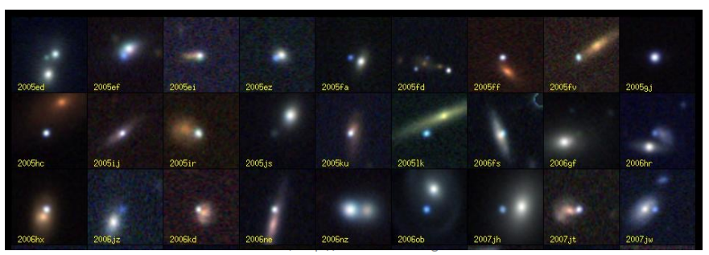

# Spectral Clustering

## High Dimensional Data
- Given a cloud of data points we want to understand its structure


## The Problem of Clustering
- Given a **set of points**, with a notion of **distance** between points, **group the points** into some number of *clusters*, so that
    - Members of a cluster are close/similar to each other
    - Members of different clusters are dissimilar
- **Usually**:
    - Points are in a high-dimensional space
    - Similarity is defined using a distance measure
    - Euclidean, Cosine, Jaccard, edit distance, ...

## Example: Clusters & Outliers


## Clustering is a hard problem!

- Clustering in two dimensions looks easy
- Clustering small amounts of data looks easy
- And in most cases, looks are not deceiving
- Many applications involve not 2, but 10 or 10,000 dimensions
- **High-dimensional spaces look different**: Almost all pairs of points are at about the same distance

## Curse of dimensionality
- "vastness" of Euclidean space

- The ratio of the volume of the hypersphere enclosed by the unit hypercube. The most intuitve example, the unit square and unit circle, are shown as an inset. Note that the volume of the hypersphere quickly becomes irrelevant for higher dimensionality.

## Clustering Problem: Galaxies
- A catalog of 2 billion “sky objects” represents objects by their radiation in 7 dimensions (frequency bands)
- Problem: Cluster into similar objects, e.g., galaxies, nearby stars, quasars, etc.
- Sloan Digital Sky Survey



## Clustering Problem: Music
- Intuitively: **Music divides into categories, and customers prefer a few categories**
    - But what are categories really?
- Represent a song by a set of customers who bought it:
    - Similar songs have similar sets of customers, and vice-versa
- **Space of all music**:
    - Think of a space with one dimension for each customer
        - Values in a dimension may be $0$ or $1$ only
        - A song is a point in this space $(x_1, x_2,\ldots, x_k)$, where $x_i = 1$ if and only if the $i$th customer bought the song
    - For Amazon, the dimension is tens of millions
    - **Task**: Find clusters of similar songs

## Clustering Problem: Documents
- **Finding topics**:
    - Represent a document by a vector $(x_1, x_2,\ldots, x_k)$, where $x_i = 1$ if and only if the $i$th (in some order) appears in the document
        - It actually doesn’t matter if $k$ is infinite; i.e., we don’t limit the set of words
    - **Documents with similar sets of words may be about the same topic**

## Cosine, Jaccard, and Euclidean
- As with songs we have a choice when we think of documents as sets of words or shingles:
    - *Sets as vectors*: Measure similarity by the **cosine distance**
    - *Sets as sets*: Measure similarity by the **Jaccard distance**
    - *Sets as points*: Measure similarity by **Euclidean distance**

## Overview: Methods of Clustering
- **Hierarchical**:
    - *Agglomerative* (bottom up):
        - Initially, each point is a cluster
        - Repeatedly combine the two “nearest” clusters into one
    - *Divisive* (top down):
        - Start with one cluster and recursively split it
- **Point assignment**:
    - Maintain a set of clusters
    - Points belong to “nearest” cluster

## Hierarchical Clustering

- **Key operation**: Repeatedly combine two nearest clusters
- Three important questions:
    1. How do you represent a cluster of more than one point?
        - **Key problem**: As you merge clusters, how do you represent the “location” of each cluster, to tell which pair of clusters is closest?
        - Euclidean case: each cluster has a *centroid* = average of its (data)points
    2. How do you determine the “nearness” of clusters?
        - Euclidean case: Measure cluster distances by distances of centroids
    3. When to stop combining clusters?


## And in the Non-Euclidean Case?

- The only “locations” we can talk about are the points themselves
    - i.e., there is no “average” of two points
- Approach 1:
    1. How to represent a cluster of many points?
        - *clustroid* = (data)point **“closest”** to other points
    2. How do you determine the “nearness” of clusters?
        - Treat clustroid as if it were centroid, when computing inter-cluster distances

## “Closest” Point?
1. How to represent a cluster of many points?
    - *clustroid* = point **“closest”** to other points
- Possible meanings of “closest”:
    - Smallest maximum distance to other points
    - Smallest average distance to other points
    - Smallest sum of squares of distances to other points
        - For distance metric $d$ clustroid $c$ of cluster $C$ is: $$ \min_{c}\;\sum_{x \in C} d(x, c)^{2} $$


- **Centroid** is the avg. of all (data)points in the cluster. This means centroid is an “artificial” point.
- **Clustroid** is an existing (data)point that is “closest” to all other points in the cluster.

## Defining “Nearness” of Clusters
2. How do you determine the “nearness” of clusters?
    - Approach 2: **Intercluster distance** = minimum of the distances between any two points, one from each cluster
    - Approach 3: Pick a notion of **“cohesion”** of clusters, e.g., maximum distance from the clustroid
      - Merge clusters whose *union* is most cohesive

## Cohesion
- Approach 3.1: Use the **diameter** of the merged cluster = maximum distance between points in the cluster
- Approach 3.2: Use the **average distance** between points in the cluster
- Approach 3.3: Use a **density-based approach**
    - Take the diameter or avg. distance, e.g., and divide by the number of points in the cluster

## Implementation
- Naïve implementation of hierarchical clustering:
    - At each step, compute pairwise distances between all pairs of clusters, then merge
    - $O(N^3)$
- Careful implementation using priority queue can reduce time to $O(N^{2}\log(N))$
    - Still too expensive for really big datasets that do not fit in memory

## $k$–means Algorithm(s)
- Assumes Euclidean space/distance
- Start by picking $k$, the number of clusters
- Initialize clusters by picking one point per cluster
- Example: Pick one point at random, then $k-1$ other points, each as far away as possible from the previous points

## Populating Clusters
1. For each point, place it in the cluster whose current centroid it is nearest
2. After all points are assigned, update the locations of centroids of the $k$ clusters
3. Reassign all points to their closest centroid
    - Sometimes moves points between clusters
- Repeat 2 and 3 until convergence
    - **Convergence**: Points don’t move between clusters and centroids stabilize

## The wrong method of getting the $k$ right
- **How to select k?**
    - Try different $k$, looking at the change in the average distance to centroid as $k$ increases
    - Average falls rapidly until right $k$, then changes little
    - **WRONG**
    - Stop using the elbow criteron method for k-means and how to choose the number of clusters instead

## Problems with the elbow method
- Heuristic with absolutely no theoretical support
- Easy to draw very poor conclusions
- Better alternatives have existed in the literature


- Despite the wildly different underlying data distributions, all five elbow plots look very similar.

## Alternatives to the elbow method
- Distance-based criteria
    - Compare diameter of clusters to cluster separation
    - Silhouette width measure
- Information-theoretic criteria
    - Minimum description length
    - Trade-off between “compactness” of clusters vs number of clusters
- Simulation-based criteria
    - “Gap” statistic: estimate a baseline error from randomized clustering, then choose a $k$ that obtains a minimum relative error (i.e. largest gap)
    - **Very sensitive to data preprocessing**—authors recommend previous methods

## Example: Picking $k$

- **Too few**; many long distances to centroid.


- **Just Right**; distances rather short


- **Too many**; little improvement in average distance

- [More K-means examples](http://www.naftaliharris.com/blog/visualizing-k-means-clustering/)

## Graph Partitioning
- **Undirected Graph**
- Bi-paritioning task: Divide vertices into two disjoint groups
- Questions:
    - How can we define a “good” partition?
    - How can we efficiently identify such a partition?

- **What makes a good partition?**
    - Maximize the number of within-group connections
    - Minimize the number of between-group connections


## Graph Cuts
- **Express partitioning objectives as a function of the “edge cut” of the partition**
- *Cut*: Set of edges with only one vertex in a group: $$ \mathrm{cut}(A, B) \;=\; \sum_{i \in A,\,j \in B} w_{ij} $$


## Graph Cut Criterion
- Criterion: **Minimum-cut**
    - Minimize weight of connections between groups
$$ \arg\min_{A, B}\;\mathrm{cut}(A, B) $$
    - Degernerate case<br>
    
    - Problem:
        - Only considers external cluster connections
        - Does not consider internal cluster connectivity
- Criterion: **Normalized-cut** [Shi-Malik, ’97]
    - Connectivity between groups relative to the density of each group
$$ \mathrm{ncut}(A,B) = \frac{\mathrm{cut}(A,B)}{\mathrm{vol}(A)}\;+\;\frac{\mathrm{cut}(A,B)}{\mathrm{vol}(B)} $$
    - where $\mathrm{vol}(P)$ is the total weight of all edges with at least one endpoint in partition $P$
    - **Why use this criterion?**
        - Produces more balanced partitions
    - How do we efficiently find a good partition?
        - **Problem**: Computing optimal cut is NP-hard

## Spectral Graph Partitioning
- $A$: adjacency matrix of undirected graph $G$
    - $A_{ij}=1$ if is an edge, else 0
- $x$ is a vector in $\mathbb{R}^n$ with components
  - Think of it as a label/value of each node of $G$
- **What is the meaning of $ A \cdot x $?**
$$
\begin{bmatrix}a_{11} & \dots & a_{1n} \\[6pt]
\vdots & \ddots & \vdots \\[6pt]
a_{n1} & \dots & a_{nn}
\end{bmatrix}
\begin{bmatrix}
x_{1} \\[6pt]
\vdots \\[6pt]
x_{n}
\end{bmatrix}
=
\begin{bmatrix}
y_{1} \\[6pt]
\vdots \\[6pt]
y_{n}
\end{bmatrix}
$$
$$
y_{i}
=
\sum_{j=1}^{n}A_{ij}\,x_{j}
=
\sum_{(i,j)\in E}x_{j}
$$
- Entry $y_i$ is a sum of labeld $x_j$ of neighbors of $i$

## What is the meaning of $Ax$?
- $j$th coordinate of $A \cdot x$:
    - Sum of the $x$-values of neighbors of $j$
    - Make this a new value at node $j$
- Spectral Graph Theory:
$$
\begin{bmatrix}
a_{11} & \dots  & a_{1n} \\[6pt]
\vdots & \ddots & \vdots \\[6pt]
a_{n1} & \dots  & a_{nn}
\end{bmatrix}
\begin{bmatrix}
x_{1} \\[6pt]
\vdots \\[6pt]
x_{n}
\end{bmatrix}
=
\lambda
\begin{bmatrix}
x_{1} \\[6pt]
\vdots \\[6pt]
x_{n}
\end{bmatrix}
$$
$$ A \cdot x = \lambda \cdot x $$
    - Analyze the “spectrum” of matrix representing $G$
    - Spectrum: Eigenvectors of a graph, ordered by the magnitude (strength) of their corresponding eigenvalues:
$$ \Lambda = \{\lambda_{1}, \lambda_{2}, \dots, \lambda_{n}\}$$
$$ \lambda_{1} \le \lambda_{2} \le \dots \le \lambda_{n} $$

## Matrix Representations
- **Adjacency matrix (A):**
    - $n \times n$ matrix
    - $A = [a_{ij}]$, $a_{ij}=1$ if edge between nodes $i$ and $j$
    - **Important Properties**
        - Symmetric matrix
        - Eigenvalues are real
        - Eigenvectors are orthogonal


- **Degree matrix (D):**
    - $n \times n$ matrix
    - $D = [d_{ii}]$, $d_{ii} = $ degree of node $i$


- **Laplacian matrix (L):**
    - $n \times n$ matrix
    - $L = D - A$
    - **Important Properties**
        - **Eigenvalues** are non-negative real numbers
        - **Eigenvectors** are real and orthogonal


## Spectral Clustering
- Graph = Matrix
    - $ W * v_1 = v_2 $ “propogates weights from neighbors”
- If $W$ is connected but roughly block diagonal with $k$ blocks, then
    - the top eigenvector is a constant vector
    - the next $k$ eigenvectors are roughly piecewise constant with “pieces” corresponding to blocks
- Outline of the algorithm:
    1. Start with (ideally) block-diagonal $A$
    2. Compute $L = D - A$
    3. Find the top $k+1$ eigenvectors $v_1, \ldots,v_{k+1}$ of $L$
    4. Discard the “top” one $v_1$ (the “trivial pair”)
    5. Replace original data with $k$-dimensional vector $x_a = \langle v_{2}(a),\,\dots,\,v_{k+1}(a)\rangle$
    6. Cluster with $k$-means


## Example: Spectral Paritioning

- Notice how for the first 10 nodes the values sit around −0.25, then there’s a sharp jump up to about +0.18 for the remaining 10 nodes.


- The 4 plateaus at -0.19, -0.12, +0.12, and +0.19 on the plot align with the 4 cliques in the graph


- Notice how the entries of the first eigenvector (the trivial one) are essentially all equal—a flat line; it carries no partition information
- In contrast, the plot of the components of $x_3$ has four distinct plateaus

## $k$-Way Spectral Clustering
- How do we partition a graph into $k$ clusters?
- Two basic approaches:
    - **Recursive bi-partitioning** [Hagen et al., ’92]
        - Recursively apply bi-partitioning algorithm in a hierarchical divisive manner
        - Disadvantages: Inefficient, unstable
    - **Cluster multiple eigenvectors** [Shi-Malik, ’00]
        - Build a reduced space from multiple eigenvectors
        - Commonly used in recent papers
        - A preferable approach...

## Why use multiple eigenvectors?
- **Approximates the optimal cut** [Shi-Malik, ’00]
    - Can be used to approximate optimal $k$-way normalized cut
- **Emphasizes cohesive clusters**
    - Increases the unevenness in the distribution of the data
    - Associations between similar points are amplified, associations between dissimilar points are attenuated
    - The data begins to “approximate a clustering”
- **Well-separated space**
    - Transforms data to a new “embedded space”, consisting of $k$ orthogonal basis vectors
- Multiple eigenvectors prevent instability due to information loss

## More terms
- If $A$ is an adjacency matrix (maybe weighted) and $D$ is a (diagonal) matrix giving the degree of each node
    - Then $L_u = D - A$ is the *(unnormalized) Laplacian*
    - $W=AD^{-1}$ is a *probabilistic adjacency matrix*
    - $L_n = I - D^{-\frac{1}{2}}AD^{-\frac{1}{2}}$ is the *(normalized or random-walk) Laplacian*
- The largest eigenvectors of $W$ correspond to the smallest eigenvectors of $L_n$
- So sometimes people talk about *“bottom eigenvectors of the Laplacian”*


- Toy example for spectral clustering where the data points have been drawn from a mixture of four Gaussians on $\mathbb{R}$. Left upper corner: histogram of the data. First and second row: eigenvalues and eigenvectors of $L_{rw}$ and $L$ based on the $k$-nearest-neighbor graph. Third and fourth row: eigenvalues and eigenvectors of $L_{rw}$ and $L$ based on the fully connected graph. For all plots, we used the Gaussian kernel with $\sigma = 1$ as similarity function.
- Each panel shows the eigenvalue “scree” and then plots of eigenvectors 1–5. You can clearly see how the normalized Laplacian on the $k$-NN graph (first and second rows) produces a clean block-constant behavior in its second, third, etc. eigenvectors, exactly the piecewise-constant signals you need for clustering, whereas the unnormalized or fully-connected choices smear out those plateaus and make cluster recovery harder.
- First two rows $\rightarrow$ $k$-nn graph $\rightarrow$ easy
- Last two rows $\rightarrow$ fully connected graph, weighted by distance $\rightarrow$ hard

## Spectrum from Data

- Three data sets, and the smallest 10 eigenvalues of $L_{rw}$.
- Left column: Four clearly separated Gaussian peaks. The spectrum shows four (near)‐zero eigenvalues before a big jump at the 5th eigenvalue—exactly signaling four clusters.
- Middle column: Four Gaussians but with more overlap. Now you see one exact zero, then three small but nonzero eigenvalues, then a spectral gap—indicating that cluster structure is still present but less clean.
- Right column: Noisy distribution. The eigenvalues rise smoothly from zero with no clear gap, telling you there is no meaningful multi-way partition to be found.
- In other words, as the underlying clusters become less well‐separated, the multiplicity and distinctness of the near-zero eigenvalues shrinks and blurs, which is the spectral hallmark of diminishing cluster structure.

## Similarity Graphs for Spectral Clustering

- $\epsilon$-ball: connect every pair whose Euclidean distance is $\le$0.3. You can see tight local “tubes” drawn along the high-density curves, but some points remain isolated.
- $k$-NN graph with $k=5$: draw a directed edge from each point to its 5 closest neighbors. This hooks every point into a network, but can introduce “bridges” that cut across low-density gaps
- mutual $k$-NN graph with $k=5$: only keep edges where each point ranks the other in its own top-5. This sparser graph preserves the tight local structure (the two curves) while breaking spurious long-range links.
- shows why the choice of $\epsilon$ vs. (mutual) $k$-NN graph matters: it changes which connections survive, which in turn affects the eigenvectors you’ll compute for spectral clustering
```
Which similarity graph(s) give rise to symmetric affinity/adjacency matrices?
    a. Epsilon-ball // correct
    b. KNN
    c. Mutual KNN // correct
```

## Spectral Clustering: Pros and Cons
- Elegant, and well-founded mathematically
- Works quite well when relations are approximately transitive (like similarity)
- Does not assume any form of the data (compare to $k$-means)
- Very noisy datasets cause problems
    - “Informative” eigenvectors need not be in top few
    - Performance can drop suddenly from good to terrible
- Expensive for very large datasets
    - Computing eigenvectors is the bottleneck

## Use cases and runtimes
- K-Means
    - *Fast*
    - “Embarrassingly parallel”
    - Not very useful on anisotropic data
- Spectral clustering
    - Excellent quality under many different data forms
    - Much slower than $k$-Means


- MiniBatch $k$-Means is extremely fast (hundredths of a second) but only works well on the Gaussian blobs (third row)—it totally fails to separate the rings or the moons.
- Spectral Clustering is much slower (seconds) yet correctly recovers the non-convex shapes (rings and moons) as well as the blobs, demonstrating its superior clustering quality at the cost of runtime.
