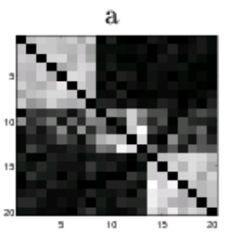
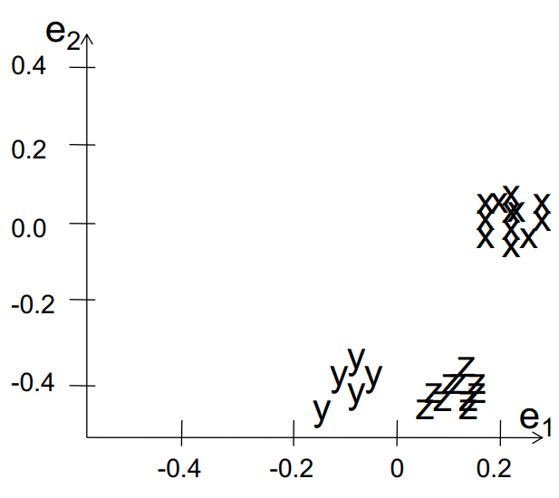

# Semi-Supervised Learning
## Supervised and Unsupervised Learning

## Semi-supervised learning
- Basically a hybrid!
- Given:
    - A pool of labeled examples $L$
    - A (usually larger) pool of unlabeled examples $U$
- **Can you improve accuracy somehow using $U$?**

- Grey circles: all the unlabeled data points $U$, which naturally form two interleaving half-moon clusters.
- Black circle: a single labeled example from one class.
- White circle: an unlabeled point whose class we’d like to infer.
- Dashed line: the decision boundary you’d get by enforcing the cluster (low-density) assumption—i.e.\ placing the separator in a region with few points, so that each moon ends up on one side of the boundary.
- In other words, even with just one label, using the structure of the unlabeled data allows you to draw a boundary that cleanly splits the two clusters.

## Spectral Clustering
- Graph = Matrix
    - $ W * v_1 = v_2 $ “propogates weights from neighbors”

## Semi-Supervised Learning as Label Propagation on a Graph
- Propagate label to “nearby” nodes
    - $X$ is “near” $Y$ if there is a high probability of reaching $Y$ from $X$
- Propagation methods
    - Personalized PageRank
    - Random walk
- Rewards multiple paths
- Penalizes longer and “high fanout” paths

- Nodes
    - Bold black nodes on the left are labeled entities; dark grey nodes in the middle are relation-templates or context patterns in which an entity appears; light grey nodes on the right are andidate fillers or unlabeled items that occur in those same contexts
- Edges
    - A directed edge from an entity to a pattern means “this entity appeared in that pattern” (black arrows for seed labels, grey for the rest)
    - A directed edge from a pattern out to a filler node means “this filler also appeared in that pattern.”
- Label propagation idea
    - You start a random-walk or personalized PageRank at your labeled seeds (Paris, Pittsburgh, Seattle).
    - Probability mass flows along edges—so patterns connected to those cities get “activated,” and then they pass that activation on to other items (like “beer,” “denial,” “Austin,” etc.).
    - Short, high-probability (low-fanout) paths accumulate more score; long or “branchy” paths are penalized.
- Even if you only have a handful of labeled nodes on the left, the structure of this graph lets you infer likely labels or scores for the vast majority of unlabeled nodes on the right

## MultiRankWalk
Seed Selection
- Order by PageRank or degree, or even randomly
- Traverse list until you have $k$ examples/class
$$ \vec{r} = (1-d)\vec{u} + dW\vec{r} $$
- MultiRankWalk algorithm:
    - Given: A graph $G = (V, E)$, corresponding to nodes in $G$ are instances $X$, composed of unlabeled instances $X^U$ and labeled instances $X^L$ with corresponding labels $Y_L$, and a damping factor $d$.
    - Returns: Labels $Y^U$ for unlabeled nodes $X_U$.
    - For each class $c$
        1. Set $u_{i} \leftarrow 1,\forall\,Y_{i}^L = c$
        2. Normalize $u$ such that $\|u\|_{1} = 1$
        3. $R_{c} \leftarrow \mathrm{RandomWalk}(G,u,d)$
    - For each instance $i$
        - $Set X^{U}_{i} \leftarrow \arg\max_{c}R_{ci}$

## Comparison: wvRN
- One definition [MacSkassy & Provost, JMLR 2007]:...
    - Given $v_{i} \in V^{U}$, the weigted vote relational-neighbor classifier (wvRN) estimates $ P(x_{i}=c \mid \mathcal{N}_i) $ as the (weighted) mean of the class-membership probabilities of the entities in $ \mathcal{N}_i $: $$ P\bigl(x_i = c \mid \mathcal{N}_i\bigr)\;=\;\frac{1}{Z}\sum_{v_j \in \mathcal{N}_i}w_{i,j}\;\cdot\;P\bigl(x_j = c \mid \mathcal{N}_j\bigr) $$
    - Does this look familiar? $\rightarrow$ **Homophily!**

## Comparison: HF
- Another definition in [X. Zhu, Z. Ghahramani, and J. Lafferty, ICML 2003]
- A harmonic field – the score of each node in the graph is the harmonic, or linearly weighted, average of its neighbors’ scores (harmonic field, HF)

- Handwritten-digit similarity graph (left)
    - HF fills in labels on the rest by taking each node’s score as the weighted average of its neighbors’ scores.

- 1D chain embedded in 2D (middle)
    - The two big markers (one red, one blue) are the seed labels at the extremes; the HF scores on every other point smoothly interpolate between them.
- “Swiss-roll” chain in 3D (right)
    - Exactly the same 1D chain, but now twisted into a 3D spiral (“swiss roll”). HF still propagates labels along the curve—so even though Euclidean neighbors in 3-space might be far along the strip, the graph connectivity (and hence the harmonic averaging) respects the manifold.
- In all three, can see how the harmonic-field solution enforces that each unlabeled node’s score is the (weighted) average of its neighbors’, giving you a smooth labeling that follows the underlying graph structure.

## MRW versus wvRN
- MRW is easily the method to beat
- wvRN matches MRW **only** when seeding is **not** random
- Still takes a larger number of labeled instances compared to MRW

## Why is MRW > wvRN?
- Start with wvRN & HF objectives
$$ P\bigl(x_i = c \mid \mathcal{N}_i\bigr)\;=\;\frac{1}{Z}\sum_{v_j \in \mathcal{N}_i}w_{i,j}\;\cdot\;P\bigl(x_j = c \mid \mathcal{N}_j\bigr) $$
$$ f(j) \;=\; \frac{1}{d_{j}} \sum_{i \to j} w_{i,j}\,f(i) $$
- Do not account for graph *structure*
    - Or location of seeds
- **Graph-walk methods do not have these constraints**
    - And directly account for graph structure

## Modern SSL
- Graph Laplacians
    - Enforces graph structure
    - Imposes smoothness on labels
- Graph embeddings
    - “Embedding” $\sim$ “context”
- Transductive $\rightarrow$ Inductive
    - Transductive: learns the unlabeled data from the labeled data + structure
    - Inductive: generalizes to completely unobserved data

## Graph Laplacians
- Reformulate SSL objective as two distinct terms:
    - Weighted sum of supervised loss over labeled instances $$ f^{T}Lf \;=\; \tfrac{1}{2}\sum_{i,j}W_{ij}\bigl(f(i)-f(j)\bigr)^{2} $$
    - Graph Laplacian regularization term $$ J(f) = f^{T}Lf\;+\;\sum_{i=1}^{l}\lambda\bigl(f(i)-y_{i}\bigr)^{2}\\[6pt] = f^{T}Lf\;+\;(f - y)^{T}\Lambda\,(f - y) $$

## Graph Embeddings
- Remember word embeddings with word2vec?
- **Context!**
- Estimate ”context” of each node with a random walk over neighborhood of a fixed window size
- Skipgram-based model, DeepWalk
$$- \sum_{(i,c)} \log p(c \mid i)\;=\;- \sum_{(i,c)}\Bigl(w_{c}^{\top}e_{i}\;-\;\log \sum_{c' \in \mathcal{C}} \exp\bigl(w_{c'}^{T}e_{i}\bigr)\Bigr)$$
- $\mathcal{C}$ is set of all possible context
- $w$'s are parameters of Skipgram
- $e_i$ is embedding of node $i$

## Inductive SSL
- You start with Xl (labeled) and XU (unlabeled), hoping their combination will result in a superior model
- Semi-supervised learning yields predictions on XU
    - Transductive learning
- What if a *completely unobserved* data point shows up?
    - Inductive learning—a concept often left out in SSL literature
- **Convert your SSL framework to classification!**
- Transductive learning (note embeddings): $$ p\bigl(y \mid x, e\bigr) = \frac{\exp\!\bigl(\bigl[h^{k}(x)^{T},\,h^{l}(e)^{T}\bigr]\,w_{y}\bigr)}{\displaystyle\sum_{y'}\exp\!\bigl(\bigl[h^{k}(x)^{T},\,h^{l}(e)^{T}\bigr]\,w_{y'}\bigr)} $$

- Inductive learning (dependent only on $x$): $$ p(y \mid x) = \frac{\exp\!\bigl(\bigl[h^{k}(x)^{T},\,h^{l}(x)^{T}\bigr]\,w_{y}\bigr)}{\displaystyle\sum_{y'}\exp\!\bigl(\bigl[h^{k}(x)^{T},\,h^{l}(x)^{T}\bigr]\,w_{y'}\bigr)} $$

## Quick digression to unsupervised learning...
- Reveal hidden structure: Use clustering, density estimates, and manifold learning to uncover natural groupings or low‑dimensional geometry in unlabeled data.
- Set the stage for SSL: The discovered clusters/manifolds supply the geometry that label‑propagation and Laplacian regularization exploit.
- Graph link: Spectral and power‑iteration methods on a similarity graph bridge directly into SSL algorithms like LP‑ZGL, MRW, and MAD

## Spectral Clustering
- Graph = Matrix
    - $ W * v_1 = v_2 $ “propogates weights from neighbors”

## Repeated averaging with neighbors as a clustering method
- Pick a vector $v^0$ (maybe at random)
- Compute $v^1 = Wv^0$
    - i.e., replace $v^{0}[x]$ with *weighted average* of $v^{0}[y]$ for the neighbors $y$ of $x$
- Plot $v^{1}[x]$ for each $x$
- Repeat for $v^2, v^3, \ldots$
- Variants widely used for *semi-supervised* learning
    - clamping of labels for nodes with known labels
- Without clamping, will converge to constant $v^t$
- What are the *dynamics* of this process?

## Repeated averaging with neighbors on a sample problem…
- Create a graph, connecting all points in the 2-D initial space to all other points
- Weighted by distance
- Run power iteration for 10 steps
- Plot node id $x$ vs $v^{10}(x)$
- nodes are ordered by actual cluster number

- 3Circles PIC result
    - Shows the original data in 2D: three rings of points.
- Embedding at $t=10$
    - After ten rounds of $v \leftarrow Wv$, you plot each node’s scalar $v^{10}(x)$ versus its index (with indices ordered by which of the three true circles it belongs to). There are three distinct plateaus, one per ring.
- Schematic
    -  Shows the underlying graph connectivity (every point connected to every other, with edge-weights decaying in distance) and the three true clusters.
- Even without any label clamping, the diffusion/averaging dynamics temporarily “unfold” the three rings into well-separated bands in the 1D $v$-space. (Eventually, if you iterate to infinity you collapse to a constant vector—so it only “clusters” at intermediate $t$.)

- The dynamic range of $v^t$ shrinks as $t$ increases. In other words, intermediate $t$ gives you the best cluster separation; too few steps, and diffusion hasn’t spread enough; too many steps, and everything over‐smooths to a constant.

## PIC: Power Iteration Clustering
- Run power iteration (repeated averaging w/ neighbors) with early stopping
    1. Pick an intial vector $V^0$.
    2. Set $ v^{t+1} \;\leftarrow\; \frac{W\,v^{t}}{\bigl\lVert W\,v^{t}\bigr\rVert_{1}} $ and $ \delta^{t+1} \leftarrow \lvert v^{t+1} - v^{t} \rvert $
    3. Increment $t$ and repeat step 2 until $ \bigl|\delta^{t} - \delta^{t-1}\bigr|\simeq 0 $
    4. Use $k$-means to cluster points on $v^t$ and return clusters $ C_1, C_2, \ldots, C_k $
- $v^0$: random start, or “degree matrix” $D$, or others
- Easy to implement, and relatively efficient (& easily parallelized!)
- Empirically, often **better** than traditional spectral methods
    - Surprising given embedded space is 1-dimensional!

## Summary
- Contrast semi-supervised learning with supervised and unsupervised
    - Goal is not simply to train on labeled data and test on unlabeled data, but to *develop a better model with both* than would have been possible with either
- Multi-rank Walk (MRW)
    - Works much like PageRank: walks the graph to infer unknown labels
- Modern SSL strategies use the Laplacian of the graph
    - Yes, even in deep neural networks
- Transductive vs Inductive SSL
- Power iteration clustering (PIC)
    - Works on same principle as MRW
    - Similarity with spectral clustering

## Notations
- $ \hat{Y}_{v,l} $: score of estimated label $l$ on node $v$
- $ Y_{v,l} $: score of seed label $l$ on node $v$
- $ R_{v,l} $: regularization target for label $l$ on node $v$
- $ S $: seed node indicator (diagonal matrix)
- $ W_{uv} $: weight of edge $(u, v)$ in the graph

## LP-ZGL (Zhu et al., ICML 2003)
$$ \arg\min_{\hat{Y}}\sum_{l=1}^{m} W_{uv}\, \bigl(\hat{Y}_{ul}-\hat{Y}_{vl}\bigr)^{2}\;=\;\sum_{l=1}^{m} \hat{Y}_{l}^{T} L \hat{Y}_{l} $$
$$ \text{such that} \quad Y_{ul} = \hat{Y}_{ul}, \quad \forall\,S_{uu} = 1 $$
$$ \text{where}\; L \;\text{is the graph laplacian}\; L=D-W \;\text{(PSD)}$$

> $\sum_{l=1}^{m} W_{uv}\, \bigl(\hat{Y}_{ul}-\hat{Y}_{vl}\bigr)^{2} \rightarrow$ Smooth

> $Y_{ul} = \hat{Y}_{ul}, \quad \forall\,S_{uu} = 1 \rightarrow$ Match seeds (hard)
- Smoothness
    - two nodes connected by an edge with high weight should be assigned similar labels
- Solution satisfies harmonic property

## Modified Adsorption (MAD) [Talukdar and Crammer, ECML 2009]
$$
\arg\min_{\hat Y}
\sum_{l=1}^{m+1}
\Bigl[
\bigl\lVert S\hat Y_{l} - S Y_{l}\bigr\rVert^{2}
\;+\;
\mu_{1}\sum_{u,v}M_{uv}\bigl(\hat Y_{u l}-\hat Y_{v l}\bigr)^{2}
\;+\;
\mu_{2}\bigl\lVert \hat Y_{l} - R_{l}\bigr\rVert^{2}
\Bigr]
$$

- $m$ labels, +1 dummy label
- $M = W'^{T} + W'$ is the symmetrized weight matrix
- $ \hat{Y}_{vl} $: weight of label $l$ on node $v$
- $ Y_{vl} $: seed weight for label $l$ on node $v$
- $ S $: diagonal matrix, nonzero for seed nodes
- $ R_{vl} $: regularization target for label $l$ on node $v$

- How to do this minimization?
- First, differentiate to find min is at $$ (\mu_{1}S + \mu_{2}L + \mu_{3}I)\hat{Y}_{l} = (\mu_{1}SY_{l} + \mu_{3}R_{l}) $$
- **Jacobi method**:
- To solve $Ax=b$ for $x$
- Iterate: $$ x^{(k+1)} = D^{-1}(b=Rx^{(k)}) $$
- ...or: $$ x^{(k+1)} = \frac{1}{a_{ii}}(b_{i} - \sum_{j \neq i} a_{ij}x_{j}^{(k)}), \quad i = 1, 2, \ldots, n $$
- Psuedocode:
    - Inputs
        - $Y$, $R$: $|V| \times (|L| + 1)$
        - $W$: $|V| \times |V|$
        - $S$: $|V| \times |V|$ diagonal
    - $\hat{Y} \leftarrow Y$
    - $M = W'^{T} + W'$
    - $ Z_{v} \;\leftarrow\; S_{uv}\;+\;\mu_{1} \sum_{u \neq v} M_{vu}\;+\;\mu_{2}\quad\forall\,v \in V $
    - repeat
        - for all $v \in V$ do
            - $ \hat{Y}_{v}\;\leftarrow\;\frac{1}{Z_{v}}\Bigl((S Y)_{v}\;+\;\mu_{1}\,M_{v\cdot}\,\hat{Y}\;+\;\mu_{2}\,R_{v}\Bigr) $
        - end for
    - until convergence

-  Extends Adsorption with well-defined optimization
- Importance of a node can be discounted
- Easily Parallelizable: Scalable

## Text classification

- PRBEP (macro-averaged) on WebKB Dataset, 3148 test instances
- With very few labels (48 or 100), LP lags far behind, Adsorption is better, and MAD is best.
- As you add more labeled instances, all methods improve, but MAD consistently outperforms the others.
- By 500 seeds, LP and Adsorption catch up somewhat, but MAD still holds the top PRBEP.

## Sentiment classification

- Precision on 3568 Sentiment test instances
- With only 100 labeled reviews, LP is at ~30% precision, Adsorption ~39%, and MAD ~38%.
- At 300 seeds, LP climbs to ~36%, Adsorption to ~43%, and MAD to ~43.5%.
- By 500 labels, LP reaches ~40.5% precision while both Adsorption and MAD top out around 44%.
- Again, the takeaway is that graph‐walk methods (Adsorption/MAD) substantially outperform plain label‐propagation when labels are scarce—and MAD matches or slightly edges out the original Adsorption.

## Class-instance acquisition

- Graph with 303k nodes, 2.3m edges
- trying to recover which instances belong to each of 192 WordNet classes given a few seed examples per class
- With just 2 seeds/class, LP and Adsorption both sit at ~0.285 MRR, whereas MAD is at ~0.36.
- At 10 seeds/class, all methods improve, but MAD still leads (~0.37 MRR) versus ~0.321 for LP and ~0.33 for Adsorption.
- This demonstrates MAD’s robustness and scaleability on a very large, real‐world KB graph.

## Network Datasets with Known Classes
- UBMCBLog
- AGBlog
- MSPBlog
- Cora
- Citesteer

| Dataset   | Nodes |  Edges  | Density |
|-----------|------:|--------:|--------:|
| UMBCBlog  |   404 |    2725 |  0.01670 |
| AGBlog    |  1222 |   19021 |  0.01274 |
| MSPBlog   |  1031 |    9316 |  0.00876 |
| Cora      |  2485 |    5209 |  0.00084 |
| CiteSeer  |  2110 |    3757 |  0.00084 |

## Assigning class labels to WebTable instances

- Problem: we have the scraped data in WebTable, and known instances under the class musician in A8
    - The venn diagram shows how the sets can be aligned: Bob Dylan (which is in both tables) is in the intersection, Jonny cash is only on the webtable side

- Build a graph with the class nodes, instance nodes, and edge weights that encode how strongly each instance co-occurs or is similar to each class
- Seed the graph with the known truths (Bob Dylan gets musician = 1.0, Billy Joel gets singer = 1.0)
- Running the graph-walk (Jacobi/PageRank-style) propagates those labels along the weighted edges so that the unknown nodes pick up scores on each class edge:
    - Johnny Cash ends up with musician = 0.87, singer = 0.73
    - Billy Joel also picks up a musician = 0.82 score in addition to its singer label.
- Finally you take the class with the highest propagated score for each instance

## New (Class, Instance) Pairs Found from the Webtable $\rightarrow$ A8 task
| Class                 | A few non-seed Instances found by Adsorption                                                                                   |
|-----------------------|---------------------------------------------------------------------------------------------------------------------------------|
| Scientific Journals   | Journal of Physics, Nature, Structural and Molecular Biology, Sciences Sociales et santé, Kidney and Blood Pressure Research, American Journal of Physiology-Cell Physiology, ... |
| NFL Players           | Tony Gonzales, Thabiti Davis, Taylor Stubblefield, Ron Dixon, Rodney Hannan, ...                                                 |
| Book Publishers       | Small Night Shade Books, House of Ansari Press, Highwater Books, Distributed Art Publishers, Cooper Canyon Press, ...            |

- Total classes: 9081
