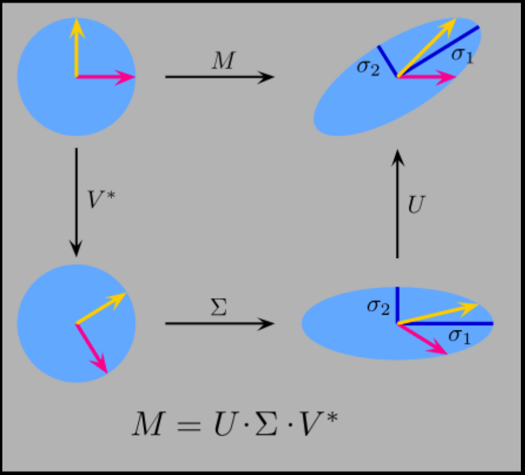
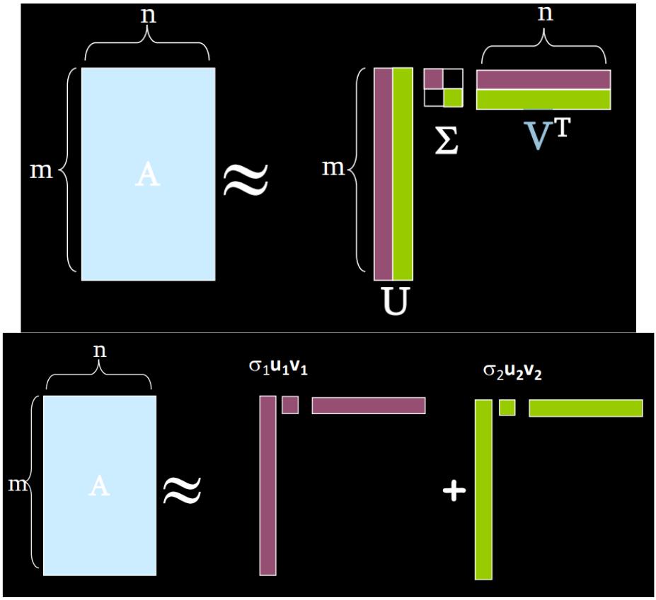
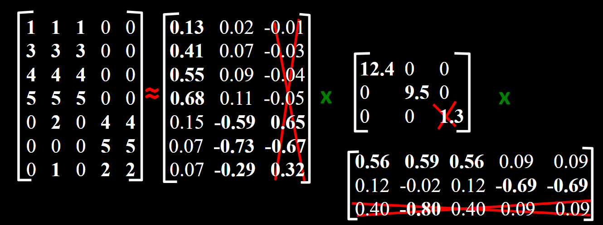
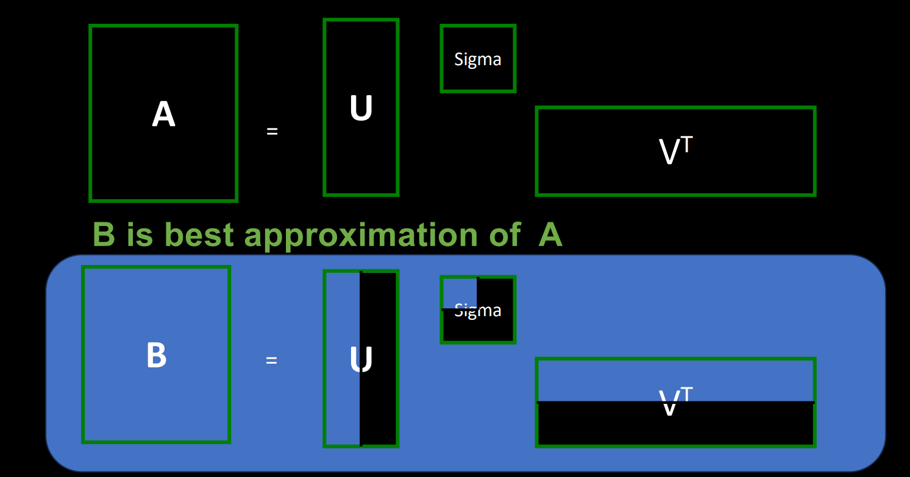
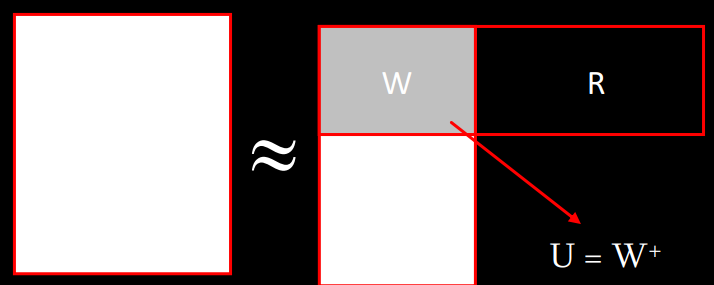
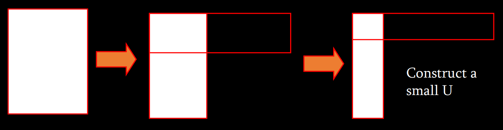
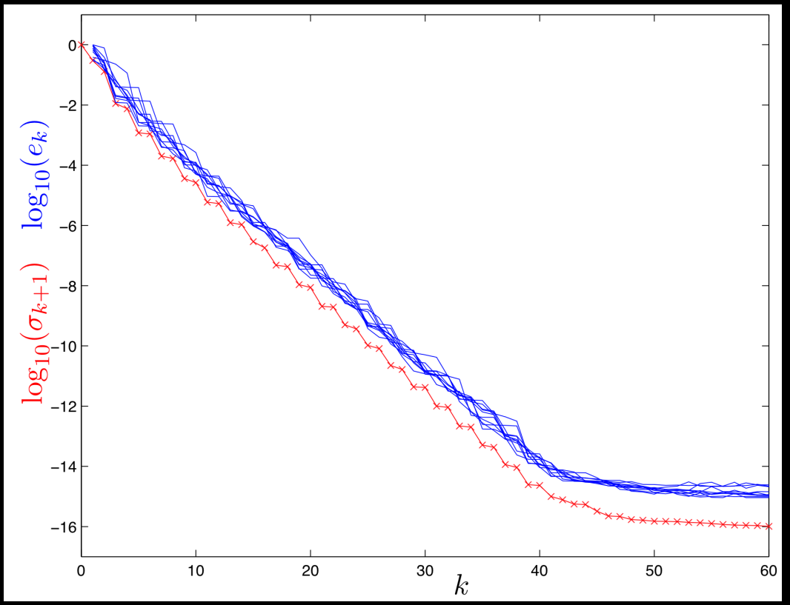
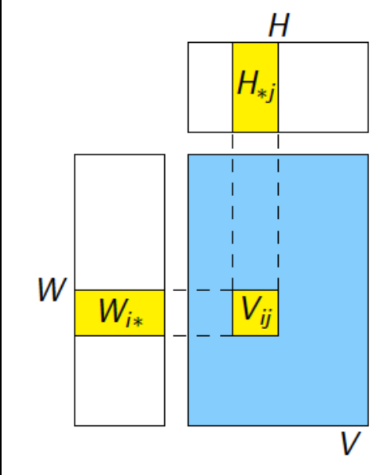

# Randomized SVD
## Singular Value Decomposition (SVD)
- Given a (any!) matrix $M$, which is $n \times m$, it can be represented as $$ M = U\Sigma V^{T} $$
> $U$: $n \times n$, unitary matrix (orthoganal)  
> $\Sigma$: $n \times m$, diagonal matrix of singular values  
> $V^{T}$: $m \times m$, unitary matrix (orthogonal) 

$$ A_{[m \times n]} = U_{[m \times r]}\Sigma_{[r \times r]}(V_{[n \times r]})^{T} $$
- $A$: Input data matrix
    - $m \times n$ matrix (e.g., $m$ documents, $n$ terms)
- $U$: Left singular vectors
    - $m \times r$ matrix ($m$ documents, $r$ concepts)
- $\Sigma$: Singular values
    - $r \times r$ diagonal matrix (strength of each ‘concept’) ($r$ : rank of the matrix $A$)
- $V$: Right singular vectors
    - $n \times r$ matrix ($n$ terms, $r$ concepts)

- Columns of $U$ and $V$ are orthonormal bases
- Singular values are the "strength" of each singular vector
- The unit circle carried by $V^{T}$ is an initial rotation of the input circle so its axes align with the directions of greatest stretching
- Carrying again by $\Sigma$ is an axis-aligned scaling (by the singular values $\sigma_1$, $\sigma_2$), turning the rotated circle into an axis-aligned ellipse
- Carrying again by $U$ is a final rotation that moves that scaled ellipse into its actual orientation

$$ A \approx U\Sigma V^{T} = \sum_{i}\sigma_{i}u_{i} \circ v_{i}^{T} $$

- $\sigma_{i}$ is a scalar
- $u_{i}$ is a vector
- $v_{i}$ is a vector

## SVD - Properties
- It is **always** possible to decompose a real matrix $A$ into $ A = U\Sigma V^{T} $, where
    - $U$, $\Sigma$, $V$: *unique*
    - $U$, $V$: *column orthanormal*
        - $U^{T}U = I$, $V^{T}V = I$
        - (Columns are orthagonal unit vectors)
    - $\Sigma$: *diagonal*
        - Entries (**singular values**) are **positive**, and sorted in decreasing order $(\sigma_{1} \ge \sigma_{2} \ge \ldots \ge 0)$

## Why randomize SVD?
- Runtime
    - We’re good at generating [pseudo-]random numbers
    - Can easily parallelize / distribute matrix algebra
    - SVD, like PCA, runs $O(n^3)$, making anything beyond ~$10^3$ infeasible

## SVD $A = U\Sigma V^{T}$ example: Users-to-Movies

- Original data: $A$ contains raw ratings (0–5) from each user for each movie.
- User loadings ($U$): Each row of $U$ shows how strongly a user projects onto each latent factor.
- Singular values ($\Sigma$): Diagonal entries (12.4, 9.5, 1.3) rank the importance of each concept.
- Movie loadings ($V^{T}$): Each column of $V^{T}$ indicates how much a movie embodies each factor.
- Reconstruction: Any rating $A_{ij}$ is approximated by $\sum_{k}U_{ik}\Sigma_{kk}V_{jk}$
- Dimensionality reduction: Truncating to the top $d$ factors yields a low-rank approximation that captures the core taste patterns.

## SVD - Interpretation #1
- 'movies', 'users' and 'concepts':
    - $U$: user-to-concept similarity matrix
    - $V$: movie-to-concept similarity matrix
    - $\Sigma$: its diagonal elements: 'strength' of each concept

## SVD - Interpretation #2

- Question: How exactly is dim. reduction done?
- Answer: **Set smallest singular values to zero**

- (Is "small"): $$ \| A - B \|_{F} = \sqrt{\sum_{i}\sum_{j}(A_{ij} - B_{ij})^{2}} $$
- Frobenius norm: $$ \| M \|_{F} = \sqrt{\sum_{i}\sum_{j}M_{ij}^{2}} $$
- In practice, you choose the number of singular values to keep so that $\| A - B \|_{F}$ remains “small” while dramatically reducing dimensionality.

## SVD - Best low rank approximation

- The best rank-$r$ approximation of the full SVD $A = U\Sigma V^{T}$ is: $$ B = U_{r}\Sigma_{r}V_{r}^{T} $$
    - formed by keeping only the first $r$ columns of $U$, the top-left $r \times r$ block of $\Sigma$, and the first $r$ rows of $V^{T}$

## Relationship to PCA
- SVD can be applied to any matrix; PCA only works on symmetric covariance matrices
- However, there is a relationship:
    $$ M^{T}M = V\Sigma^{T}U^{T}U\Sigma V^{T} = V(\Sigma^{T}\Sigma)V^{T} $$
    $$ MM^{T} = U\Sigma V^{T}V\Sigma^{T}U^{T} = U(\Sigma \Sigma^{T})U^{T} $$
- Columns of $V$ are eigenvectors of $M^{T}M$
- Columns of $U$ are eigenvectors of $MM^{T}$
- Singular values are square roots of eigenvalues of $M^{T}M$ or $MM^{T}$

## SVD: Drawbacks
- Pro: Optimal low-rank approximation in terms of Frobenius norm
- Con: Interpretability problem
    - A singular vector specifies a linear combination of all input columns or rows
- Con: Lack of sparsity
    - Singular vectors are dense!

## CUR Decomposition
- Frobenius norm: $$ \| M \|_{F} = \sqrt{\sum_{i}\sum_{j}M_{ij}^{2}} $$
- **Goal: Express $A$ as a product of matrices $C$, $U$, $R$**
    - Make $\| A - [C \cdot U \cdot R] \|_{F}$ small
- "Constraints" on $C$ and $R$:   

## CUR: How it works
- Sampling columns (similarly for rows) (Note that this is a randomized algorithm; the same column can be sampled more than once):
    - **Input**: matrix $A \in \mathbb{R}^{m \times n}$, sample size $c$
    - **Output**: $C_{d} \in \mathbb{R}^{m \times c}$
        - for $x=1:n$ [column distribution]
            - $P(x) = \sum_{i}A(i, x)^{2} / \sum_{i,j}A(i, j)^{2}$
        - end for
        - for $i = 1:c$ [sample columns]
            - Pick $j \in 1:n$ based on distribution $P(x)$
            - Compute $C_{d}(:, j) = A(:, j) / \sqrt{cP(j)}$
        - end for

## Computing $U$
- Let $W$ be the “intersection” of sampled columns $C$ and rows $R$
    - Let SVD of $W = XZY^{T}$
- Then: $U = W^{+} = YZ^{+}X^{T}$
    - $Z^{+}$: **reciprocals of non-zero singluar values**: $Z^{+}_{ii} = 1 / Z_{ii}$
    - $W^{+} is the "psuedoinverse"$

- Why pseudoinverse works?
    - $W = XZY$ then $W^{-1} = X^{-1}Z^{-1}Y^{-1}$
    - Due to orthonomality $X^{-1}=X^T$ and $Y^{-1}=Y^T$
    - Since $Z$ is diagonal $Z^{-1}$ = $1/Z_{ii}$
    - Thus, if $W$ is nonsingular, pseudoinverse is the true inverse

## CUR: Pros & Cons
- Pros:
    - Easy interpretation: Since the basis vectors are actual columns and rows
    - Sparse basis: Since the basis vectors are actual columns and rows
- Cons:
    - Duplicate columns and rows: Columns of large norms will be sampled many times

## Solution
- **If we want to get rid of the duplicates:**
- Throw them away
- Scale (multiply) the columns/rows by the square root of the number of duplicates

## SVD vs. CUR
$$ \text{SVD:} \quad A = U\Sigma V^{T} $$
- $A$: huge but sparse
- $U$ and $V^T$: big and dense
- $\Sigma$: sparse and small
$$ \text{CUR:} \quad A = CUR $$
- $A$: huge but sparse
- $U$: dense but small
- $C$ and $R$: big but sparse

## Stochastic SVD (SSVD)
- Uses **random projections** to find close approximation to SVD
- Combination of probabilistic strategies to maximize convergence likelihood
- Easily scalable to *massive* linear systems

## SSVD Basic Goal
- Matrix $A$
    - Find a low-rank approximation of $A$
    - Basic dimensionality reduction
$$ \| A - QQ^{*}A \| < \epsilon $$
- preconditioning

## Approximating range of $A$
- **Input**: $A$, $k$, $p$
- **Output**: $Q$
    1. Draw gaussian $n \times k$ test matrix $\Omega$
    2. Form product $Y = A\Omega$
    3. Orthogonalize columns of $Y \to Q$

## Approximating SVD of $A$
- **Input**: $Q$
- **Output**: Singular vectors $U$
    1. Form $k \times n$ matrix $B = Q^{T}A$
    2. Compute SVD of $B = \hat U \Sigma V^{T}$
    3. Comput singular vectors $U = Q\hat U$

## SSVD Emperical Results

- 1000x1000 matrix
- Several runs of empirical results (blue) to theoretical lower bound (red)
- Error seems to be systemic
- As $k$ grows, both curves fall roughly in parallel: the SSVD error consistently tracks the optimal truncation error (up to a small systematic gap)

## Power iterations
- Affects decay of eigenvalues / singular values
- (WRONG) $ Y = A\Omega$
$$ Y = (AA^{*})^{q}A\Omega$$

$$ \mathbb{E}\| A - QQ^{T}A \|_{2} \;\le\; (1 + \sqrt{\frac{k}{p-1}})\sigma_{k+1} + \frac{e\sqrt{k+p}}{p} \cdot (\sum_{j \gt k}\sigma_{j}^{2})^{\frac{1}{2}} \;\le\; [1 + \frac{4\sqrt{k+p}}{p-1} \cdot \sqrt{\min\{m, n\}}]\sigma_{k+1} \;=\; C \cdot \sigma_{k+1}$$
- Upshot: after only a single power iteration, the error is proportional to the next [uncomputed] singular value (times a constant $C$).

## Power iterations emperical results
![Four side-by-side plots showing the impact of applying 0–3 power iterations in the randomized SVD: the two left panels plot the Frobenius-norm approximation error e_k (top) and the recovered eigenvalue decay \lambda_j (bottom) against the exact optimal curves, and the two right panels repeat those comparisons for the singular-value setting (error e_k on the left, estimated \sigma_j on the right). In each case, curves for higher q (more power iterations) move closer to the theoretical optimum, demonstrating that even one or two power steps dramatically improve both approximation accuracy and spectral estimation.](./pics/powerIterations_results.png)
- Left pair ("Approximation error $e_k$" & "Estimated Eigenvalues $lambda_j$"):
  - Plotted for $q = 0, 1, 2, 3$ power iterations (magenta/blue/green/black) against the red "minimal error" or exact eigenvalues.
  - As $q$ increases, the approximation error $e_k$ drops closer to the theoretical optimum, and the estimated eigenvalues $lambda_j$ track the true decay much more faithfully—especially in the tail.
- Right pair ("Approximation error $e_k$" & "Estimated Singular Values $\sigma_j$"):
  - The same experiment in the SVD setting, plotting the Frobenius-norm error versus rank $k$ and the recovered singular-value decay versus index $j$.
  - Again, each additional power iteration (higher $q$) dramatically tightens the error curve toward the red "ideal" and makes the $\sigma_j$ estimates align with the true spectrum.
- Bottom line: Even a single power iteration ($q = 1$) substantially improves approximation quality and spectral accuracy, and further iterations continue closing the gap to the optimal truncated SVD.

## Why does this work?
- Three primary reasons:
    1. **Johnson-Lindenstrauss Lemma**
        $$ \kappa = \frac{|\lambda_{\max}|}{|\lambda_{\min}|} $$
        - Low-dimensional embeddings preserve pairwise distances: $$ (1 - \epsilon)\| u - v \|^{2} \le \| f(u) - f(v) \|^{2} \le (1 + \epsilon)\| u - v \|^{2} $$
    3. **Concentration of measure**
        - Geometric interpretation of classical idea: regular functions of independent random variables rarely deviate far from their means
    4. **Preconditioning**
        - Condition number: how much change in output is produced from change in input (relation to #1)
        - $Q$ matrix lowers condition number while preserving overall system

## Summary
- Relationship of SVD and PCA
    - PCA: eigenvectors and eigenvalues of the covariance matrix (or kernel matrix, for Kernel PCA)
    - SVD: Low-rank approximation for *any* matrix
- CUR
    - Randomly sample columns of data matrix A to use as basis
    - Interpretable and sparse, but potentially oversample high-magnitude columns
- SVD via SGD
    - Reframe SVD as a matrix completion problem
    - Use SGD in alternating least-squares to infer "missing" components
- SSVD
    - Full-blown Johnson-Lindenstrauss exploitation
    - Use random projections to approximate SVD to high accuracy
    - Requires some empirical tweaks (oversampling, power iterations)

## Large-Scale Matrix Factorization with Distributed Stochastic Gradient Descent

- Collaborative Filtering
    - Problem
        - Set of users
        - Set of items (movies, books, jokes, products, stories, ...)
        - Feedback (ratings, purchase, click-through, tags, ...)
    - Predict additional items a user may like
        - Assumption: Similar feedback $\Rightarrow$ Similar taste
    - Example: $$ \left(\begin{array}{l|ccc}
              & \text{Avatar} & \text{The Matrix} & \text{Up} \\ \hline
  \text{Alice}   & ? & 4 & 2 \\
  \text{Bob}     & 3 & 2 & ? \\
  \text{Charlie} & 5 & ? & 3
\end{array}\right) $$
    - Netflix competition: 500k users, 20k movies, 100M movie ratings, 3M question marks

- Recovering latent factors in a matrix   ![This diagram illustrates the core idea of matrix‐factorization–based collaborative filtering: the full user–movie rating matrix V (of size n users by m movies, with entry v_ij the rating of user i for movie j) is approximated by the product of two much smaller factor matrices—W (n x r), whose ith row (x_i, y_i, ...) gives user i’s coordinates in an r-dimensional latent feature space, and H (r x m), whose jth column (a_j ,b_j ,...) encodes movie j’s loading on those same r latent factors—so that WH \approx V.](./pics/recovLatentFact_visual.png)

- Semantic factors   ![2-D “taste map” showing both movies and users embedded in the first two latent factors learned by matrix-factorization: the vertical axis runs from Escapist (bottom) to Serious (top), and the horizontal axis from Geared toward females (left) to Geared toward males (right). Movie titles sit at their inferred positions in this space (e.g. Amadeus high-seriousness, The Princess Diaries in the female-escapist quadrant), and little avatars (like “Dave” or “Gus”) show example user profiles in the same factor plane.](./pics/semanticFactors_visual.png)

- Laten Factor Models
    - Discover latent factors ($r=1$)   ![This table illustrates a simple rank-1 matrix factorization on a 3 x3 user–movie rating matrix: each user (Alice = 1.98, Bob = 1.21, Charlie = 2.30) and each movie (Avatar = 2.24, The Matrix = 1.92, Up = 1.18) is assigned a single latent factor, and every entry in the grid is then predicted as the product of its user and movie factors. The black numbers are the actual ratings (with “?” for unknowns) and the red parentheses show the model’s predicted values—including filling in the missing ratings.](./pics/latentFactor_visual.png)
    - Minimum loss: $$ \min_{W, H}\sum_{(i, j) \in Z}(V_{ij} - [WH]_{ij})^{2} + \lambda(\| W \| + \| H \| + \| u \| + \| m \|)$$
    - Bias, regularization

- Matrix factorization as SGD
    - require that the loss can be written as $$ L = \sum_{(i, j) \in Z}l(V_{ij}, W_{i*}, H_{*j}) $$
    - Algorithm 1 for SGD matrix factorization
        - **Require**: A training set $Z$, initial values $W_0$ and $H_0$
            - **while** not converged **do** {step}
                - Select a training point $(i, j) \in Z$ uniformly at random
                - $ W_{i*}' \leftarrow W_{i*} - \epsilon_{n}N\frac{\partial}{\partial W_{i*}}l(V_{ij}, W_{i*}, H_{*j}) $
                - $ H_{*j}' \leftarrow H_{*j} - \epsilon_{n}N\frac{\partial}{\partial H_{*j}}l(V_{ij}, W_{i*}, H_{*j}) $
                - $ W_{i*} \leftarrow W_{i*}' $
            - **end while**

- Stochastic Gradient Descent   ![This two‐panel illustration shows how stochastic gradient descent (SGD) progresses on a noisy loss surface: the top plot overlays the true objective’s contour lines in green, with the jagged black path of SGD iterates winding downhill; at one point the red arrow marks the exact gradient while the blue arrow shows its stochastic estimate. The bottom plot charts the corresponding error metric (e.g. gradient norm or suboptimality) versus normalized iteration time, demonstrating a steady decline toward zero despite the randomness in each update.](./pics/stoGrdDsct.png)
    - Find minimum $\theta^{*}$ of function $L$
    - Pick a starting point $\theta_{0}$
    - Approximate gradient $\hat L'(\theta_{0})$
    - Jump "approximately" downhill
    - Stochastic difference equation: $$ \theta_{n+1} = \theta_{n} - \epsilon_{n}\hat L'(\theta_{n}) $$
    - Under certain conditions, asymptotically approximates (continuous) gradient descent

- Key claim: Because the loss can be written as $L = \sum_{(i, j) \in Z}l(V_{ij}, W_{i*}, H_{*j})$, each training example $(i,j)$ touches only the $i$th row of $W$ and the $j$th column of $H$. The diagram highlights that the yellow blocks $W_{i∗}$, $H_{∗j}$, and entry $V_{ij}$ form a small “local” subproblem:   
    $$
\frac{\partial}{\partial W_{i'k}}L_{ij}(W,H)
=
\begin{cases}
0 & i \neq i',\\[6pt]
\displaystyle
\frac{\partial}{\partial W_{ik}}
\,l\bigl(V_{ij},\,W_{i*},\,H_{*j}\bigr) & \text{otherwise.}
\end{cases}
    $$
    $$
\frac{\partial}{\partial H_{k'j}}L_{ij}(W,H)
=
\begin{cases}
0 & j \neq j',\\[6pt]
\displaystyle
\frac{\partial}{\partial H_{kj}}
\,l\bigl(V_{ij},\,W_{i*},\,H_{*j}\bigr) & \text{otherwise.}
\end{cases}
    $$

- Checking the claim
    $$ \frac{\partial}{\partial W_{i*}}L(W,H)=\frac{\partial}{\partial W_{i*}}\sum_{(i',j)\in Z}L_{i'j}\bigl(W_{i'*},H_{*j}\bigr)=\sum_{j\in Z_{i*}}\frac{\partial}{\partial W_{i*}}L_{ij}\bigl(W_{i*},H_{*j}\bigr) \quad \text{where} \quad Z_{i*} = \{j : (i, j) \in Z\} $$
    $$ \frac{\partial}{\partial H_{*j}}L(W,H)=\sum_{i\in Z_{*j}}\frac{\partial}{\partial W_{*j}}L_{ij}\bigl(W_{i*},\,H_{*j}\bigr) \quad \text{where} \quad Z_{*j} = \{i : (i, j) \in Z\} $$
    - Think for SGD for logistic regression
        - LR loss = compare $y$ and $\hat y = w \cdot x$
        - similar but now update $w$ (user weights) and $x$ (movie weight)

- Stochastic Gradient Descent on Netflix Data   
