# Backpropagation
## Artifical Neural Networks
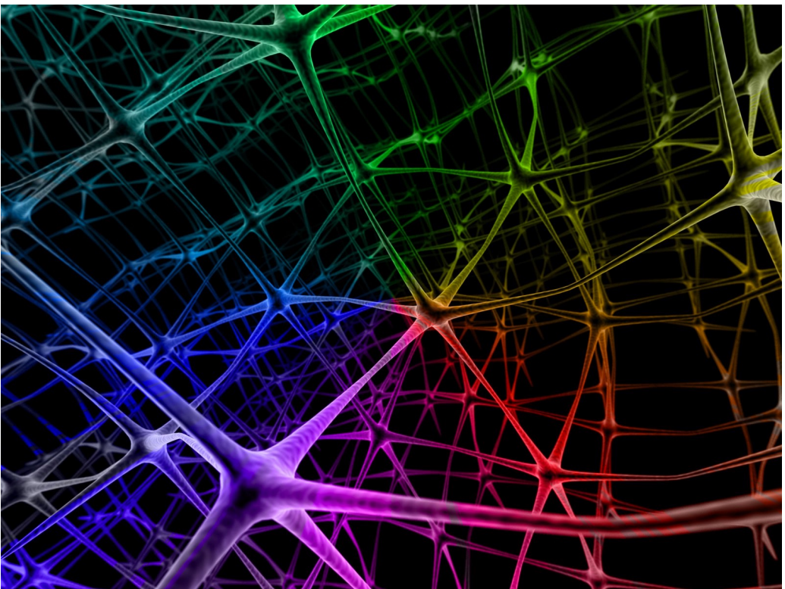
- Not a new concept!
    - Roots as far back as 1940s work in unsuperivsed learning
    - Took off in 1980s and 1990s
        - **1986 paper by Rumelhart *et al*—fastest backpropagation algorithm since original 1970s version**
    - Waned in 2000s
- "Biologically-inspired" computing
    - May or may not be true
- **Shift from rule-based to emergent learning**

## Logistic Regression as a Graph
- Define output $o(x)$: $$ o(x) = \sigma(w_{0}+\sum_{i}w_{i}X_{i}) = \frac{1}{1 + \exp{(-(w_{0} + \sum_{i}w_{i}X_{i}))}} $$

## Multilayer networks
- Simplest case: classifier is a multilayer network of ~~logistic~~ units **that perform some differentiable computation**
- Each unit takes some inputs and produces one output ~~using a logistic classifier~~
- Output of one unit can be the input of other units

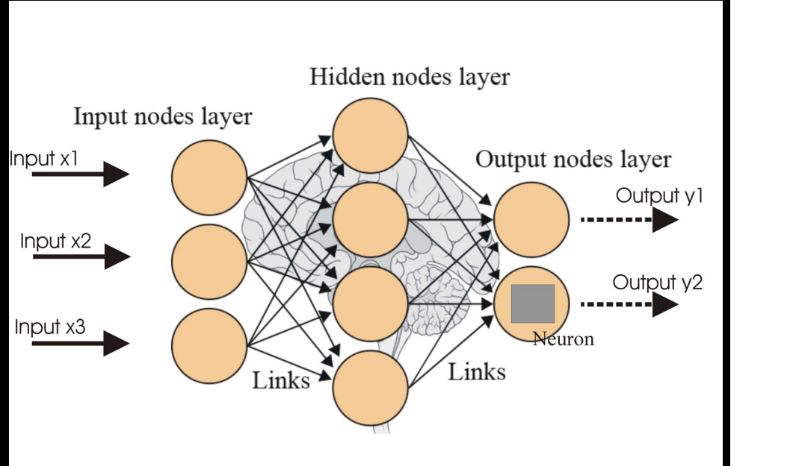

## Learning a multilayer network
- Define a loss (simplest case: squared error)
    - But over a network of “units” that do simple computations: $$ J_{X,y}(\vec{w}) = \sum_{i}(y^{i} - \hat{y}^{i})^{2} $$
- Minimize loss with gradient descent
    - You can do this over complex networks if you can take the *gradient* of each unit: every computation is *differentiable*

## ANNs in the 90s
![LeNet-5 architecture diagram. It shows, from left to right: INPUT- a 32x32 grayscale image; C1 (Convolution)- 6 feature maps of size 28×28 (using 5x5 kernels); S2 (Subsampling/Pooling)- 6 maps of size 14x14; C3 (Convolution)- 16 maps of size 10x10; S4 (Subsampling/Pooling)- 16 maps of size 5x5; C5 (Fully Connected Conv.)- 120 units (each “plane” here is 1x1 conv); F6 (Fully Connected): 84 units; OUTPUT: 10 units (one per digit class), with Gaussian connections. Each “plane” is a feature map whose weights are tied (shared) across all spatial positions. The arrows illustrate convolutional, pooling (subsampling), and full-connection stages that transform the input into a final 10-way classification.](./pics/leNetArch_visual.png)
- In the 90s: mostly 2-layer networks (or specialized “deep” networks that were hand-built)
- Worked well, but training was *slow*

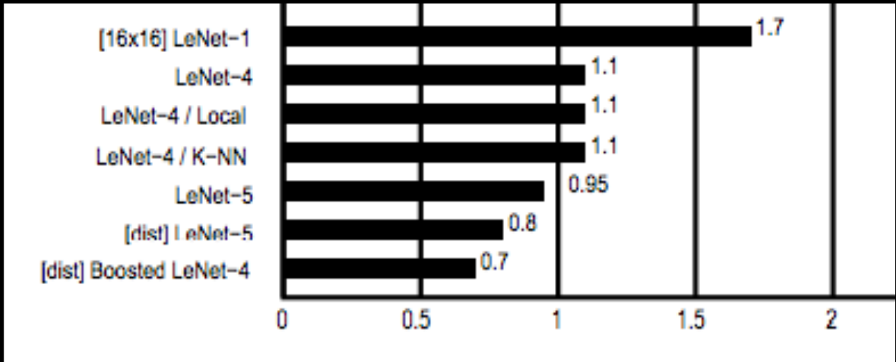
- Custom CNN: 98.3 - 99.3% accurate

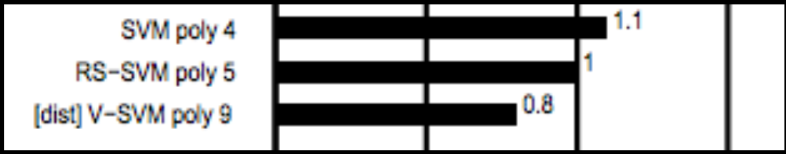
- SVM with polynomial kernel: 98.9 - 99.2% accurate

## Nomenclature
- *Backpropagation*: refers *only* to the method for computing the gradient of a function
    - Is NOT specific to multilayer neural networks (in principle, can compute gradients for any function)
- *Stochastic gradient descent*: conducts learning using the derived gradient
    - Hence, you can run SGD on gradients you derive manually, or through backprop

## Notation
- “Borrowing” from
    - William Cohen at Carnegie Mellon (author of SSL algorithm implemented in HW3)
    - Michael Nielson of [Neural Networks and Deep Learning](http://neuralnetworksanddeeplearning.com/)

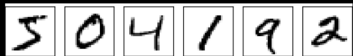
- Each digit is $28 \times 28 = 784$ dimensions/inputs

- $w_{jk}^{l}$ is the weight from the $k$th neuron in the $(l-1)$th layer to the $j$th neuron in the $l$th layer
- Vectorize: $w^{l}$ is the weight matrix for layer $l$
- $a_{1}^{3}$: activation
- $b_{3}^{2}$: bias
- Vectorize: $a^{l}$ and $b_{l}$ are activations and bias matrices for layer $l$: $$ a_{j}^{l} = \sigma(\sum_{k}w_{jk}^{l}a_{k}^{l-1} + b_{j}^{l}) $$
$$ a^{l} = \sigma(w^{l}a^{l-1} + b^{l}) $$
$$ z^{l} \equiv w^{l}a^{l-1} + b^{l} $$

- Computation is "feedforward"   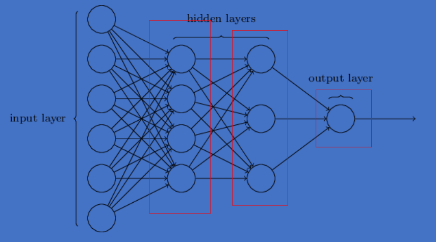
    - for $l = 1, 2, \ldots, L$:
        - $ a^{l} = \sigma(w^{l}a^{l-1} + b^{l}) $

- Set up a cost function $C$: $$ C = \frac{1}{2n}\sum_{x}\| y(x) - a^{L}(x) \|^{2} $$
- Rewrite as an average: $$ C = \frac{1}{n}\sum_{x}C_{x} \quad \text{where} \quad C_{x} = \frac{1}{2}\| y - a^{L} \|^{2} $$
    - Allows us to compute partial derivatives $\partial{C_x}/\partial{w}$ and $\partial{C_x}/\partial{b}$ for single training examples, then recover $\partial{C}/\partial{w}$ and $\partial{C}/\partial{b}$ by averaging over training examples.

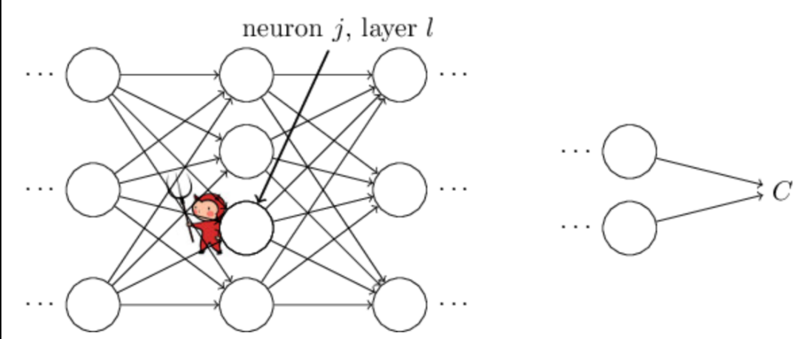
- Error in the $j$th neuron at the $l$th layer: $$ \delta_{j}^{l} \equiv \frac{\partial{C}}{\partial{z_{j}^{l}}} $$

## BackProp: last layer
$$ \delta_{j}^{L} = \frac{\partial{C}}{\partial{a_{j}^{L}}}(z_{j}^{L}) $$
- Matrix form: $$ \delta^{L} = \nabla_{a}C \odot \sigma'(z^{L}) $$
    > $\nabla_{a}C$: components are $\partial{C} / \partial{a_{j}^{L}}$  
    > $\sigma'(z^{L})$: components are $\sigma'(z_{j}^{L})$  
    > $\odot$ is the Hadamard product: just element-wise multiplication
- Level $l$ for $l = 1, \ldots, L$
- Matrix: $w^{l}$
- Vectors:
    - bias $b^{l}$
    - activation $a^{l}$
    - pre-sigmoid activ: $z^{l}$
    - target output $y$
    - "local error" $\delta^{l}$

- Matrix form squared loss: $$ \delta^{L} = (a^{L} - y) \odot \sigma'(z^{L}) $$

## BackProp: error at level $l$ in terms of error at level $l+1$
$$ \delta^{L} = ((w^{l+1})^{T}\delta^{l+1}) \odot \sigma'(z^{l}) $$
- which we can use to compute:
    $$ \frac{\partial{C}}{\partial{b_{j}^{l}}} = \delta_{j}^{l} \quad \to \quad \frac{\partial{C}}{\partial{b}} = \delta $$
    $$ \frac{\partial{C}}{\partial{w_{jk}^{l}}} = a_{k}^{l-1}\delta_{j}^{l} \quad \to \quad \frac{\partial{C}}{\partial{w}} = a_{\text{in}}\delta_{\text{out}} $$

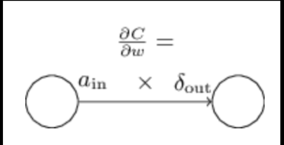

## BackProp: Summary:

- Level $l$ for $l = 1, \ldots, L$
- Matrix: $w^{l}$
- Vectors:
    - bias $b^{l}$
    - activation $a^{l}$
    - pre-sigmoid activ: $z^{l}$
    - target output $y$
    - "local error" $\delta^{l}$

$$ \delta^{L} = \nabla_{a}C \odot \sigma'(z^{L}) $$
$$ \delta^{L} = ((w^{l+1})^{T}\delta^{l+1}) \odot \sigma'(z^{l}) $$
$$ \frac{\partial{C}}{\partial{b_{j}^{l}}} = \delta_{j}^{l} $$
$$ \frac{\partial{C}}{\partial{w_{jk}^{l}}} = a_{k}^{l-1}\delta_{j}^{l} $$

## Full Backpropagation
1. **Input** $x$: Set the corresponding activation $a^{l}$ for the input layer.
2. **Feedforward**: For each $l = 2, 3, \ldots, L$ compute $z^{l} = w^{l}a^{l-1} + b^{l}$ and $a^{l} = \sigma(z^{l})$.
3. **Output error** $\delta^{L}$: Compute the vector $\delta^{L} = \nabla_{a}C \odot \sigma'(z^{L})$.
4. **Backpropagate the error**: For each $l = L-1, L-2, \ldots, 2$ compute $\delta^{L} = ((w^{l+1})^{T}\delta^{l+1}) \odot \sigma'(z^{L})$.
5. **Output**: The gradient of the cost function is given by $\frac{\partial{C}}{\partial{w_{jk}^{l}}} = a_{k}^{l-1}\delta_{j}^{l}$ and $\frac{\partial{C}}{\partial{b_{j}^{l}}} = \delta_{j}^{l}$
6. Use SGD to update the weights according to the gradients, then loop back to step 1

## Weight updates for multilayer ANN
- For nodes $k$ in output later $L$: $$ \delta_{k}^{L} = (t_{k} - a_{k})a_{k}(1 - a_{k}) $$
- For nodes $j$ in hidden layer $h$: $$ \delta_{j}^{h} = \sum_{k}(\delta_{j}^{h+1}w_{kj})a_{j}(1 - a_{j}) $$
- What happens as the layers get further and further from the output layer? $$ \frac{\partial{C}}{\partial{b_{1}}} = \sigma'(z_{1}) \times w_{2} \times \sigma'(z_{2}) \times w_{3} \times \sigma'(z_{3}) \times w_{4} \times \sigma'(z_{1}) \times \frac{\partial{C}}{\partial{a_{4}}} $$   

## Gradients are unstable
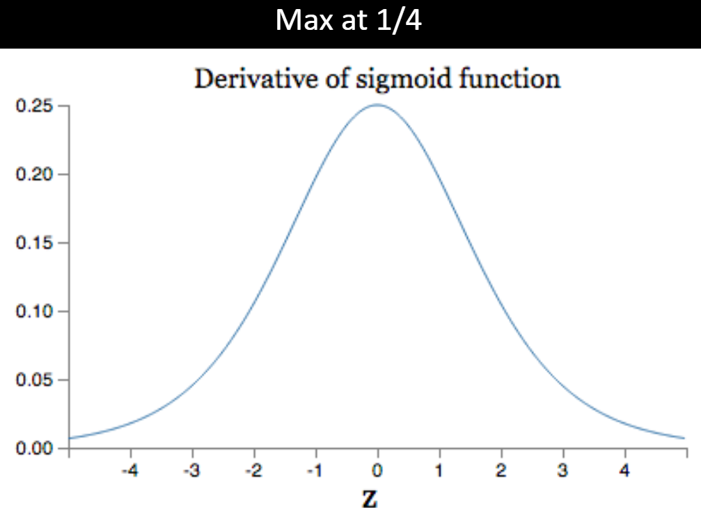
- If weights are usually $\lt 1$, and we are multiplying many, *many* such numbers...
    - **Vanishing Gradient!**
$$ \frac{\partial{C}}{\partial{b_{1}}} = \sigma'(z_{1}) \times w_{2} \times \sigma'(z_{2}) \times w_{3} \times \sigma'(z_{3}) \times w_{4} \times \sigma'(z_{1}) \times \frac{\partial{C}}{\partial{a_{4}}} $$

## Understanding the difficulty of training deep feedforward neural networks

- Histogram of gradients in a 5-layer netowrk for an artificial image recognition task

![plot showing test‐error curves (y‐axis: error %) as a function of training progress (x‐axis: number of examples seen, up to 25 million) for various deep-net configurations and activations: Sigmoid depth 5, Sigmoid depth 4, Tanh, Softsign, Softsign N, Tanh N, Pre-training. Deep sigmoid nets without pretraining struggle; Reducing depth to 4 helps but still plateaus around 35%; Switching to tanh or softsign yields much faster learning and lower asymptotic error (~28 – 30%); Adding simple normalization tweaks improves tanh/softsign slightly further; Unsupervised pre-training dramatically accelerates learning and reaches the lowest test error (~11%)](./pics/deepnet_Error.png)

## It's easy for sigmoid units to saturate
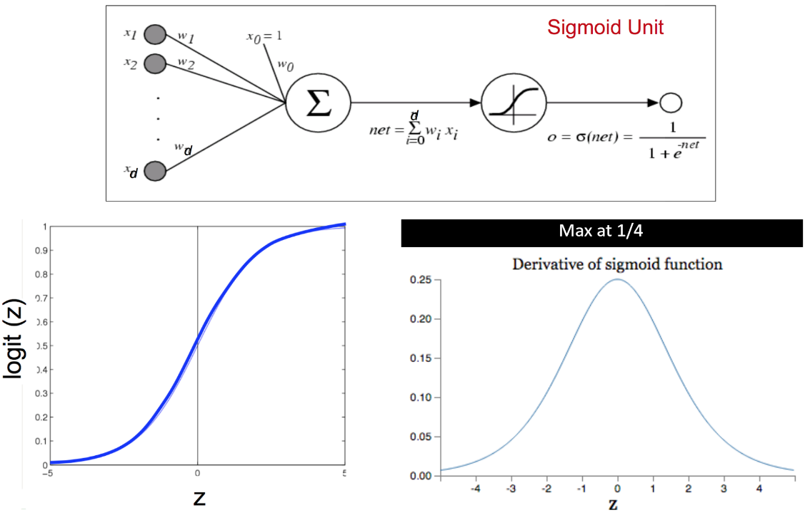
- (on right end of logit graph where logit is close to 1) Learning rate approaches zero, and neuron gets “stuck”

- If there are 500 non-zero inputs initialized with a Gaussian $\sim \mathcal{N}(0,1)$ then the SD is $\sqrt{500} \approx 22.4$   
- Saturation visualization from Glorot & Bengio 2010 - using a smarter initialization scheme   ![shows how the distribution of sigmoid activations evolves over training when using a “smart” (Xavier) weight initialization. Each colored line is one hidden layer’s mean activation (with vertical bars showing ± one standard deviation) plotted against epoch (batches of 20 k examples): layer 1, layer 2, layer 3, and layer 4. You can see that, thanks to Xavier initialization, Layers 1–3 stay in their non-saturated regime (means in the mid-range around 0.5–0.8), but the bottom layer (black) remains “stuck” near zero for about the first 100 epochs before finally moving out of saturation.](./pics/smartInitScheme_plot.png)
    - Bottom layer still stuck for first 100 epochs

- Common heuristics for initializing weights:
    $$ N(0, \frac{1}{\sqrt{\text{number of inputs}}}) $$
    $$ U(\frac{-1}{\sqrt{\text{number of inputs}}}, \frac{1}{\sqrt{\text{number of inputs}}}) $$

## Key differences About Modern ANNs
- Use of softmax and entropic loss instead of quadratic (squared) loss
    - Often learning is faster and more stable as well as getting better accuracies in the limit
- Use of alternate non-linearities
    - ReLU and hyperbolic tangent, instead of sigmoid
- Better understanding of weight initialization
- Data augmentation
    - Especially for image data
- Ability to explore architectures rapidly

## Cross-entropy loss
$$ C = -\frac{1}{n}\sum_{x}[y\ln{a} + (1-y)\ln{(1-a)}] $$
$$ \frac{\partial{C}}{\partial{w_{j}}} = \frac{1}{n}\sum_{x}x_{j}(\sigma(z)-y) $$
$$ \frac{\partial{C}}{\partial{w}} = \sigma(z)-y $$

![ 3-D “loss landscape” comparing two cost functions over a simple two-weight model (weights W_1 respectivley on the first layer and W_2 on the second, output layer). The black wireframe is the cross-entropy loss surface. The red wireframe (lying below) is the quadratic (sum-of-squares) loss surface. By plotting them together over the (W_1, W_2) plane, you can see that cross-entropy remains steep and well-conditioned (no wide flat regions), whereas the quadratic loss has broad plateaus and can lead to very small gradients—illustrating why cross-entropy often trains deep nets more reliably](./pics/crossEntropy_3dplot.png)
- Cross entropy (black, surface on top) and quadratic (red, bottom surface) cost as a function of two weights (one at each layer) of a network with two layers, $W_{1}$ respectivley on the first layer and $W_{2}$ on the second, output layer.

## Softmax output layer
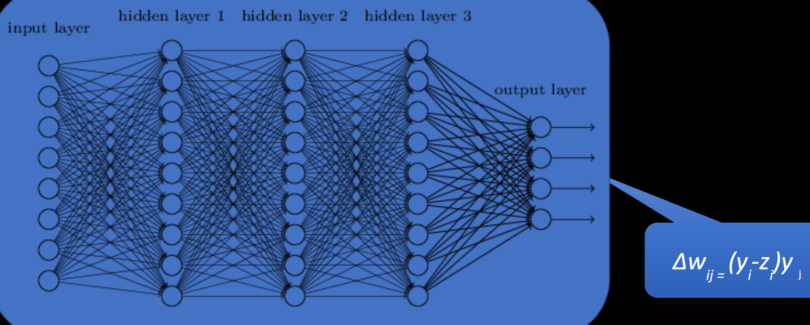
- $\Delta w_{ij} = (y_{i} - z_{i})y_{j}$ is the gradient (or update) for the weight from hidden unit $j$ to output unit $i$ when you combine softmax activations $z_{i}$ with the cross-entropy loss against the one-hot target $y_{i}$. In other words, at the final layer the backprop step simplifies to “(target − prediction) $\times$ previous activation.”
- softmax layer output: $$ a_{j}^{L} = \frac{e^{z_{j}^{L}}}{\sum_{k}e^{z_{k}^{L}}} $$
    - Cross entropy loss after a softmax layer gives a very simple numerically stable gradient: $(y - a^{L})$
- Network outputs a probability distribution!

## Alternative non-linearities
- Changes so far
    - Changed the **loss** from square error to cross-entropy (no effect at test time)
    - Proposed adding another output layer (softmax)
- A new change: modifying the nonlinearity
    - The logistic / sigmoid is not widely used in modern ANNs

- Alternative #1: tanh   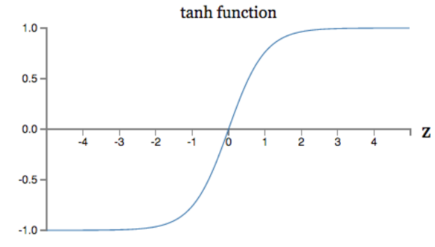
    - Like logistic, but shifted to range [-1, +1]

- Alternative #2: ReLU   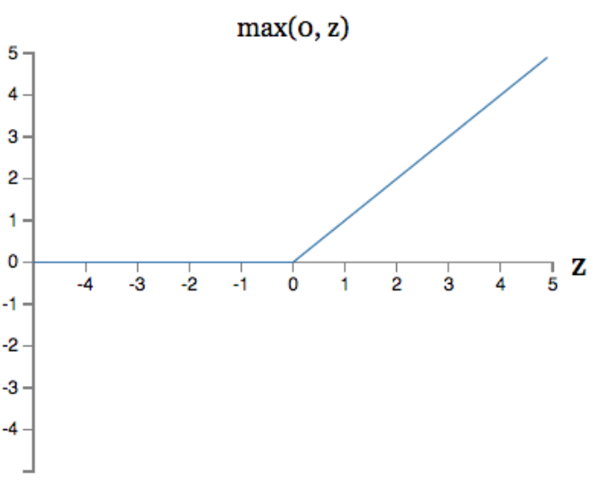
    - Linear with cut-off at zero
    - $\max(0, w \cdot x + b)$
- Alternative #2.5: ”Soft” ReLU
    - Doesn’t saturate (at one end)
    - Sparsifies outputs
    - Helps with vanishing gradient

## Initializing to avoid saturation
- In Glorot and Bengio (2010) they suggest weights if level $j$ (with $n_{j}$ inputs) from $$ W \sim U[-\frac{\sqrt{6}}{\sqrt{n_{j} + n_{j+1}}}, \frac{\sqrt{6}}{\sqrt{n_{j} + n_{j+1}}}] $$

| TYPE       | Shapeset | MNIST | CIFAR-10 | ImageNet |
|------------|----------|-------|----------|----------|
| Softsign   | 16.27    | 1.64  | 55.78    | 69.14    |
| ***Softsign N*** | 16.06    | 1.72  | 53.8     | 68.13    |
| Tanh       | 27.15    | 1.76  | 55.9     | 70.58    |
| ***Tanh N***    | 15.60    | 1.64  | 52.92    | 68.57    |
- First breakthrough deep learning results were based on clever pre-training initialization schemes, where deep networks were seeded with weights learned from unsupervised strategies
- This is not always the solution – but good initialization is very important for deep nets!

## Summary
- Backpropagation makes training deep neural networks possible
    - Known since 1970s, understood since 1980s, used since 1990s, tractable since 2010s
- Feed-forward versus backward propagation
    - Feed-forward evaluates the network’s current configuration, $J()$
    - Backpropagation assigns error in $J()$ to individual weights
- Each layer considered a function of its inputs
    - Differentiable activation functions strung together
    - Chain rule of calculus
- Modern deep architectures made possible due to logistical tweaks
    - Vanishing/Exploding gradient and new activation functions

## Example
- Simple Equation: $$ f(x,y,z) = (x+y)z $$
- Some example inputs:
    - $x=-2$
    - $y=5$
    - $z=-4$

![computational‑graph/back‑prop example for the function f(x,y,z) = (x+y)z. Forward pass: inputs x=-2, y=5, z=-4; add node q=x+y=3; multiply node f=qz=-12. Backward pass: Starting with \frac{\partial{f}}{\partial{f}}=1, reverse‑mode differentiation sends gradients back through each edge: multiply node- \frac{\partial{f}}{\partial{q}}=z=-4, \frac{\partial{f}}{\partial{z}}=q=3; add node- \frac{\partial{f}}{\partial{x}}=\frac{\partial{f}}{\partial{q}} \times 1=-4, \frac{\partial{f}}{\partial{y}}=\frac{\partial{f}}{\partial{q}} \times 1=-4. demonstrates how back‑propagation applies the chain rule along a computation graph, producing exact partial derivatives for each input.](./pics/compGraph_simple.png)

## (slightly less simple) Example
- 2D Logistic Regression, with a bias term: $$ P(Y=1 \mid X) = \frac{1}{1 + \exp{(-(w_{0} + \sum_{i}w_{i}X_{i}))}} $$

![Computation‑graph/back‑prop example for a 2‑dimensional logistic‑regression node f = w_{0}x_{0} + w_{1}x_{1} + w_{2} passed through the sigmoid. Forward pass (green): each multiply gives w_{0}x_{0} = -2,\; w_{1}x_{1} = 6; the add node outputs q = 4; adding the bias yields s = 1; negating, exponentiating, adding 1, and inverting produce the sigmoid output \hat{y} = 0.73. Backward pass (red): starting with \frac{\partial \hat{y}}{\partial \hat{y}} = 1, gradients flow back through reciprocal, addition, exp, etc., giving \frac{\partial \hat{y}}{\partial s} = 0.20, which splits to \frac{\partial \hat{y}}{\partial q} = 0.20 and \frac{\partial \hat{y}}{\partial w_{2}} = 0.20; at the earlier add node this further distributes so that \frac{\partial \hat{y}}{\partial (w_{0}x_{0})} = \frac{\partial \hat{y}}{\partial (w_{1}x_{1})} = 0.20; multiplying by inputs yields \frac{\partial \hat{y}}{\partial w_{0}} = -0.20,\; \frac{\partial \hat{y}}{\partial w_{1}} = -0.39 and \frac{\partial \hat{y}}{\partial x_{0}} = 0.20w_{0} = -0.40,\; \frac{\partial \hat{y}}{\partial x_{1}} = 0.20w_{1} = -0.60, illustrating how the chain rule traverses the logistic‑regression graph to provide exact gradients for every weight and input.](./pics/compGraph_complex.png)
