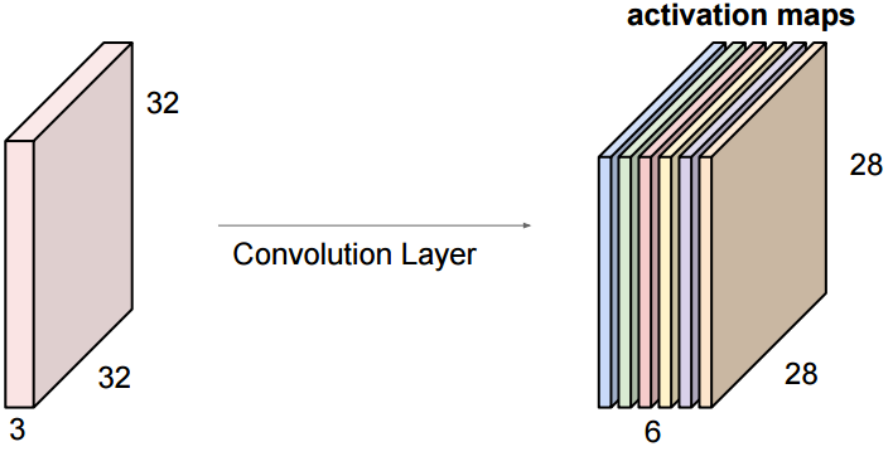

# Convolutional Neural Networks

## [The Neural Network Zoo](http://www.asimovinstitute.org/neural-network-zoo/)

- CNNs: Deep Convolutional Network, Deconvolutional network, deep convolutional inverse graphics network

## Convolution
- Basically a fancy way of saying “multiplication”
- Originally devised to make non-differentiable signals differentiable
- KDE is related to convolution
- For an input function $f$ and convolutional filter $g$:

```
scipy.signal.convolve(in1, in2, mode ='full', method='auto')
    Convolve two N-dimensional arrays.
    Convolve 'in1' and 'in2', with output size determined by 'mode' argument.
    Parameters: in1: array_like
                    First input
                in2: array_like
                    Second input. Should have the same number of dimensions as in1.
                mode: str{'full', 'valid', 'same'}, optional
                    A string indicating the size of the output:
```


```
What is the infinite verb form of "convolution"?
    a. convolve // correct
    b. convolute
    c. convolutionize
    d. convolvar
```

- Can be viewed as an *integral transform*
    - One of the signals is shifted
$$ (f \circledast g)(t) = \int_{-\infty}^{\infty}f(\tau)g(t - \tau)d\tau = \int_{-\infty}^{\infty}f(t - \tau)g(\tau)d\tau $$


## Convolution in 2D
- 2D convolutions are critical in computer vision
- Basic idea is still the same
    - Choose a kernel
    - Run kernel over image
    - Build a representation of the convolved image (likely an intermediate representation)
- Lots of applications


- Specific kernels can highlight different image features
- This kernel is an edge detector (others can be smoothers, sharpeners, etc) <br> 

- Works basically the same as 1D
- Filter / kernel computes a dot product with underlying pixels
- Generates an output
- Shift kernel and repeat


- **Stride** dictates how far the kernel moves after each convolution
- **Padding** is used to help with edge cases
- Pictured: stride of 2, padding of 1 <br> ![visual of how padding and stride works in 2D convolution. padding=1: add a one-pixel “frame” of zeros (or whatever pad value) around the original input, so the kernel can still be centered on the very edge pixels. stride=2: Instead of sliding the filter one pixel at a time, you move it two pixels over (and down) between applications. output sampling: Each time the filter (the solid red box) is applied, you compute a single dot-product and write it into the corresponding cell of the (smaller) output grid. Because of stride-2, the output is downsampled by a factor of two in both dimensions.](./pics/stridePadding_ex.png)

- Repeated convolutions can generate large intermediate feature maps
- “Pooling” is used to reduce dimensionality of feature maps while maintaining most informative features
- Mean-pooling, **max-pooling**
- Functions as a regularizer (or an infinitely-strong prior)


## Filters
- Different filter topologies
- Captures long-range pixel dependencies
- *Very* computationally expensive to implement


## Convolution
- Key point: **parameter sharing**
- Images are sparse
    - Pixel dependencies don’t span arbitrarily large distances
    - Important effects are local
- Instead of a fully-connected network we have one that is more sparsely-connected


## Parameter Sharing


## CNNs in practice
- Stacked
    - Convolutions
    - Pools
    - Activations
- Fully-connected classification layer <br> 

- Pattern can be repeated several times <br> 
- Still “deep”, but convolutions are **the most important part**

- Filters are the things that “search” for something in particular in an image
- To search for many different things, have many different filters




- Hyperparameters relevant to CNNs:
    - Kernel size
        - Usually small
    - Stride
        - Usually 1 (larger for pooling layers)
    - Zero padding depth
        - Enough to permit convolutional output size to be the same as input size
    - Number of convolutional filters
        - Number of “patterns” for the network to search for

- 1$\times$1 convolutions are a special case
- Convolve the **feature maps**, rather than the **pixel maps**
- Function as a dimensionality reduction step (like pooling)
    - Can also be used in pooling


## CNN Applications: Object Localization
- Two discrete steps:
    - Localizing a bounding box (*regression*)
    - Identifying the object (*classification*)


- Generate “region proposals” <br> 
- Classification accuracy

|                                       | R-CNN        | Fast R-CNN      | Faster R-CNN     |
|---------------------------------------|--------------|-----------------|------------------|
| Test time per image (with proposals)  | 50 seconds   | 2 seconds       | **0.2 seconds**  |
| (Speedup)                             | 1x           | 25x             | **250x**         |
| mAP (VOC 2007)                        | 66.0         | **66.9**        | **66.9**         |
- The best result now is Faster RCNN with a resnet 101 layer

## CNN Applications: Single-shot Detection
- Combines region-proposal (regression) and object detection (classification) into a single step
- Use deep-level feature maps to predict class scores and bounding boxes
- Families of Single-shot detectors:
    - YOLO (single activation map for both class and region)
    - SSD (different activations)
    - R-FCN (like Faster R-CNN)

![visual showing grid‐cell scheme used in single‐shot object detectors. image is overlaid with a coarse SxS grid (in red). Each grid cell is responsible for predicting object bounding boxes whose centers fall inside it. The green boxes are the actual predicted bounding boxes for the pedestrians, produced directly in one pass—no separate region‐proposal step. shows how a detector like YOLO partitions the image into fixed cells and simultaneously regresses multiple boxes and class scores from those cells](./pics/singleShot_ex.png)

## CNN Applications: Object Segmentation
- Create a map of the detected object areas
- “Fully-convolutional” networks
    - Substitute fully-connected layer at end for another convolutional layer
    - Activations show object
- Resolution is lost in upsampling step
    - Skip-connections to bring in some of the “lost” resolution
- *EXTREME* Segmentation
    - Replace upsampling with a complete deconvolution stack

![canonical fully-convolutional network (FCN) architecture for semantic segmentation. 1) A standard convolutional backbone (e.g. VGG) turns the input image into progressively smaller, deeper feature maps. 2) Instead of ending in dense (FC) layers, it uses a final 1×1 convolution to produce an low-resolution “score map” (21 channels here, one per class). 3) That coarse map is then upsampled (with learnable deconvolution/transpose-conv filters) back to the original image size. The result is a pixel-wise prediction map which is compared against the ground-truth segmentation.  shows how you convert a classification CNN into a dense, end-to-end trainable model that labels every pixel.](./pics/objSeg_visual.png)

![visual showing how you can turn a standard image classifier into a weak localization model by “convolutionalizing” its fully-connected layers to produce a class activation heatmap. Top row: a CNN + FC layers spits out a single “tabby cat” score—no idea where in the image the cat lives. convolutionalization: you replace those FC layers with equivalent 1×1 convolutions. Bottom row: that same network now outputs a low-resolution spatial map (the “tabby cat heatmap”) that lights up the regions most responsible for the “tabby cat” prediction.](./pics/localizationModel_imageClass.png)

![comparison of three fully-convolutional network (FCN) variants for semantic segmentation, showing how adding skip-connections at different depths trades off semantic strength for spatial detail. FCN-32s:  no skips—upsamples the very coarse final feature map by ×32. You get strong, high-level “semantics” but very blocky masks. FCN-16s:  injects a skip from the pool-4 layer (stride-16) before upsampling. You fuse somewhat finer features, so the mask is sharper than FCN-32s. FCN-8s: adds another skip from pool-3 (stride-8) as well. That restores even more spatial detail, producing the most finely resolved segmentation.](./pics/segmentation_comparison.png)

- "DeconvNet": *Super*-expensive to train <br> ![DeconvNet (encoder–decoder) architecture for pixel-wise semantic segmentation. Convolutional “Encoder”: A standard CNN (e.g. VGG-style) repeatedly applies convolutions + ReLUs and max-pooling, shrinking the spatial size from 224×224 down to a 7×7 “bottleneck.” Deconvolutional “Decoder”: It then mirrors that process: at each decoder stage you unpool (using the saved pooling switches to place activations back where they came from) and follow with learned deconvolution filters to upsample back through 14×14, 28×28, 56×56, 112×112 and finally reconstruct a 224×224 segmentation map. arrows show the skip-connections of pooling indices that guide the unpooling, letting the network recover fine spatial detail (important for small objects), at the cost of a very heavyweight, expensive-to-train model](./pics/deconvnet_arch.png)
- But results are excellent
    - Particularly for small objects <br> 

```
The parameter sharing/ receptive field architecture unique to CNNs enables dramatically reduced parameter counts in neural architectures, exploiting the inherent sparsity of images. What is a disadvantage of this approach?
    a. CNNs tend to blur object boundaries, much like optical flow.
    b. CNNs cannot build up an internal representation of object hierarchy.
    c. CNNs struggle to identify objects in high-resolution images.
    d. CNNs have no notion of absolute object locality, or of relative positioning of multiple objects. // correct
```

## Conclusions
- CNNs are mostly “convolutions inside a deep network”
    - Main operator (i.e. **most important**) is the convolution
    - Exploits image sparsity: important features are **local**
- A couple new[ish] tricks include
    - Automatically learning the filters as part of the training process
    - Using pooling
    - 1$\times$1 convolutions
- Applications include
    - Object detection (is there an object)
    - Object localization and segmentation (where is the object)
    - Object classification (what is the object)
    - Zero- and single-shot detectors
