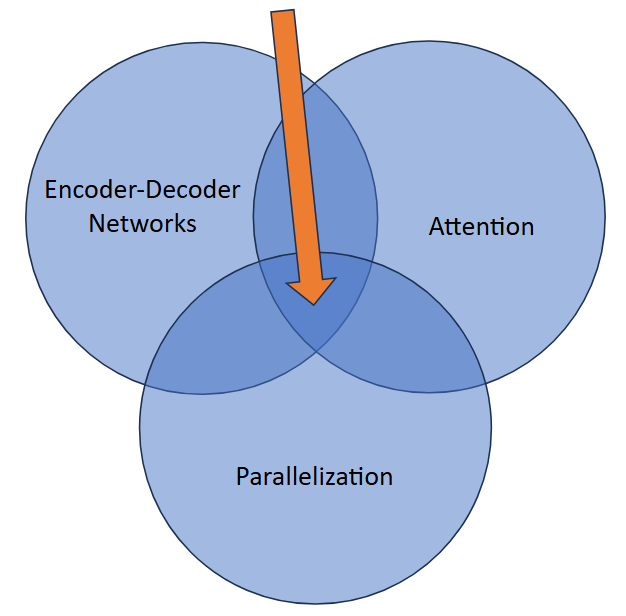

# Transformers

## [The Neural Network Zoo](http://www.asimovinstitute.org/neural-network-zoo/)

- Transformers: Attention network

## RNNs revisited
- Recurrences
    - Input + hidden state
    - LSTM “forget” gate
    - Encoder-decoder
- Sequential architecture precludes parallelization
- Lot of information crammed into $h_{t}$
- “Catastrophic forgetting”

![top panel shows an RNN model: circles labeled h^(...) -> h^(t-1) -> h^(t) -> h^(t+1) -> h^(...) use “f” to propagate state, and each h(t) also receives an external input x(t). Right panel shows (seq2seq) encoder–decoder architecture drawn as two unrolled RNNs. Encoder: an RNN reads the input sequence{x^(1) to x^(n_x)} step by step, passing its hidden state forward. The final hidden state is collapsed into a fixed-length context vector C. Decoder: a second RNN is initialized (or conditioned) on C and then unrolled to generate the output sequence {y^(1) to y^(n_y)}; At each timestep it takes as input its previous output (or a special start token) plus C to produce the next symbol. Solid arrows show the usual recurrent connections (hidden-to-hidden and hidden-to-output). The heavy arrow from the encoder’s last state into the decoder indicates that context vector C is fed into every decoder step. Dashed arrows typically denote teacher-forcing links (feeding ground-truth y^(t−1) during training).](./pics/rnn_ex.png)

## Transformers
- A confluence of multiple Technologies and theories



- Transductive model
- Relies entirely on self-attention mechanisms
- No sequence-aligned RNNs or convolutions

## Transformer architecture
- Encoder
    - Maps input sequence $(x_{1}, \ldots, x_{n})$ to a representation sequence $(z_{1}, \ldots, z_{n})$
- Decoder
    - From sequence $z$, generates an output sequence $(y_{1}, \ldots, y_{m})$
- Stacked self-attention and point-wise fully connected layers
- Positional encodings allow for fully parallelized encodings

![classic schematic from “Attention Is All You Need” of the full Transformer architecture. Left block – Encoder (repeated N times): 1. Input tokens are converted to continuous vectors by an Input Embedding layer, then have a Positional Encoding added; 2. Each encoder layer contains two sub‑layers, each wrapped with residual (“Add”) connections and layer normalization (“Add & Norm”), the Multi‑Head Self‑Attention (orange) lets every position attend to every other and the Position‑wise Feed‑Forward Network (blue) processes each position independently. Right block – Decoder (repeated N times): 1. Target tokens (shifted right) pass through an Output Embedding plus Positional Encoding; Each decoder layer has three sub‑layers, again surrounded by residuals and layer norm, the Masked Multi‑Head Self‑Attention (prevents positions from seeing future tokens), the Encoder–Decoder (cross) Multi‑Head Attention over the encoder’s outputs, and the Feed‑Forward Network. Output projection: The final decoder representation is fed through a Linear layer and a Softmax to produce token‑level probability distributions. Arrows show data flow and residual (skip) connections, and the × N braces indicate that the encoder and decoder stacks can be repeated an arbitrary number of layers.](./pics/transformer_arch.png)

## Attention
- Maps a query, a set of key-value pairs $\to$ an output:
    - Weighted sum of values
    - Weight assigned to each value is output of a "compatibility function" of query with corresponding key
- Query, Key, Value $\to$ Vectors (in theory), matrices in practice (i.e., many queries/keys/values in parallel)
$$ \text{Attention}(Q, K, V) = \text{softmax}(\frac{QK^{T}}{\sqrt{d_{k}}})V $$

- In 2017 paper, Attention = "Scaled Dot-Product Attention"
- Multi-head attention
    - Linearly project $Q$, $K$, and $V$ $h$ times with different learned projections
    - Attention performed in parallel on each projection
    - Concatenated to compute final attention values

![diagram showing scaled dot production attention (left) and multi-head attention (right). Scaled Dot product attention: Queries and Keys -> Matmul -> Scale -> Mask (optional) -> Softmax; Softmax and Values -> Matmul -> final attended output. Multi-head attention: project Q, K, V via h distinct learned linear layers -> Run Scaled Dot-Product Attention in parallel for each head -> concatenate the h head outputs and apply a final linear transform to mix them. Together, these modules let the Transformer flexibly model pairwise interactions across all positions, then combine multiple “attention perspectives” for richer sequence representations.](./pics/attention_arch.png)
$$ \text{MultiHead}(Q, K, V) = \text{Concat}(\text{head}_{1}, \ldots, \text{head}_{h})W^{O} \quad \text{where} \quad \text{head}_{i} = \text{Attention}(QW_{i}^{Q}, KW_{i}^{K}, VW_{i}^{V})$$

## Attention and Self-Attention
- Encoder-decoder attention layers
    - $Q$ from previous decoder layer
    - $K$, $V$ from output of encoder
    - Every position in the decoder can attend to all input positions
- Encoder contains self-attention layers
    - $Q$, $K$, $V$ all come from the same place (output of previous encoder layer)
    - Each position in encoder can attend to all positions in previous encoder layer
- Decoder contains self-attention layers
    - Each position in decoder can attend to all positions in previous decoder layer **up to and including the current position** (but not past it!)

## Connections to Support Vector Machines
- SVMs were all the rage in the late 90s and early 2000s
    - Neural networks had been a “dead end” since early 90s
- 1-layer self-attention Transformers = hard-margin SVM
- Multilayer transformers = hierarchy of SVMs

## Pictures (Courtesy of the Illustrated Transformer)
![high-level schematic of a Transformer used for sequence-to-sequence tasks (e.g., machine translation). On the left is a stack of encoder layers (here, six “ENCODER” blocks) that read the input tokens “Je suis étudiant” and build contextualized representations via self-attention and feed-forward sublayers. On the right is a stack of decoder layers (six “DECODER” blocks) that generate the output sequence “I am a student.” Each decoder layer has: Masked self-attention over the tokens generated so far (to prevent seeing future words), Encoder–decoder (cross) attention — shown by the arrows from the top of the encoder stack to every decoder block — which lets the decoder attend to all positions of the encoded input, and feed-fowrard processing. illustrates how the Transformer’s decoder repeatedly queries (“attends to”) the encoder’s outputs at each layer to produce the target translation (I am a student)](./pics/seq2seqTransformer_schematic.png)
- Final $K$, $V$ from encoder sent to each decoder
- Each decoder focuses its attention on “correct” positions of encoder


![ worked numerical example of scaled dot-product self-attention on two tokens (“Thinking” and “Machines”). 1. embeddings: Each word is first mapped to an embedding x_1, x_2. 2. Linear Projections: x_1, x_2 get turned into queries q_1 and q_2, keys k_1 and k_2, and value v_1 and v_2 vectors for each token. Score computation: dot products q_1 \cdot k_1 = 112 and q_1 \cdot k_2 = 96 is computed. Scaling: divide by \sqrt{d_{k}}=8, score becomes 14 and 12. Softmax: convert to attention weights 0.88 and 0.12. Weighted sum: multiply each value by its weight and sum: z_1 =  0.88v_1 + 0.12v_2. The same process (with its own dot-products, scaling, softmax) yields z_2 for the second token. illustrates exactly how a single attention head “looks up” related tokens and blends their value vectors into new, context-aware representations.](./pics/selfAttention_ex.png)

![self-attention score matrix for the single sentence “a fluffy blue creature roamed the verdant forest.” Top row: each token is embedded to E_1 to E_8, then projected to a query vector Q̅_i = E_{i}W^Q. Leftmost column: the same embeddings are projected to key vectors K̅_j = E_{j}W^K. Inner grid: at row j, column i you get the raw dot-product score K̅_{j} \cdot Q̅_{i} (visualized by circle size/intensity) — i.e. how much token i “attends to” token j. Normally you’d then scale, softmax, and weight the value vectors V̅_j = E_{j}W^V according to those scores to produce each output z_i. it’s the classic “queries vs keys” attention map, showing all pairwise compatibilities before they get normalized into attention weights.](./pics/selfAttention_matrix.png)

![diagram illustrating the per-head linear projections in a two-head self-attention layer. Input X (here the embeddings for “Thinking” and “Machines”) is fed, in parallel, into two separate attention heads. Head 0 applies its own learned weight matrices W_{0}^{Q}, W_{0}^{K}, W_{0}^{V} to X, producing Q_0 = XW_{0}^{Q}, K_0 = XW_{0}^{K}, V_0 = XW_{0}^{V}. Head 1 likewise uses W_{1}^{Q}, W_{1}^{K}, W_{1}^{V} to compute Q_1, K_1, V_1. Each head then performs scaled dot-product attention independently on its (Q_i, K_i, V_i) before their outputs are concatenated and mixed. This separation into multiple heads lets the model attend to different representation subspaces simultaneously.](./pics/selfAttention_twoHead.png)

## Vision Transformers (ViT)
- Built on the same principles
- Patches = tokens
    - Still have positional encodings
    - Are still embedded in the first encoder step
- Attention = dictionary lookup
    - dictionary[query] = value
    - If key==query, return value
    - “Soft” selection
- Everything else is the same!

![diagram showing patch‐tokenization and embedding process used by a Vision Transformer. Left panel shows how the image is turned into patches: the input image is divided into a grid of fixed-size patches (here 3×3), each assigned a unique index (0…8)—often in simple row-major order (the red zig-zag just highlights the sequence in which patches become tokens). Patch -> visual embedding: Each patch is flattened into a vector and multiplied by a learned projection matrix W_e, producing a visual embedding for that patch. Add Positional Encoding: A corresponding positional embedding is looked up from a small table (one entry per patch index) and added to the visual embedding, yielding the final token embedding. Those token embeddings (one per patch) are then fed into the Transformer’s encoder exactly as in NLP—everything else (self-attention, feed-forward layers) remains unchanged.](./pics/vit_visual.png)

## Transformer limitation
- Attention mechanism is still $O(n^{2})$
    - Each token compared to each other token
    - Subquadratic methods exist but rely on low-rank / sparse approximations, and require dense Attention layers
    - **Ultimately limits the possible sequence length n (context window)**

## Hyena
- Subquadratic drop-in Attention replacement
    - Hyena operator
- Long convolutions
    - filter sizes as long as the input
- Data-controlled gating (element-wise multiplication)
    - Convolutions in FFT (i.e., frequency) space are element-wise multiplications!

![The diagram shows the Hyena operator, a sub-quadratic, convolution-based alternative to self-attention: an input sequence u first passes through a dense layer to produce v, then iteratively traverses N “recurrence” blocks, each of which applies a long, learnable Toeplitz convolution matrix S_{h}^{N} (constructed from the filter h^n), followed by element-wise gating via a diagonal matrix D_{x}^{n} whose entries come from a separate dense projection of u. A direct residual connection from u bypasses all blocks and is added back at the end to form the output y. To generate each filter h^n efficiently, a small feed-forward network transforms a fixed “window” of positional embeddings (encoding relative distances) into the full-length convolution kernel, allowing Hyena to mix global context in linear time and constant memory.](./pics/hyena_arch.png)

```
The attention mechanism is:
    a. x * Wq
    b. x * Wk
    c. key * query
    d. (key * query) * value // correct
```

## Conclusions
- Transformer architecture for modeling sequences (of text or images)
    - Throws out recurrences of RNNs for more parallel training
    - Ditching recurrences also allows for arbitrary context windows
- Still use the encoder-decoder architecture
    - Input embeddings are critical to the overall performance
- Attention
    - Transformer allows for all tokens to “attend” to all other tokens
    - Can model extremely long-distance dependencies (spatially or sequentially)
    - Only drawback is quadratic computation time
- Hyena operator
    - Clever use of FFT-based convolutions and Toeplitz matrices to accelerate standard computations and produce subquadratic performance
